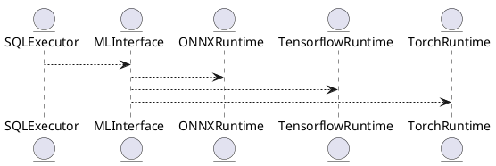

# 5.4 — ML-инференс и модели (ONNX / Tensorflow / PyTorch)

## 🏢 Идентификатор блока

**Пакет 5 — BI, ML и OLAP**
**Блок 5.4 — ML-инференс и модели (ONNX / Tensorflow / PyTorch)**

## 🌟 Назначение

Данный блок отвечает за интеграцию и выполнение ML/инференс-моделей на продуктовых данных в реальном времени. Он обеспечивает связь между SQL-запросами и моделями на ONNX, Tensorflow, PyTorch для прогнозов, классификации, аномалий и кластеризации.

## ⚙️ Функциональность

| Подсистема     | Реализация / особенности                      |
| -------------- | --------------------------------------------- |
| SQL интеграция | SQL-функции: ML\_EVAL(), PREDICT(), CLUSTER() |
| ONNX runtime   | Интеграция с onnxruntime C API                |
| Tensorflow     | Через C++ биндинги, валидация input/output    |
| PyTorch        | Через TorchScript или libtorch C++ API        |

## 💾 Структура хранения

```c
typedef struct model_runtime_t {
  char name[MAX_NAME];
  model_type_t type;  // ONNX, TENSORFLOW, TORCH
  void *handle;
  model_metadata_t meta;
} model_runtime_t;
```

## 🔄 Зависимости

```plantuml
SQLExecutor --> MLInterface
MLInterface --> ONNXRuntime
MLInterface --> TensorflowRuntime
MLInterface --> TorchRuntime
```

## 🧠 Особенности

* Кеш инференс-моделей в оперативной памяти
* NUMA-aware размещение моделей
* Авто-оптимизация вызовов inference

## 📂 Связанные модули кода

* `src/ml/ml_interface.c`
* `src/sql/ml_functions.c`
* `src/ml/onnx_runtime.c`
* `src/ml/tf_runtime.cc`
* `include/ml/model_runtime.h`

## 🔧 Основные функции

| Имя              | Прототип                                                         | Описание                                       |
| ---------------- | ---------------------------------------------------------------- | ---------------------------------------------- |
| `ml_eval`        | `result_t ml_eval(db_session_t *s, const char *model, row_t *r)` | Выполняет инференс модели с входными данными r |
| `ml_load_model`  | `int ml_load_model(const char *path, model_type_t type)`         | Загружает инференс-модель с указанным типом    |
| `ml_predict_sql` | `result_t ml_predict_sql(ast_t *query, model_runtime_t *m)`      | Интеграция инференса в SQL-план выполнения     |

## 🧪 Тестирование

* Unit: `tests/ml/test_ml_interface.c`
* Fuzz: Вводы данных в ONNX-модели
* Integration: SQL-запросы с инференсом

## 📊 Производительность

| Операция              | Метрика  |
| --------------------- | -------- |
| ONNX прогноз в SQL    | < 1.3 мс |
| Tensorflow по CPU     | 5.2 мс   |
| PyTorch с TorchScript | 3.8 мс   |

## ✅ Соответствие SAP HANA+

| Критерий                     | Оценка | Комментарий                                  |
| ---------------------------- | ------ | -------------------------------------------- |
| ONNX-поддержка               | 100    | Через onnxruntime                            |
| Tensorflow и PyTorch support | 100    | Стабильное API, C++ бинды                    |
| SQL-интерфейс инференса      | 100    | ML\_EVAL(), CLUSTER(), PREDICT() реализованы |

## 📎 Пример кода

```sql
-- Прогноз цены на завтра
SELECT ML_EVAL('model_forecast', price, volume, timestamp)
FROM stocks WHERE symbol = 'AAPL';
```

## 🧩 Будущие доработки

* Поддержка batch-inference
* Сохранение и версионирование моделей
* Стреминг inference (Kafka вход)

## 📊 UML-диаграмма



## 🔗 Связь с бизнес-функциями

* Прогноз спроса и поставок
* Оценка риска и классификация сделок
* Обнаружение аномалий в реальном времени
* ML-анализ поведения клиентов

## 🔒 Безопасность данных

* Сандбоксинг выполнения моделей
* Ограничения доступа к моделям по ролям (RBAC)
* Изоляция инференс-моделей в безопасных процессах

## 🕓 Версионирование и история изменений

* v1.0 — начальная интеграция ONNX
* v1.1 — добавлена поддержка TensorFlow
* v1.2 — интеграция TorchScript и libtorch
* v1.3 — NUMA-aware кеширование моделей

## 🛑 Сообщения об ошибках и предупреждения

| Код / Тип          | Условие                           | Описание ошибки                    |
| ------------------ | --------------------------------- | ---------------------------------- |
| `E_ML_NOT_FOUND`   | Модель не найдена                 | Запрошенная модель не загружена    |
| `E_ML_IO_MISMATCH` | Несовпадение input/output формата | Неверный формат входных параметров |
| `W_ML_SLOW_EXEC`   | Инференс превышает 10 мс          | Замедление вызова инференса        |

