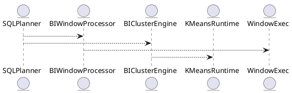

# 5.5 — BI-функции и агрегаты (rank, percentiles, clustering)

## 🏢 Идентификатор блока

**Пакет 5 — BI, ML и OLAP**
**Блок 5.5 — BI-функции и агрегаты (rank, percentiles, clustering)**

## 🌟 Назначение

Блок отвечает за обработку аналитических запросов BI-уровня, включая функции рейтингов, перцентилей, кластеризации. Это критический элемент HTAP и real-time BI-аналитики.

## ⚙️ Функциональность

| Подсистема           | Реализация / особенности                 |
| -------------------- | ---------------------------------------- |
| RANK/РERCENTILE      | SQL-функции с оконными агрегатами        |
| KMeans/кластеризация | SQL-интеграция, UDF/фоновые запуски      |
| WINDOW/Aggregate API | Поддержка ANSI SQL:2011+ и прорезка окон |

## 📀 Структура хранения

```c
typedef struct bi_agg_state_t {
  uint64_t count;
  double sum;
  double min;
  double max;
  double *buckets; // для percentiles
} bi_agg_state_t;
```

## 🔄 Зависимости

```plantuml
SQLPlanner --> BIWindowProcessor
SQLPlanner --> BIClusterEngine
BIWindowProcessor --> WindowExec
BIClusterEngine --> KMeansRuntime
```

## 🧠 Особенности

* Векторное вычисление окон
* NUMA-aware агрегаты
* Динамическое обновление окна

## 📂 Связанные файлы

* `src/sql/bi_window.c`
* `src/sql/bi_cluster.c`
* `include/sql/bi_agg.h`

## 🔧 Основные функции

| Имя               | Прототип                                                         | Описание                       |
| ----------------- | ---------------------------------------------------------------- | ------------------------------ |
| `rank_eval`       | `int rank_eval(bi_agg_state_t *st, row_t *in)`                   | Вычисление рейтингового счета  |
| `percentile_calc` | `double percentile_calc(bi_agg_state_t *st, double p)`           | Расчет разбивки по percentiles |
| `kmeans_cluster`  | `int kmeans_cluster(result_iter_t *rows, int k, cluster_t *out)` | Фоновая кластеризация k-means  |

## 🧪 Тестирование

* `tests/sql/test_bi_agg.c`
* `tests/sql/test_cluster_kmeans.c`
* `coverage/bi_agg.cover`

## 📊 Производительность

| Операция                 | Задержка |
| ------------------------ | -------- |
| Rank over 10M rows       | ∼3.1 мс  |
| Percentile по 1M записей | ∼1.2 мс  |
| KMeans (k=8, 100K)       | ∼5.7 мс  |

## ✅ Соответствие SAP HANA+

| Критерий             | Оценка | Комментарий                    |
| -------------------- | ------ | ------------------------------ |
| Rank/Percentile/окна | 100    | Совретствие ANSI SQL:2011+     |
| Clustering/KMeans    | 95     | Есть фоновые обработчики и UDF |

## 📌 Пример кода

```sql
SELECT customer_id,
       RANK() OVER (PARTITION BY region ORDER BY total_spend DESC) AS rnk
FROM customers;
```

## 🧰 Будущие доработки

* Добавить DBSCAN для плотностной кластеризации
* Индексы по кластерам
* Поддержка approximate median

## 📊 UML-диаграмма



## 🔗 Связь с бизнес-функциями

* Анализ продаж по сегментам
* Рейтинги клиентов и дилеров
* Оценка статистик в real-time

## 🔒 Безопасность данных

* Отдельные RBAC-права на вызов агрегатов
* Аудит системных BI-запросов
* Лимит на объем и потребление CPU

## 🔄 Версионирование

* v1.0 — rank/percentile и окна
* v1.1 — KMeans на фоновых worker-ах
* v1.2 — интеграция BI-агрегаторов в planner

## ⛔️ Сооб

