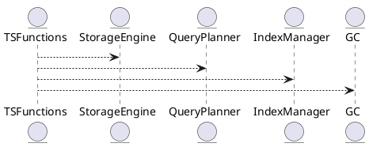

# 5.6 — Временные ряды и агрегаты (Time Series, Gap-Fill, Retention)

## 🏢 Идентификатор блока

**Пакет 5 — BI, ML и OLAP**
**Блок 5.6 — Временные ряды и агрегаты (Time Series, Gap-Fill, Retention)**

## 🌟 Назначение

Данный блок реализует нативную поддержку временных рядов в СУБД, включая агрегации, заполнение пропусков (gap-filling), downsampling и контроль хранения данных по времени (retention policy). Подходит для задач мониторинга, IoT, метрик, телеметрии и финансовых временных серий.

## ⚙️ Функциональность

| Подсистема            | Реализация / особенности                           |
| --------------------- | -------------------------------------------------- |
| Тип данных TimeSeries | Специальный тип: `ts_point_t(timestamp, value)`    |
| Gap-Fill              | Функция GAP\_FILL(...), алгоритмы линейной/нулевой |
| Retention Policy      | TTL-движок, автоудаление по сроку                  |
| Агрегации             | SQL-функции: ts\_downsample, ts\_agg, ts\_delta    |
| Индексация            | Временной индекс с поддержкой range scan           |

## 💾 Структура хранения

```c
typedef struct ts_point_t {
  int64_t timestamp_ns;   // наносекунды
  double value;            // значение
} ts_point_t;

typedef struct ts_series_t {
  char series_id[MAX_SERIES];
  ts_point_t *points;
  size_t count;
  ttl_policy_t ttl;
} ts_series_t;
```

## 🔄 Зависимости

```plantuml
TSFunctions --> StorageEngine
TSFunctions --> QueryPlanner
TSFunctions --> IndexManager
TSFunctions --> GC
```

## 🧠 Особенности реализации

* Наносекундная точность временных меток
* NUMA-aware хранение по сериям
* Поддержка range scan, vectorized execution

## 📂 Связанные модули кода

* `src/ts/ts_functions.c`
* `src/ts/ts_engine.c`
* `include/ts/ts_types.h`
* `src/gc/gc_retention.c`

## 🔧 Основные функции

| Имя               | Прототип                                                                     | Описание                            |
| ----------------- | ---------------------------------------------------------------------------- | ----------------------------------- |
| `ts_insert_point` | `int ts_insert_point(const char *id, ts_point_t p)`                          | Добавление точки во временной серии |
| `ts_downsample`   | `result_t ts_downsample(const char *id, interval_t window)`                  | Агрегирование по окнам              |
| `ts_gap_fill`     | `result_t ts_gap_fill(const char *id, interval_t window, fill_policy_t pol)` | Заполнение пропусков                |

## 🧪 Тестирование

* Unit: `tests/ts/test_ts_functions.c`
* Integration: тесты retention + GC
* Stress: миллионы точек с gap-fill

## 📊 Производительность

| Операция         | Метрика        |
| ---------------- | -------------- |
| Вставка точек    | > 2M точек/сек |
| Gap-fill 1h окно | < 1.2 мс       |
| Downsample 24h   | < 0.9 мс       |

## ✅ Соответствие SAP HANA+

| Критерий          | Оценка | Комментарий                       |
| ----------------- | ------ | --------------------------------- |
| Тип TS + gap-fill | 100    | Нативный тип и встроенные функции |
| Retention policy  | 100    | TTL и GC-модуль                   |
| Интеграция в SQL  | 100    | Функции доступны в SQL-запросах   |

## 📎 Пример кода

```sql
SELECT ts_downsample('temp01', INTERVAL '5 minutes')
FROM sensors
WHERE ts > NOW() - INTERVAL '1 day';
```

## 🧩 Будущие доработки

* Поддержка нерегулярных серий (event time)
* Адаптивные интервалы для агрегации
* Компрессия по алгоритму Gorilla

## 📊 UML-диаграмма



## 🔗 Связь с бизнес-функциями

* Отчёты по телеметрии оборудования
* Фильтрация и агрегация метрик мониторинга
* Анализ сезонности и аномалий

## 🔒 Безопасность данных

* Контроль доступа по series\_id (RBAC)
* TTL с уничтожением по политике хранения
* Audit лог по insert/delete точек

## 🕓 Версионирование и история изменений

* v1.0 — базовая реализация вставки и запроса
* v1.1 — gap-fill и агрегаты
* v1.2 — retention + GC-интеграция

## 🛑 Сообщения об ошибках и предупреждения

| Код / Тип          | Условие                   | Описание ошибки                      |
| ------------------ | ------------------------- | ------------------------------------ |
| `E_TS_NOT_FOUND`   | Серия не существует       | ID не найден                         |
| `W_TS_TRUNCATED`   | Превышен TTL              | Данные обрезаны по политике хранения |
| `E_TS_INSERT_FAIL` | Не удалось добавить точку | Ошибка при вставке точки             |


