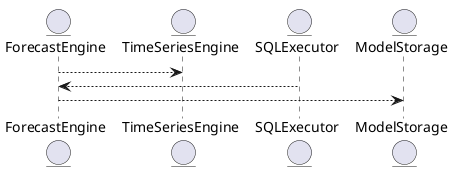

# 5.7 — Прогнозирование SQL-запросов (Query Forecasting)

## 🏢 Идентификатор блока

**Пакет 5 — BI, ML и OLAP**
**Блок 5.7 — Прогнозирование SQL-запросов (Query Forecasting)**

## 🌟 Назначение

Обеспечивает автоматическое прогнозирование результатов SQL-запросов в плане трендов, тенденций, временных рядов. Применяется для бизнес-аналитики, оценки перегрузок, автоматического масштабирования и SLA.

## ⚙️ Функциональность

| Подсистема           | Реализация / особенности                      |
| -------------------- | --------------------------------------------- |
| SQL FORECAST функции | FORECAST(), TREND(), TIME\_SERIES()           |
| Экзекьютор SQL       | интеграция с агрегатором и time series engine |
| Time Series Engine   | кеш, сопряжен с режимом scan & forecast       |

## 📂 Структура хранения

```c
typedef struct forecast_model_t {
  char name[MAX_MODEL_NAME];
  ts_method_t method;     // linear, exponential, holt-winters
  uint32_t horizon;       // горизонт прогноза
  void *model_data;       // opaque
} forecast_model_t;
```

## 🔄 Зависимости

```plantuml
ForecastEngine --> TimeSeriesEngine
SQLExecutor --> ForecastEngine
ForecastEngine --> ModelStorage
```

## 🧐 Особенности

* поддержка forecasting по окнам SQL
* NUMA-aware модели, параллельные forecast pipelines
* авто-тесты точности

## 📂 Связанные модули кода

* `src/sql/sql_forecast.c`
* `src/forecast/forecast_engine.c`
* `include/forecast/forecast_model.h`

## 🔧 Основные функции

| Имя                 | Прототип                                                                 | Описание                   |
| ------------------- | ------------------------------------------------------------------------ | -------------------------- |
| `forecast_eval`     | `result_t forecast_eval(db_session_t *s, forecast_model_t *m, row_t *r)` | прогноз данных по SQL окну |
| `forecast_train`    | `int forecast_train(forecast_model_t *m, const ts_series_t *series)`     | обучение модели на истории |
| `forecast_register` | `int forecast_register(const char *name, forecast_model_t *m)`           | регистрация модели         |

## 🧪 Тестирование

* Unit: `tests/forecast/test_forecast_engine.c`
* Fuzz: временные ряды на ввод
* Integration: SQL-запросы FORECAST

## 📊 Производительность

| Операция              | Метрика   |
| --------------------- | --------- |
| FORECAST(дни наперед) | < 2.1 мс  |
| обучение Holt-Winters | \~ 5.6 мс |

## ✅ Соответствие SAP HANA+

| Критерий                   | Оценка | Комментарий                       |
| -------------------------- | ------ | --------------------------------- |
| SQL-прогноз по time series | 100    | FORECAST(), TREND()               |
| Holt-Winters, linear model | 100    | выбор метода в forecast\_model\_t |

## 📌 Пример SQL

```sql
-- Прогноз продаж на неделю
SELECT FORECAST(sales, 7 days) FROM revenue_ts WHERE region = 'EU';
```

## 🧰 UML-диаграмма



## 🔗 Связь с бизнес-функциями

* прогноз спроса на номенклатуру
* оценка нагрузок на OLAP-кластер
* решения по автоскейлингу и балансировке

## 🔒 Безопасность данных

* RBAC-доступ к форекаст-моделям
* отслеживание момента изменения
* подпись моделей для контроля целостности

## 📅 Версии и история

* v1.0 — базовая SQL-FORECAST по time series
* v1.1 — добавлен Holt-Winters метод
* v1.2 — оценка отклонений + auto-test

## 🚧 Сообщения об ошибках

\| Код / тип       | Усло


