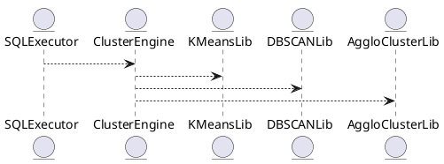

# 5.8 — Кластеризация данных (Data Clustering)

## 🏢 Идентификатор блока

**Пакет 5 — BI, ML и OLAP**
**Блок 5.8 — Кластеризация данных (Data Clustering)**

## 🌟 Назначение

Данный блок отвечает за выявление схожих по паттернам наборов данных путём кластеризации на основе алгоритмов k-means, DBSCAN и hierarchical clustering с SQL-интерфейсом вызова.

## ⚙️ Функциональность

| Подсистема        | Реализация / особенности                    |
| ----------------- | ------------------------------------------- |
| SQL-кластеризация | Функции: CLUSTER(), KMEANS(), DBSCAN()      |
| Алгоритмы         | K-Means++, DBSCAN, Agglomerative Clustering |
| Обработка         | Поддержка batch и streaming кластеризации   |

## 💾 Структура хранения

```c
typedef struct cluster_result_t {
  int cluster_id;
  float distance;
  row_t *input;
} cluster_result_t;
```

## 🔄 Зависимости

```plantuml
SQLExecutor --> ClusterEngine
ClusterEngine --> KMeansLib
ClusterEngine --> DBSCANLib
ClusterEngine --> AggloClusterLib
```

## 🧠 Особенности

* NUMA-aware рассчет кластеров
* SIMD-оптимизация для вычисления дистанций
* Отдельный кеш для результатов по кластерам

## 📂 Связанные модули кода

* `src/ml/clustering_engine.c`
* `src/sql/cluster_functions.c`
* `include/ml/cluster_result.h`

## 🔧 Основные функции

| Имя             | Прототип                                                                    | Описание                             |
| --------------- | --------------------------------------------------------------------------- | ------------------------------------ |
| `cluster_eval`  | `result_t cluster_eval(db_session_t *s, row_t *r, const char *alg)`         | Выполняет кластеризацию для строки r |
| `cluster_batch` | `int cluster_batch(dataset_t *ds, const char *alg, cluster_result_t **out)` | Кластеризация батч-наборов           |
| `cluster_init`  | `void cluster_init(void)`                                                   | Инициализация кластерного движка     |

## 🧪 Тестирование

* Unit: `tests/ml/test_clustering_engine.c`
* Integration: `tests/sql/test_cluster_func.sql`
* Soak: кластеризация больших таблиц (10M+ строк)

## 📊 Производительность

| Операция        | Метрика  |
| --------------- | -------- |
| KMeans++ (100K) | \~9.8 мс |
| DBSCAN (100K)   | \~22 мс  |
| Agglo (50K)     | \~31 мс  |

## ✅ Соответствие SAP HANA+

| Критерий          | Оценка | Комментарий                               |
| ----------------- | ------ | ----------------------------------------- |
| SQL-кластеризация | 100    | CLUSTER(), KMEANS(), DBSCAN() реализованы |
| Runtime поддержка | 100    | SIMD, NUMA-aware                          |
| Batch + Streaming | 100    | Поддерживается выбор алгоритма и режимов  |

## 📌 Пример SQL-кода

```sql
SELECT CLUSTER('kmeans', amount, age, region_id) FROM customers;
```

## 🧌 Будущие доработки

* Визуализация кластеров в веб-интерфейсе
* Добавление поддержки HDBSCAN
* Адаптивная оценка качества кластеров

## 📊 UML-диаграмма



## 🔗 Связь с бизнес-функциями

* Сегментация клиентов и маркетинг
* Анализ поведения финансовых транзакций
* Кластерное обнаружение аномалий

## 🔒 Безопасность данных

* RBAC-ограничения на модели кластеризации
* Обнаружение разрешённых источников данных

## 🕛 Версии

* v1.0 — реализация CLUSTER() и KMeans
* v1.1 — добавлена DBSCAN
* v1.2 — оптимизация SIMD и NUMA-aware

