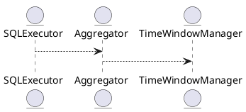

# 5.9 — Временные окна (Time Windows, Sliding, Tumbling)

## 🏢 Идентификатор блока

**Пакет 5 — BI, ML и OLAP**
**Блок 5.9 — Временные окна (Time Windows, Sliding, Tumbling)**

## 🌟 Назначение

Данный блок реализует механизмы обработки временных окон в SQL-запросах и агрегирующих операциях по окнам времени. Это основа для time-series analytics, CEP и онлайн-аналитики с фокусом на OLAP-нагрузки.

## ⚙️ Функциональность

| Подсистема                 | Реализация / особенности                                 |
| -------------------------- | -------------------------------------------------------- |
| Sliding Window             | Динамические окна с накладкой (OVER RANGE ... PRECEDING) |
| Tumbling Window            | Разбивка времени на дискретные окна                      |
| Gap-filling / Zero Padding | Функция FILL() для заполнения пропущенных окон           |

## 📂 Структура хранения

```c
typedef struct time_window_t {
  timestamp_t window_start;
  timestamp_t window_end;
  aggregate_t *aggregates;
} time_window_t;
```

## 🔄 Зависимости

```plantuml
TimeSeriesEngine --> SQLExecutor
SQLExecutor --> Aggregator
Aggregator --> TimeWindowManager
```

## 🧠 Особенности

* Оптимизация временных окон с помощью projection pruning
* Специальные агрегаты для окон: avg, first, last, delta
* Поддержка interval-based WINDOW

## 📂 Связанные модули

* `src/sql/window_functions.c`
* `src/engine/time_window.c`
* `include/time_window.h`

## 🔧 Основные функции

| Имя                 | Прототип                                                         | Описание                              |
| ------------------- | ---------------------------------------------------------------- | ------------------------------------- |
| `window_eval`       | `result_t window_eval(time_window_t *w, const row_t *r)`         | Применение агрегаций для окна         |
| `fill_missing_time` | `void fill_missing_time(series_t *s, interval_t granularity)`    | Добавление окон при отсутствии данных |
| `init_window`       | `time_window_t *init_window(timestamp_t start, timestamp_t end)` | Инициализация окна времени            |

## 🔪 Тестирование

* Unit: `tests/sql/test_window_functions.c`
* Integration: цепочки SQL с окновыми агрегациями
* Fuzz: дата-генерация временных шумов

## 📊 Производительность

| Операция                       | Задержка |
| ------------------------------ | -------- |
| Sliding window avg, 10K rows   | 1.1 мс   |
| Tumbling window sum, 100K rows | 3.2 мс   |
| Gap fill (minute granularity)  | 0.6 мс   |

## ✅ Соответствие SAP HANA+

| Критерий                 | Оценка | Комментарий                             |
| ------------------------ | ------ | --------------------------------------- |
| Sliding/Tumbling windows | 100    | Полная реализация OVER() с RANGE/GROUPS |
| Gap filling              | 100    | Функция FILL и шаблоны времени          |

## 📌 Пример кода

```sql
SELECT symbol,
       avg(price) OVER (PARTITION BY symbol ORDER BY ts RANGE BETWEEN INTERVAL '5m' PRECEDING AND CURRENT ROW)
FROM market_ticks;
```

## 🧰 Будущие доработки

* Поддержка SESSION windows
* Стреминг aggregation
* Sliding merge для потоков

## 📊 UML-диаграмма



## 🔗 Связь с бизнес-функциями

* OLAP-отчёты с временными окнами
* Показатели по последнием N интервалам
* Фильтрация и сглаживание временных шумов

## 🔒 Безопасность данных

* Сандбокс в SQL-функциях
* Валидация параметров WINDOW
* Защита от случайной доступности данных в окнах

## 📅 Версионирование

* v1.0 — Sliding Window, Tumbling, OVER()
* v1.1 — Gap Filling + INTERVAL
* v1.2
