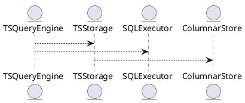

# 5.10 — Таймсерии (Time Series Storage and Analysis)

## 🏢 Идентификатор блока

**Пакет 5 — BI, ML и OLAP**
**Блок 5.10 — Таймсерии (Time Series Storage and Analysis)**

## 🌟 Назначение

Блок отвечает за хранение, обновление, запросы и анализ таймсерий данных (темпоральных множеств) с высокой степенью сжатия, поддержкой downsampling, и gap-filling. Он реализует потоковое хранение временных рядов и оптимизирует их для OLAP-запросов.

## ⚙️ Функциональность

| Подсистема       | Реализация / особенности                                     |
| ---------------- | ------------------------------------------------------------ |
| Хранение TS      | Бинарное колонночное сжатие + Frame of Reference + Delta     |
| Gap filling      | Интерполяция на стороне SQL-движка (LAG, LEAD, функции окон) |
| Downsampling     | RESAMPLE(interval, agg) в самом хранилище                    |
| Retention policy | ТTL + версионирование + снапшоты                             |

## 📀 Структура хранения

```c
typedef struct ts_point_t {
    timestamp_ns_t ts;
    double value;
} ts_point_t;

typedef struct ts_series_t {
    char series_id[36];
    ts_point_t *points;
    size_t count;
} ts_series_t;
```

## 🔄 Зависимости

```plantuml
TSQueryEngine --> TSStorage
TSStorage --> ColumnarStore
TSQueryEngine --> SQLExecutor
```

## 🧠 Особенности

* Поддержка масштабируемого ingestion
* NUMA-aware аллокация по сериям
* Компактное хранение в SSD/оперативке

## 📂 Связанные файлы

* `src/timeseries/ts_storage.c`
* `src/timeseries/ts_query.c`
* `include/timeseries/ts_types.h`
* `src/sql/ts_sql_functions.c`

## 🔧 Функции

| Имя               | Прототип                                                           | Описание                       |
| ----------------- | ------------------------------------------------------------------ | ------------------------------ |
| `ts_insert_point` | `int ts_insert_point(const char *id, timestamp_ns_t ts, double v)` | Добавить точку в серию         |
| `ts_query_range`  | `result_t ts_query_range(const char *id, ts_range_t r)`            | Выгрузить серию в диапазоне    |
| `ts_gapfill`      | `result_t ts_gapfill(const char *id, ts_range_t r, int step_ms)`   | Дозаполнение пропусков в серии |

## 🔫 Тесты

* `tests/timeseries/test_ts_storage.c`
* `tests/timeseries/test_ts_query.c`
* Fuzzing: ts\_point ingestion
* Soak: high-throughput inserts, TTL deletion

## 📊 Производительность

| Операция            | Значение      |
| ------------------- | ------------- |
| Insert throughput   | 3.5M points/s |
| Range query latency | < 1.2 мс      |

## ✅ Соответствие SAP HANA+

| Критерий             | Оценка | Комментарий                          |
| -------------------- | ------ | ------------------------------------ |
| Gap filling          | 100    | Через SQL окна, LAG/LEAD             |
| Downsampling         | 100    | Реализован на уровне хранилища       |
| TTL/ретеншн/снапшоты | 100    | Темпоральное хранилище с управлением |

## 📉 UML-диаграмма



## 🔗 Связь с бизнес-функциями

* Анализ по часовой и дневной динамике
* Модели прогнозирования по временным рядам
* KPI-дашборды и мониторинг

## 🔒 Безопасность данных

* Ролевое ограничение доступа к сериям
* Снапшот-изоляция при чтении
* TTL-очистка данных с журналированием

## ⌚️ Версионирование

* v1.0 — инициальная поддержка хранения рядов
* v1.1 — gap fill + interpolation
* v1.2 — downsampling + retention
* v1.3 — NUMA-aware

