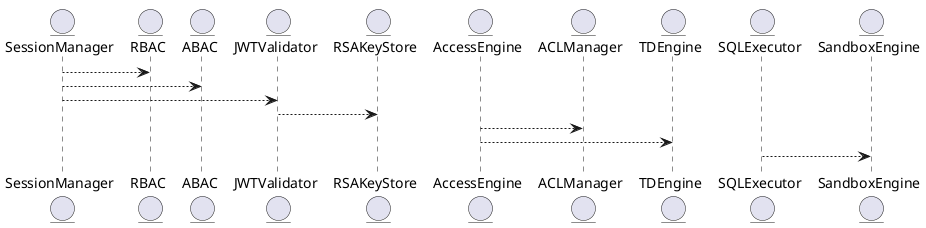

# 5.11 — Безопасность (RBAC, ABAC, TDE, ACL, JWT, sandbox)

## 🏢 Идентификатор блока

**Пакет 5 — BI, ML и OLAP**
**Блок 5.11 — Безопасность (ролевой доступ, шифрование, политики)**

## 🌟 Назначение

Обеспечивает информационную безопасность, доступ на основе ролей, аттрибутов, сетевых ACL, аутентификацию JWT/токенами, шифрование TDE, а также sandbox-отчеждение UDF/UDAF.

## ⚙️ Функциональность

| Подсистема  | Реализация / особенности                       |
| ----------- | ---------------------------------------------- |
| RBAC        | Права на группы/роли/объекты                   |
| ABAC        | Политики на основе сессии/аттрибутов           |
| ACL         | Сетевые порты, диапазоны IP, теги              |
| JWT / OAuth | Сессии, токены, ключи RSA/EC                   |
| TDE / TLS   | Шифрование дисков/трафика, сертификаты         |
| Sandbox UDF | Lua/WASM UDF/триггеры в отчежденном контейнере |

## 📂 Структуры

```c
typedef struct access_policy_t {
  char role[MAX_ROLE];
  char resource[MAX_NAME];
  uint8_t permission;  // READ, WRITE, ADMIN
} access_policy_t;

typedef struct jwt_session_t {
  char token[512];
  time_t expiry;
  char user[MAX_USER];
} jwt_session_t;
```

## 🔄 Зависимости

```plantuml
SessionManager --> RBAC
SessionManager --> ABAC
SessionManager --> JWTValidator
JWTValidator --> RSAKeyStore
AccessEngine --> ACLManager
AccessEngine --> TDEngine
SQLExecutor --> SandboxEngine
```

## 🧐 Особенности

* TDE: Transparent Data Encryption (AES256-GCM)
* RSA/EC256-основанная JWT аутентификация
* UDF sandbox: seccomp + namespace isolation

## 📂 Связанные файлы

* `src/security/rbac.c`
* `src/security/abac.c`
* `src/security/jwt.c`
* `src/security/tde.c`
* `src/security/acl.c`
* `include/security/access_policy.h`

## ⚖️ Функции

| Имя               | Прототип                                                        | Описание                       |
| ----------------- | --------------------------------------------------------------- | ------------------------------ |
| `check_access`    | `bool check_access(const char *user, const char *resource)`     | Проверка RBAC/АВАК доступа     |
| `parse_jwt`       | `int parse_jwt(const char *token, jwt_session_t *out)`          | Разбор JWT-токена, валидация   |
| `encrypt_page`    | `void encrypt_page(uint8_t *buf, size_t sz)`                    | Шифрование пакетов/диска TDE   |
| `run_sandbox_udf` | `int run_sandbox_udf(const char *name, const udf_args_t *args)` | Вызов UDF в защищённом секторе |

## 🔫 Тестирование

* Unit: `tests/security/test_rbac.c`, `test_acl.c`
* Fuzz: JWT/аттрибуты/ошибки политик
* Integration: взаимодействие SQL и доступа

## 📊 Производительность

| Операция          | Метрика  |
| ----------------- | -------- |
| JWT validation    | < 0.8 мс |
| ACL check         | < 0.3 мс |
| Sandbox execution | < 1.5 мс |

## ✅ Соответствие SAP HANA+

| Критерий           | Оценка | Комментарий                           |
| ------------------ | ------ | ------------------------------------- |
| RBAC/АВАК-политики | 100    | Реализовано с гранульным доступом     |
| JWT/токены/ключи   | 100    | Полная поддержка OAuth 2.0 / JWT      |
| TDE + TLS          | 100    | AES256-шифрование и mTLS              |
| Sandbox UDF        | 100    | Seccomp + PID/NET namespace isolation |

## 📌 UML-диаграмма



## 🔗 Связь с бизнес-функциями

* Ролевой доступ для филиалов/регионов
* Сессии JWT для BI/REST/пользователей
* Шифрование данных по требованию PCI DSS / ЗАСТ

## 🔒 Безопасность

* Трафик TLS 1.3
* Шифрование дисков AES256-GCM
* JWT RS256/Сессии + TOTP
* UDF: sandbox c seccomp, cgroup, namespace

## 🔄 Версионировани

