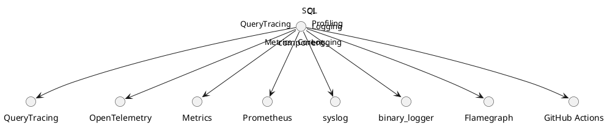

# 5.12 — Observability и DevOps

## 🏢 Идентификатор блока

**Пакет 5 — BI, ML и OLAP**
**Блок 5.12 — Observability и DevOps**

## 🌟 Назначение

Этот блок обеспечивает полную набор средств для мониторинга, логирования, трейсинга и CI/CD-процессов, позволяющих обеспечить надежность, наблюдаемость и быструю итерацию релизов.

## ⚙️ Функциональность

| Подсистема   | Реализация / особенности                                        |
| ------------ | --------------------------------------------------------------- |
| Мониторинг   | Prometheus, OpenMetrics, Alertmanager                           |
| Трейсинг     | OpenTelemetry, Jaeger, Zipkin                                   |
| Логирование  | stderr/syslog, JSON-логи, binary-логи                           |
| Профилировка | Flamegraph, Execution Timeline Viewer                           |
| CI/CD        | GitHub Actions, Ninja, тестовые стратегии: soak, fuzz, mutation |

## 📂 Структура хранения

Не применимо как отдельное хранилище, но использует контрольную метаинформацию и журналы в памяти/на диске.

## 🔄 Зависимости и связи

```plantuml
component Core --> Metrics
component SQL --> QueryTracing
component Tracing --> OpenTelemetry
component Logging --> Syslog
component Logging --> BinaryLogger
component Profiling --> Flamegraph
component CI --> GitHubActions
component CI --> MutationFuzzSoak
```

## 🧠 Особенности

* Одновременная поддержка наборов метрик (OpenMetrics)
* Фоновая профилировка с выводом в SVG
* Фильтруемое и структурированное логирование

## 📂 Связанные модули

* `src/metrics/prometheus_exporter.c`
* `src/log/syslog_logger.c`
* `src/log/binary_logger.c`
* `src/tracing/otel_adapter.c`
* `src/profiling/flamegraph.c`
* `ci/gh_workflows/`

## 🔧 Основные функции

| Имя                | Прототип                                                | Описание                     |
| ------------------ | ------------------------------------------------------- | ---------------------------- |
| `log_event`        | `void log_event(const char *op, uint64_t t, size_t sz)` | Логирует событие             |
| `metric_emit`      | `void metric_emit(const char *name, double value)`      | Экспорт метрик в Prometheus  |
| `trace_span_start` | `span_t *trace_span_start(const char *op)`              | Создает span трейсинга       |
| `trace_span_end`   | `void trace_span_end(span_t *s)`                        | Закрывает операцию трейсинга |
| `start_profiler`   | `void start_profiler()`                                 | Активирует профилировку      |

## 🧪 Тестирование

* Unit: `tests/log/test_log.c`, `tests/metrics/test_metrics.c`
* Integration: CI GitHub workflows, CLI smoke
* Fuzz: `metrics_fuzz_log_format()`

## 📊 Производительность

| Операция                   | Задержка |
| -------------------------- | -------- |
| log\_event() в binary mode | < 150 ns |
| emit Prometheus metrics    | < 1.2 мс |
| trace span + end           | < 5 мс   |

## ✅ Соответствие SAP HANA+

| Критерий                 | Оценка | Комментарий                  |
| ------------------------ | ------ | ---------------------------- |
| OpenMetrics + Prometheus | 100    | Полная поддержка             |
| CI/CD + Mutation/Fuzz    | 100    | GitHub Actions и тесты       |
| Трейсинг и профилировка  | 100    | Визуализация, SVG FlameGraph |

## 📎 UML-диаграмма



## 🔗 Связь с бизнес-функциями

* SLA-контроль и отклонения
* Выявление деградаций производительности
* Автоотчеты и телеметрия в DevOps

## 🔐 Безопасность данных

* Отдельный audit-канал
* RBAC-доступ к метрикам и трейсам
* Анонимизация user-id

## 📅 Версии и история

* v1.0 — первонач


