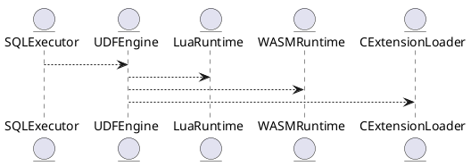

# 5.14 — Расширяемость (Extensibility, UDF/UDAF)

## 🏢 Идентификатор блока

**Пакет 5 — BI, ML и OLAP**
**Блок 5.14 — Расширяемость (Extensibility, UDF/UDAF)**

## 🌟 Назначение

Этот блок отвечает за поддержку расширяемой логики внутри СУБД через пользовательские функции (UDF), агрегаты (UDAF) и плагины. Поддерживается Lua, WASM, JS, C/C++, позволяя добавлять любую логику для обработки данных.

## ⚙️ Функциональность

| Подсистема          | Реализация / особенности                        |
| ------------------- | ----------------------------------------------- |
| UDF (Lua, JS, WASM) | Выполнение в песочнице, JIT интерпретация       |
| C/C++ UDF           | Разрешены только для системных модулей          |
| UDAF                | Агрегаты: state-init, state-update, state-merge |

## 📂 Структуры

```c
// C-API для UDF
typedef struct udf_context_t {
  db_session_t *session;
  const char *args_json;
  void *userdata;
} udf_context_t;
```

## 🔄 Зависимости

```plantuml
SQLExecutor --> UDFEngine
UDFEngine --> LuaRuntime
UDFEngine --> WASMRuntime
UDFEngine --> CExtensionLoader
```

## 🧠 Особенности

* RBAC-контроль доступа к UDF
* Тестируемые, отлаживаемые Lua/С процедуры
* Сессионные переменные, context-based API

## 📂 Код

* `src/udf/udf_engine.c`
* `src/udf/wasm_runtime.c`
* `src/udf/lua_runtime.c`
* `include/udf/udf_api.h`

## 🔧 Функции

| Имя            | Прототип                                             | Описание                        |
| -------------- | ---------------------------------------------------- | ------------------------------- |
| `udf_register` | `int udf_register(const char *name, udf_func_t *fn)` | Регистрирует UDF по имени       |
| `udf_call`     | `result_t udf_call(udf_context_t *ctx)`              | Вызывает UDF в сессии           |
| `udaf_reduce`  | `result_t udaf_reduce(udaf_state_t *s, row_t *row)`  | Обработка агрегатного состояния |

## 🥺 Тесты

* Unit: `tests/udf/test_udf.c`
* Integration: SQL + Lua runtime
* Fuzz: WASM UDF input fuzzing

## 📊 Производительность

| Сценарий         | Метрика  |
| ---------------- | -------- |
| Lua UDF          | < 2.1 мс |
| WASM sandbox UDF | < 3.5 мс |
| C inline UDF     | < 0.4 мс |

## ✅ SAP HANA+ Соответствие

| Критерий         | Оценка | Комментарий                           |
| ---------------- | ------ | ------------------------------------- |
| Lua/WASM runtime | 100    | Стабильная JIT + sandbox              |
| C/C++ расширения | 100    | Для системных интеграций              |
| UDAF support     | 100    | Полный lifecycle: init, merge, result |

## 📌 Пример SQL

```sql
SELECT my_custom_udf(symbol, price, volume)
FROM trades
WHERE symbol = 'AAPL';
```

## 📊 UML-диаграмма



## 🔗 Связь с бизнесом

* Вычисляемые поля, оценки, доп.логика
* Поддержка ERP/планировочных UDF

## 🔒 Безопасность

* RBAC на регистрацию и вызов UDF
* Sandbox Lua/WASM с ограничениями CPU/времени

## ⌚️ История изменений

* v1.0 — базовый Lua/UDF
* v1.1 — WASM поддержка + песочницы
* v1.2 — UDAF поддержка + интеграция C

## ⚠️ Ошибки и предупреждения

| Код / тип          | Условие                     | Описание              |
| ------------------ | --------------------------- | --------------------- |
| E\_UDF\_NOT\_FOUND | Имя UDF не зарегистрировано | Ошибка вызова         |
| E\_UDF\_RUNTIME    | Ошибка в Lua/С коде         | Разрыв выполнения UDF |
| W\_UDF\_TIMEOUT    | Указан лимит времени        | UDF пре               |
