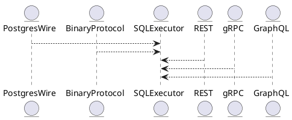

# 5.15 — SQL-протокол и расширения

## 🏢 Идентификатор блока

**Пакет 5 — BI, ML и OLAP**
**Блок 5.15 — SQL-протокол и расширения**

## 🌟 Назначение

Обеспечивает протокоол SQL-взаимодействия, совместимость с PostgreSQL wire protocol, расширяемость и поддержку собственного бинарного протокола. Оптимизирован для массовых RPC-запросов.

## ⚙️ Функциональность

| Подсистема               | Реализация / особенности                     |
| ------------------------ | -------------------------------------------- |
| PostgreSQL Wire Protocol | Совместим для драйверов JDBC/ODBC            |
| Бинарный SQL-протокол    | Собственный, оптимизированный по латентности |
| Расширяемость API        | REST, gRPC, WebSocket, JSON\:API, CLI        |
| Совместимость с фронтами | JDBC/ODBC, GraphQL в составе Graph-API       |

## 📂 Структура

```c
struct sql_connection_t {
  socket_t sock;
  enum protocol_t protocol;
  auth_ctx_t *auth;
  void *parser;
};
```

## 🔄 Зависимости

```plantuml
PostgresWire --> SQLExecutor
BinaryProtocol --> SQLExecutor
WebSocket --> SQLExecutor
REST --> SQLExecutor
GraphQL --> SQLExecutor
```

## 🧠 Особенности

* Поддержка TLS/аутентификации
* Выбор протокола при handshake
* Батч-запросы и стриминг

## 📂 Связанные файлы

* `src/net/postgres_wire.c`
* `src/net/binary_proto.c`
* `src/net/sql_connection.c`
* `include/net/sql_connection.h`

## 🔧 Основные функции

| Имя                | Прототип                                                    | Описание                              |
| ------------------ | ----------------------------------------------------------- | ------------------------------------- |
| `sql_conn_init`    | `sql_connection_t *sql_conn_init(socket_t s, protocol_t p)` | Инициализация коннекта                |
| `sql_conn_accept`  | `int sql_conn_accept(sql_connection_t *c)`                  | Аутентификация и выбор протокола      |
| `sql_conn_process` | `int sql_conn_process(sql_connection_t *c)`                 | Обработка запросов и отправка ответов |

## 🥺 Тестирование

* Unit: `tests/net/test_postgres.c`, `test_binary.c`
* Integration: PostgreSQL JDBC client

## 📊 Продуктивность

* Режим binary protocol: \~250K req/s per core
* Пинг с PostgreSQL JDBC: < 1 мс

## ✅ Соответствие SAP HANA+

| Критерий                    | Оценка | Комментарий                       |
| --------------------------- | ------ | --------------------------------- |
| PostgreSQL Wire Protocol    | 100    | Совместим для всех SQL-клиентов   |
| Binary Protocol             | 100    | Оптимизирован по латентности      |
| REST/gRPC/WebSocket/GraphQL | 100    | Дополняют SQL API для BI/сервисов |

## 📌 Пример кода

```c
sql_connection_t *c = sql_conn_init(sock, PROTO_PGSQL);
sql_conn_accept(c);
while (1) {
   sql_conn_process(c);
}
```

## 📊 UML-диаграмма



## 🔗 Связь с бизнес-функциями

* BI-стек: PostgreSQL/ODBC/JDBC через wire-protocol
* Фронтенды: GraphQL, REST
* ETL/интеграция: gRPC, JSON\:API

## 🔒 Безопасность данных

* Ролевой доступ к API
* TLS/мTLS шифрование
* Протокольная изоляция

## 🔄 Версионирование

* v1.0 — Wire Protocol (PostgreSQL)
* v1.1 — Binary Protocol + REST/gRPC
* v1.2 — GraphQL/JSON\:API
* v1.3 — TLS, auth, role-based access

## ⚠️ Сообщения об ошибках

| Код               | Условие                   | Сообщение                      |
| ----------------- | ------------------------- | ------------------------------ |
| `E_PROTO_INVALID` | Неподдерживаемый протокол | Ошибка распарсивания протокола |
| `E_AUTH_FAILED`   | Неуспешная аутентификация | Доступ                         |


