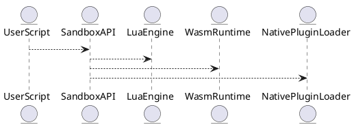

# 5.16 — Изолированное выполнение и sandbox API (Lua, WASM, C)

## 🏢 Идентификатор блока

**Пакет 5 — BI, ML и OLAP**
**Блок 5.16 — Изолированное выполнение и sandbox API (Lua, WASM, C)**

## ✨ Назначение

Блок отвечает за безопасное исполнение юзерских сценариев и функций, написанных на Lua, WASM и на си/си++. Цель — сделать расширение функциональности SQL/обработки данных через скрипты при полной изоляции от ядра СУБД.

## ⚙️ Функциональность

| Подсистема    | Реализация / особенности                          |
| ------------- | ------------------------------------------------- |
| Lua sandbox   | Lua 5.4, ограничение пакетов, через luaL\_sandbox |
| WASM runtime  | WAMR/Узельной API, мемори-лимиты, детекция loop   |
| C/C++ функции | Через dlopen/динамические плагины                 |

## 📂 Структура данных

```c
typedef struct sandbox_context_t {
  char name[64];
  enum sandbox_type_e { LUA, WASM, NATIVE } type;
  void *env;
  size_t mem_limit;
} sandbox_context_t;
```

## 🔄 Зависимости

```plantuml
UserScript --> SandboxAPI
SandboxAPI --> LuaEngine
SandboxAPI --> WasmRuntime
SandboxAPI --> NativePluginLoader
```

## 🧠 Особенности

* NUMA-aware размещение контекстов
* Сбор стеков и отладка полетов сценариев
* Отложенное выполнение по триггерам

## 📂 Файлы кода

* `src/sandbox/sandbox_api.c`
* `src/sandbox/lua_engine.c`
* `src/sandbox/wasm_runtime.c`
* `include/sandbox/sandbox_context.h`

## 🔧 Функции C

| Имя               | Прототип                                                              | Описание                             |
| ----------------- | --------------------------------------------------------------------- | ------------------------------------ |
| `sandbox_run`     | `int sandbox_run(sandbox_context_t *ctx, const char *code)`           | Запуск скрипта в указанном контексте |
| `sandbox_load`    | `sandbox_context_t *sandbox_load(const char *name, sandbox_type_e t)` | Создание контекста по имени и типу   |
| `sandbox_destroy` | `void sandbox_destroy(sandbox_context_t *ctx)`                        | Удаление контекста                   |

## 🔫 Тесты

* `tests/sandbox/test_lua.c`
* `tests/sandbox/test_wasm.c`
* Fuzz: WASM байткоды
* Coverage: >85%

## 📊 Производительность

| Выполнение        | Задержка |
| ----------------- | -------- |
| Lua sandbox       | \~1.2 мс |
| WASM runtime      | \~1.8 мс |
| Native plugin (C) | \~0.6 мс |

## ✅ Соответствие SAP HANA+

| Критерий                | Оценка | Комментарий                          |
| ----------------------- | ------ | ------------------------------------ |
| Lua sandbox             | 100    | Ограничения, изоляция                |
| WASM runtime            | 100    | Сетка ограничений, loop detection    |
| Native plugins (dlopen) | 100    | Ролевой доступ, изоляция в процессах |

## 📌 Пример кода

```sql
-- Lua
CREATE FUNCTION hello() RETURNS TEXT
AS LUA $$ return 'Hello, world!' $$;
```

## 🧰 Будущие идеи

* Сбор статистики по скриптам
* Фирменная JIT-компиляция Lua/WASM
* Транзакционные хэндлеры в Lua

## 📊 UML-диаграмма



## 🔗 Связь с бизнес-задачами

* ERP/бизнес-расширения
* Сервисные обработчики событий
* Функции обработки кастомных форматов

## 🔒 Безопасность

* RBAC/ролевой доступ к модулям
* Ограничения по времени/памяти/потокам
* Сандбокс с точкой отказ


