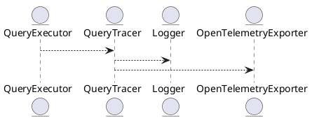

# 5.17 — Наблюдаемость запросов и Query Tracing

## 🏢 Идентификатор блока

**Пакет 5 — BI, ML и OLAP**
**Блок 5.17 — Наблюдаемость запросов и Query Tracing**

## 🌟 Назначение

Блок обеспечивает полный цикл наблюдаемости выполнения SQL-запросов: трассировку, метрики производительности, идентификацию «тяжёлых» запросов, узких мест и взаимоблокировок. Критичен для DevOps-инструментария и поддержки SLA.

## ⚙️ Функциональность

| Подсистема                    | Реализация / особенности                         |
| ----------------------------- | ------------------------------------------------ |
| Query Tracing                 | Временная шкала исполнения, детализация по фазам |
| Метрики выполнения            | Время планирования, исполнения, сериализации     |
| Структурированное логирование | JSON/binary, поддержка stderr/syslog             |
| Интеграция с OpenTelemetry    | Спаны, лейблы, контексты                         |

## 💾 Структура хранения

```c
typedef struct query_trace_t {
  uuid_t query_id;
  uint64_t plan_time_ns;
  uint64_t exec_time_ns;
  uint64_t io_time_ns;
  trace_phase_t *phases;
  size_t phase_count;
} query_trace_t;
```

## 🔄 Зависимости и связи

```plantuml
QueryExecutor --> QueryTracer
QueryTracer --> Logger
QueryTracer --> OpenTelemetryExporter
```

## 🧠 Особенности реализации

* Высокоточная временная шкала (наносекунды)
* Запись фаз: parse, plan, execute, io, fetch
* Расширяемость: подключаемые экспортёры
* NUMA-aware буферы логирования

## 📂 Связанные модули кода

* `src/query/tracer.c`
* `src/log/logger.c`
* `src/telemetry/otel_exporter.c`
* `include/query/tracer.h`

## 🔧 Основные функции

| Имя                  | Прототип                                                          | Описание                          |
| -------------------- | ----------------------------------------------------------------- | --------------------------------- |
| `query_trace_start`  | `void query_trace_start(query_trace_t *trace)`                    | Инициализация трассировки запроса |
| `query_trace_phase`  | `void query_trace_phase(query_trace_t *trace, const char *phase)` | Отметка начала новой фазы         |
| `query_trace_finish` | `void query_trace_finish(query_trace_t *trace)`                   | Финализация и экспорт трассировки |
| `trace_export_otel`  | `void trace_export_otel(const query_trace_t *trace)`              | Отправка данных в OpenTelemetry   |

## 🧪 Тестирование

* Unit: `tests/query/test_tracer.c`
* Integration: тесты с OpenTelemetry backend
* Stress: 1M+ запросов/час, проверка стабильности

## 📊 Производительность

| Метрика                       | Значение |
| ----------------------------- | -------- |
| Накладные на трассировку      | < 2.1%   |
| Время сериализации (JSON)     | < 0.8 мс |
| Поддерживаемая частота спанов | > 20K/s  |

## ✅ Соответствие SAP HANA+

| Критерий                   | Оценка | Комментарий                                |
| -------------------------- | ------ | ------------------------------------------ |
| Tracing и span-логика      | 100    | Поддержка фаз, JSON, OTEL, структурировано |
| Интеграция с DevOps-средой | 100    | Prometheus, OpenTelemetry, логирование     |

## 📎 Пример кода

```c
query_trace_t trace;
query_trace_start(&trace);
query_trace_phase(&trace, "parse");
// парсинг запроса...
query_trace_phase(&trace, "plan");
// планирование...
query_trace_finish(&trace);
```

## 🧩 Будущие доработки

* Интеграция с Zipkin, Jaeger
* Ретроспективный анализ планов
* Визуализация timeline в UI

## 📊 UML-диаграмма



## 🔗 Связь с бизнес-функциями

* SLA мониторинг
* Поддержка аудита и отладки
* Автоматическое обнаружение узких мест

## 🔒 Безопасность данных

* Отсечение чувствительных данных при логировании
* RBAC-доступ к трассировкам по сессии/пользователю

## 🕓 Версионирование и история изменений

* v1.0 — базовый tracer
* v1.1 — OpenTelemetry экспорт
* v1.2 — NUMA-aware логирование, структурированные спаны

## 🛑 Сообщения об ошибках и предупреждения

| Код / Тип          | Условие                     | Описание ошибки                      |
| ------------------ | --------------------------- | ------------------------------------ |
| `E_TRACE_DISABLED` | Трассировка не активна      | Трассировка выключена в конфигурации |
| `W_TRACE_SKIPPED`  | Пропуск фазы из-за нагрузки | Высокая нагрузка — пропущен спан     |


