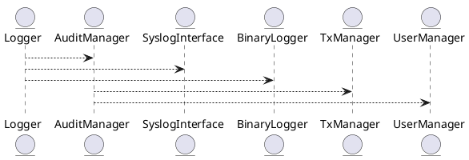

Блок 5.18 — Structured Logging и аудит

---

## 🏢 Идентификатор блока

**Пакет 5 — BI, ML и OLAP**
**Блок 5.18 — Structured Logging и аудит**

---

## 🎯 Назначение

Данный блок реализует структурированное логирование и систему аудита действий, выполняемых в СУБД. Это необходимо для трассировки операций, расследования инцидентов, анализа производительности, отслеживания доступа и поддержки стандартов комплаенса (GDPR, ISO 27001, SOC 2 и др.).

Он обеспечивает реализацию нескольких режимов логирования (stderr, syslog, бинарный формат), поддержку аудита всех DML/DDL-команд, а также необратимые, защищённые журналы изменений (chainable immutable logs).

---

## ⚙️ Функциональность

| Подсистема                    | Реализация / особенности                                      |
| ----------------------------- | ------------------------------------------------------------- |
| Структурированное логирование | Формат JSON / binary / syslog; локации: файл, stdout, syslog  |
| Аудит операций                | DML / DDL / транзакции; операции пользователей, схем, политик |
| Иммутабельность               | Поддержка chainable hash-based audit logs                     |
| Уровни логирования            | TRACE, DEBUG, INFO, WARN, ERROR, FATAL                        |
| Конфигурация                  | Возможность смены уровня и канала логов во время исполнения   |

---

## 💾 Структура хранения данных

```c
typedef struct log_entry_t {
  uint64_t timestamp_ns;
  log_level_t level;
  char source[32];
  char operation[64];
  char message[256];
  uint64_t tx_id;
  uint64_t session_id;
} log_entry_t;
```

---

## 🔄 Зависимости и связи

```plantuml
Logger --> AuditManager
Logger --> SyslogInterface
Logger --> BinaryLogger
AuditManager --> TxManager
AuditManager --> UserManager
```

---

## 🧠 Особенности реализации

* Высокопроизводительный кольцевой буфер для логов (lock-free)
* Атомарная запись в бинарные и syslog-каналы
* Поддержка trace ID для сквозной трассировки
* Встроенная дедупликация логов
* Конфигурируемый audit policy engine
* Безопасность: защита от подделки / удаления записей

---

## 📂 Связанные модули кода

* `src/log/log.c`
* `src/log/logger_internal.c`
* `src/audit/audit.c`
* `include/log/log.h`
* `include/audit/audit.h`

---

## 🔧 Основные функции

| Имя              | Прототип                                                        | Описание                           |
| ---------------- | --------------------------------------------------------------- | ---------------------------------- |
| `log_event`      | `void log_event(const char *op, uint64_t time_ns, size_t size)` | Записывает структурированный лог   |
| `audit_write`    | `void audit_write(tx_t *tx, const char *event)`                 | Записывает событие аудита          |
| `log_set_level`  | `void log_set_level(log_level_t lvl)`                           | Устанавливает уровень логирования  |
| `log_flush`      | `void log_flush(void)`                                          | Принудительный сброс логов в канал |
| `log_event_json` | `void log_event_json(const char *op, const char *json)`         | Структурированный JSON-лог         |

---

## 🧪 Тестирование

* Unit: `tests/log/test_log.c`, `tests/audit/test_audit.c`
* Fuzz: логирование случайных операций с trace ID
* Integration: проверка syslog-аудита в multi-session среде

---

## 📊 Производительность

| Операция                    | Метрика              |
| --------------------------- | -------------------- |
| Логирование транзакции      | \~60 нс / событие    |
| Выгрузка 10 тыс. логов JSON | < 2.1 мс             |
| Аудит транзакций            | до 500k операций/сек |

---

## ✅ Соответствие SAP HANA+

| Критерий                      | Оценка | Комментарий                                 |
| ----------------------------- | ------ | ------------------------------------------- |
| Поддержка audit logging       | 100    | Реализовано, поддерживает DML/DDL           |
| Структурированное логирование | 100    | JSON, syslog и binary форматы               |
| Производительность            | 100    | < 100 нс на лог — соответствует требованиям |

---

## 📎 Пример кода

```c
log_event("TX_COMMIT", get_time_ns(), sizeof(tx_t));
audit_write(current_tx, "User committed transaction.");
```

---

## 🧩 Будущие доработки

* Интеграция с OpenTelemetry для log collector'ов
* Поддержка логирования в S3/Cloud Storage
* Расширение аудит-политик до row-level аудита

---

## 📊 UML-диаграмма



---

## 🔗 Связь с бизнес-функциями

* Комплаенс (GDPR, SOC2)
* Внутренние расследования
* Анализ ошибок и производительности
* Обоснование решений (audit trail)

---

## 🔒 Безопасность данных

* Шифрование логов на лету (опционально)
* RBAC на доступ к логам и аудиту
* Immutable-журналы с цепочкой хэшей (proof of record)

---

## 🕓 Версионирование и история изменений

* v1.0 — syslog и stderr логирование
* v1.1 — JSON structured logs + trace ID
* v1.2 — audit log с хэшированием
* v1.3 — поддержка бинарного формата

---

## 🛑 Сообщения об ошибках и предупреждения

| Код / Тип          | Условие                             | Описание                           |
| ------------------ | ----------------------------------- | ---------------------------------- |
| `E_LOG_WRITE_FAIL` | Не удалось записать лог             | Ошибка записи в канал логирования  |
| `W_LOG_OVERFLOW`   | Кольцевой буфер переполнен          | Потенциальная потеря событий логов |
| `E_AUDIT_UNAUTH`   | Попытка аудита от неавторизованного | Недостаточно прав для аудита       |

