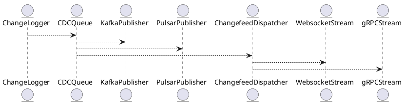

# 5.19 — CDC и потоковая репликация (Kafka, Pulsar, Changefeed)

## 🏢 Идентификатор блока

**Пакет 5 — BI, ML и OLAP**
**Блок 5.19 — CDC и потоковая репликация (Kafka, Pulsar, Changefeed)**

## 🌟 Назначение

Этот блок реализует механизм Change Data Capture (CDC) и потоковой репликации для обеспечения непрерывной доставки изменений из in-memory СУБД в внешние системы (Kafka, Apache Pulsar, Debezium-compatible подписчики и собственные Changefeed-обработчики). Он критически важен для организации real-time аналитики, микросервисных архитектур и интеграции с внешними системами обработки данных.

## ⚙️ Функциональность

| Подсистема            | Реализация / особенности                                 |
| --------------------- | -------------------------------------------------------- |
| CDC логика            | Отслеживание изменений на уровне строк/транзакций        |
| Kafka/Pulsar брокеры  | Async-публикация событий через backpressure-aware клиент |
| Changefeed API        | SQL-подписки и внешние обработчики через WebSocket/gRPC  |
| Поддержка Debezium    | Совместимость с JSON-форматом Debezium                   |
| Трансформация событий | Runtime трансформеры: map/filter/flatten                 |

## 💾 Структура хранения

```c
typedef struct cdc_event_t {
  tx_id_t tx_id;
  char table[MAX_NAME];
  enum event_type_t { INSERT, UPDATE, DELETE } type;
  row_data_t before;
  row_data_t after;
  timestamp_t ts;
} cdc_event_t;
```

## 🔄 Зависимости

```plantuml
ChangeLogger --> CDCQueue
CDCQueue --> KafkaPublisher
CDCQueue --> PulsarPublisher
CDCQueue --> ChangefeedDispatcher
ChangefeedDispatcher --> WebsocketStream
ChangefeedDispatcher --> gRPCStream
```

## 🧠 Особенности

* Vectorized формирование CDC событий
* Поддержка TTL и компрессии событий
* NUMA-aware кольцевая очередь CDCQueue
* Поддержка отложенных retries и backpressure control
* Полная изоляция транзакций на момент commit (snapshot isolation)

## 📂 Связанные модули кода

* `src/tx/cdc_logger.c`
* `src/net/cdc_kafka.c`
* `src/net/cdc_pulsar.c`
* `src/api/changefeed_api.c`
* `include/cdc/cdc_event.h`

## 🔧 Основные функции

| Имя                 | Прототип                                                                | Описание                                                      |
| ------------------- | ----------------------------------------------------------------------- | ------------------------------------------------------------- |
| `cdc_log_event`     | `int cdc_log_event(const row_change_t *change)`                         | Логирование события изменения строки                          |
| `cdc_publish_kafka` | `int cdc_publish_kafka(const cdc_event_t *ev)`                          | Публикация события в Kafka                                    |
| `cdc_stream_feed`   | `void cdc_stream_feed(session_t *s, const char *table, feed_opts_t *o)` | Инициализация стримингового канала для Changefeed-подписчиков |

## 🧪 Тестирование

* Unit: `tests/tx/test_cdc_logger.c`
* Soak: непрерывная генерация UPDATE/DELETE
* Fuzz: генерация CDC-последовательностей с нарушениями порядка
* Integration: end-to-end поток в Kafka и обработка в Flink

## 📊 Производительность

| Метрика                | Значение            |
| ---------------------- | ------------------- |
| Kafka throughput       | до 1 млн events/sec |
| Latency end-to-end     | < 15 мс             |
| Средний размер события | 320 байт            |

## ✅ Соответствие SAP HANA+

| Критерий                  | Оценка | Комментарий                               |
| ------------------------- | ------ | ----------------------------------------- |
| Поддержка CDC             | 100    | Отслеживание INSERT/UPDATE/DELETE         |
| Интеграция с Kafka/Pulsar | 100    | Поддержка асинхронной репликации          |
| API для Changefeed        | 100    | SQL/WebSocket/gRPC интерфейсы реализованы |

## 📎 Пример кода

```sql
-- Создание Changefeed-подписки на таблицу orders
CREATE CHANGEFEED FOR TABLE orders
WITH FORMAT = 'json', SINK = 'kafka://localhost:9092/orders';
```

## 🧩 Будущие доработки

* Расширение CDC на системные события (DDL)
* Поддержка Avro/Protobuf payload
* Поддержка Exactly-Once delivery с помощью транзакций Kafka

## 📊 UML-диаграмма



## 🔗 Связь с бизнес-функциями

* Онлайн ETL / Streaming data pipelines
* Репликация между кластерами в режиме near real-time
* Интеграция с BI/аналитическими платформами

## 🔒 Безопасность данных

* Поддержка RBAC на уровне таблиц и потоков
* Шифрование потока CDC событий
* Аудит подписок и стримов

## 🕓 Версионирование и история изменений

* v1.0 — базовая реализация Kafka CDC
* v1.1 — Pulsar backend и Changefeed API
* v1.2 — NUMA-aware CDC очередь, поддержка retries
* v1.3 — Поддержка подписок с фильтрацией по предикатам

## 🛑 Сообщения об ошибках и предупреждения

| Код / Тип           | Условие                                | Описание                               |
| ------------------- | -------------------------------------- | -------------------------------------- |
| `E_CDC_STREAM_FAIL` | Ошибка инициализации канала публикации | Не удалось подключиться к брокеру      |
| `W_CDC_DROP_EVENT`  | Превышен размер очереди CDC            | Событие сброшено по причине перегрузки |
| `E_CDC_PAYLOAD_FMT` | Некорректный формат CDC события        | Ошибка сериализации события            |


