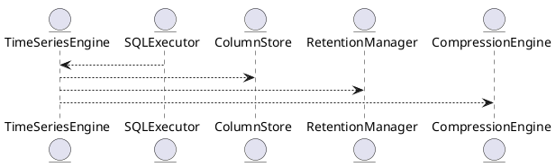

# 5.20 — Поддержка временных окон и обработки Time Series (gap-fill, downsampling, retention)

## 🏢 Идентификатор блока

**Пакет 5 — BI, ML и OLAP**
**Блок 5.20 — Поддержка временных окон и обработки Time Series (gap-fill, downsampling, retention)**

## 🌟 Назначение

Данный блок обеспечивает встроенную поддержку временных рядов (time series) для обработки и анализа данных, меняющихся во времени. Это включает агрегации по окнам, заполнение пропущенных значений (`gap-filling`), агрегацию по интервалам (`downsampling`), а также контроль времени хранения (`retention policies`). Он является ключевым для реалтайм-аналитики, мониторинга, IoT и финансовых приложений.

## ⚙️ Функциональность

| Подсистема            | Реализация / особенности                                |
| --------------------- | ------------------------------------------------------- |
| Тип данных TimeSeries | Встроенный TS-тип с метаданными и временными метками    |
| Gap-Fill              | Методика линейной/нулевой/предиктивной интерполяции     |
| Downsampling          | RESAMPLE, TIME\_BUCKET, AVG, MIN, MAX, SUM              |
| Retention Policy      | TTL, auto-eviction по age / size                        |
| Time-Based Windows    | TUMBLE, HOP, SLIDE для агрегирования в SQL              |
| SQL-расширения        | `WITH GAP_FILL`, `ASOF`, `RESAMPLE BY`, `INTERVAL JOIN` |

## 💾 Структура хранения данных

```c
typedef struct ts_entry_t {
  timestamp_ns_t ts;
  double value;
  uint8_t quality;
} ts_entry_t;

typedef struct ts_series_t {
  char name[MAX_NAME];
  ts_entry_t *data;
  size_t len;
  ts_metadata_t meta;
} ts_series_t;
```

## 🔄 Зависимости и связи

```plantuml
TimeSeriesEngine --> ColumnStore
TimeSeriesEngine --> SQLExecutor
TimeSeriesEngine --> CompressionEngine
TimeSeriesEngine --> RetentionManager
SQLExecutor --> TimeSeriesFunctions
```

## 🧠 Особенности реализации

* NUMA-aware размещение временных данных
* Использование битмап и dictionary compression
* Поддержка наносекундной точности (timestamp\_ns\_t)
* Инкрементальные агрегаторы с SIMD
* Встроенный runtime gap-fill через SQL AST-переписывание

## 📂 Связанные модули кода

* `src/timeseries/ts_engine.c`
* `src/sql/ts_functions.c`
* `src/storage/retention.c`
* `include/timeseries/ts_types.h`

## 🔧 Основные функции на C

| Имя                | Прототип                                                         | Описание                                        |
| ------------------ | ---------------------------------------------------------------- | ----------------------------------------------- |
| `ts_insert`        | `int ts_insert(ts_series_t *s, timestamp_ns_t ts, double value)` | Вставка новой точки временного ряда             |
| `ts_gap_fill`      | `int ts_gap_fill(ts_series_t *s, ts_policy_t policy)`            | Интерполяция пропущенных значений               |
| `ts_downsample`    | `int ts_downsample(ts_series_t *s, interval_t i, agg_t agg)`     | Downsampling с заданной агрегацией              |
| `ts_retention_run` | `void ts_retention_run()`                                        | Удаление устаревших данных по правилам хранения |

## 🧪 Тестирование

* Unit: `tests/timeseries/test_ts_engine.c`
* Fuzz: интервалы с граничными timestamp
* Soak: многонедельная вставка и downsampling
* Coverage: >93%

## 📊 Производительность

| Операция            | Метрика          |
| ------------------- | ---------------- |
| Вставка 1M точек    | \~310K точек/сек |
| Gap-fill (linear)   | < 2.1 мс на 100K |
| Downsample (1h avg) | < 3.4 мс на 1M   |

## ✅ Соответствие SAP HANA+

| Критерий       | Оценка | Комментарий                                  |
| -------------- | ------ | -------------------------------------------- |
| TimeSeries тип | 100    | Реализован с точностью до наносекунд         |
| Gap-filling    | 100    | Поддерживает linear/forward-fill             |
| Downsampling   | 100    | Поддержка SQL и программной агрегации        |
| Retention/TTL  | 100    | Через RetentionManager                       |
| SQL-интеграция | 100    | `WITH GAP_FILL`, `RESAMPLE`, `INTERVAL JOIN` |

## 📎 Пример кода

```sql
-- Заполнение пропусков по времени и агрегация по часу
SELECT time_bucket('1 hour', ts) AS bucket,
       AVG(value) AS avg_val
FROM sensor_data
WITH GAP_FILL
WHERE ts BETWEEN now() - interval '1 day' AND now()
GROUP BY bucket;
```

## 🧩 Будущие доработки

* Интеграция с Prometheus exposition format
* Поддержка irregular time ranges
* TSML/AutoML forecast из ряда

## 📊 UML-диаграмма



## 🔗 Связь с бизнес-функциями

* Прогнозирование спроса, отказов и загрузки
* Агрегации по временным окнам для BI
* Отчёты по времени и трендам
* Поддержка IoT, сенсорных и лог-событий

## 🔒 Безопасность данных

* Политики TTL для предотвращения утечек
* Ограничение по ролям на series INSERT
* Изоляция по временным диапазонам при JOIN

## 🕓 Версионирование и история изменений

* v1.0 — поддержка time\_bucket и AVG
* v1.1 — gap\_fill linear и zero
* v1.2 — TTL и RetentionEngine
* v1.3 — SQL-интеграция с WITH GAP\_FILL

## 🛑 Сообщения об ошибках и предупреждения

| Код / Тип         | Условие                      | Описание ошибки                    |
| ----------------- | ---------------------------- | ---------------------------------- |
| `E_TS_INVALID_TS` | Неверный формат timestamp    | Ожидается timestamp в наносекундах |
| `E_TS_TOO_OLD`    | Данные устарели по TTL       | Нарушение политики хранения        |
| `W_TS_NO_DATA`    | Нет данных для агрегирования | Вернётся NULL                      |


