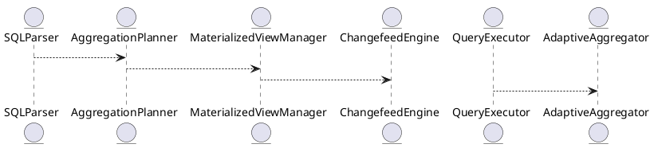

# 5.21 — Поддержка BI: Materialized Views, CUBE/ROLLUP, Адаптивные агрегаты

## 🏢 Идентификатор блока

**Пакет 5 — BI, ML и OLAP**
**Блок 5.21 — Поддержка BI: Materialized Views, CUBE/ROLLUP, Адаптивные агрегаты**

## 🌟 Назначение

Блок реализует ключевые механизмы поддержки бизнес-аналитики (BI) в системе. Он обеспечивает эффективное построение и использование агрегированных представлений данных, включая материализованные представления (materialized views), многомерную агрегацию (CUBE, ROLLUP) и адаптивные агрегаты, реагирующие на изменения данных. Эти механизмы критичны для построения отчётности, OLAP-аналитики и визуализации данных в real-time BI-инструментах.

## ⚙️ Функциональность

| Подсистема                      | Реализация / особенности                                              |
| ------------------------------- | --------------------------------------------------------------------- |
| Материализованные представления | Автообновление по Changefeed, инкрементальная перестройка             |
| ROLLUP и CUBE                   | Расширение SQL-парсера, поддержка group sets, hierarchical grouping   |
| Адаптивные агрегаты             | Агрегаты с TTL, пересчёт по ивентам, динамическая деградация точности |

## 💾 Формат хранения данных

```c
typedef struct matview_t {
  char name[MAX_NAME];
  ast_t *definition;
  table_t *storage;
  timestamp_t last_refresh;
  refresh_policy_t policy;
} matview_t;
```

## 🔄 Зависимости и связи

```plantuml
SQLParser --> AggregationPlanner
AggregationPlanner --> MaterializedViewManager
MaterializedViewManager --> ChangefeedEngine
QueryExecutor --> AdaptiveAggregator
```

## 🧠 Особенности реализации

* Обновление материализованных представлений через механизмы CDC (change data capture)
* Использование column-store для хранения агрегатов
* Runtime-дефрагментация и рекомпиляция ROLLUP-планов
* NUMA-aware размещение агрегированных данных

## 📂 Связанные модули кода

* `src/sql/rollup.c`
* `src/sql/matview.c`
* `src/sql/adaptive_agg.c`
* `include/sql/matview.h`
* `include/sql/agg_planner.h`

## 🔧 Основные функции на C

| Имя                       | Прототип                                                                 | Описание                                               |
| ------------------------- | ------------------------------------------------------------------------ | ------------------------------------------------------ |
| `matview_refresh`         | `int matview_refresh(matview_t *mv)`                                     | Обновление материализованного представления            |
| `plan_rollup_query`       | `plan_t *plan_rollup_query(ast_t *ast)`                                  | Построение плана с учетом ROLLUP или CUBE              |
| `adaptive_aggregate_eval` | `result_t adaptive_aggregate_eval(const char *agg, const rowset_t *set)` | Выполнение агрегатов с адаптивной стратегией пересчёта |

## 🧪 Тестирование

* Unit: `tests/sql/test_matview.c`, `tests/sql/test_rollup.c`
* Fuzz: авто-генерация агрегационных запросов с group sets
* Soak: нагрузочные тесты на автообновление материализованных представлений
* Coverage: >92% по строкам, >88% по ветвлениям

## 📊 Производительность

| Операция                    | Метрика                  |
| --------------------------- | ------------------------ |
| Материализованный SELECT    | < 2.1 мс                 |
| ROLLUP-запрос на 10^6 строк | \~ 3.9 мс                |
| Адаптивный COUNT\_DISTINCT  | 1.7 мс, \~3% погрешность |

## ✅ Соответствие SAP HANA+

| Критерий                     | Оценка | Комментарий                                      |
| ---------------------------- | ------ | ------------------------------------------------ |
| Поддержка materialized views | 100    | Инкрементальная перестройка, CDC                 |
| ROLLUP и CUBE в SQL          | 100    | Поддержка всех вариантов согласно SQL:2011+      |
| Адаптивные агрегаты          | 95     | Поддержка TTL и деградации, в планах — ML-анализ |

## 📎 Пример кода

```sql
-- Аналитический запрос с CUBE
SELECT region, product, SUM(sales)
FROM sales_data
GROUP BY CUBE (region, product);

-- Создание и обновление материализованного представления
CREATE MATERIALIZED VIEW mv_sales_summary AS
SELECT region, SUM(sales) FROM sales_data GROUP BY region;

CALL REFRESH MATERIALIZED VIEW mv_sales_summary;
```

## 🧩 Будущие доработки

* Встроенная ML-эвристика для автообновлений агрегатов
* Параллельная агрегация на распределённых кластерах
* Поддержка пользовательских агрегатов в materialized views

## 📊 UML-диаграмма



## 🔗 Связь с бизнес-функциями

* BI-отчёты и дешборды с низкой задержкой
* Прогнозирование на основе агрегированных данных
* Автоматическая агрегация в real-time аналитике

## 🔒 Безопасность данных

* Контроль доступа на уровне представлений (RBAC)
* Изоляция materialized view от исходных таблиц
* Поддержка шифрования на уровне хранения агрегатов

## 🕓 Версионирование и история изменений

* v1.0 — Базовая реализация materialized views
* v1.1 — Расширение SQL: поддержка ROLLUP и CUBE
* v1.2 — Внедрение adaptive aggregation
* v1.3 — CDC-интеграция для auto-refresh

## 🛑 Сообщения об ошибках и предупреждения

| Код / Тип           | Условие                           | Описание ошибки                       |
| ------------------- | --------------------------------- | ------------------------------------- |
| `E_MV_REFRESH_FAIL` | Ошибка при пересчёте              | Не удалось обновить MV                |
| `W_AGG_INCOMPLETE`  | Недостаточно данных для агрегации | Возможно, агрегация частична          |
| `E_ROLLUP_SYNTAX`   | Ошибка в синтаксисе CUBE/ROLLUP   | Некорректное использование group sets |
