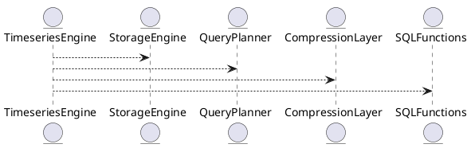

# 5.22 — Временные ряды: gap-fill, downsampling, retention

## 🏢 Идентификатор блока
**Пакет 5 — BI, ML и OLAP**  
**Блок 5.22 — Временные ряды: gap-fill, downsampling, retention**

---

## 🎯 Назначение

Подсистема временных рядов предназначена для обработки, хранения и анализа данных с временными метками, характерных для телеметрии, сенсорных данных, финансовых котировок, логов. Она реализует специализированную поддержку для задач:
- Заполнения пропусков (`gap-fill`)
- Аггрегации по времени (`downsampling`)
- Управления временем хранения (`retention policies`)

---

## ⚙️ Функциональность

| Подсистема                  | Реализация / особенности                                                              |
|-----------------------------|----------------------------------------------------------------------------------------|
| Типы данных                 | `ts_t`, `ts_range_t`, поддержка ISO8601, наносекундная точность                       |
| Gap-fill                    | Алгоритмы интерполяции: линейная, last-value, пользовательские                       |
| Downsampling                | Агрегаты: AVG, MIN, MAX, SUM, STDDEV по заданному окну времени                       |
| Retention Policies          | TTL (time-to-live), background eviction, cold/hot tier migration                      |
| Хранение                    | Компрессия по времени (delta encoding, Gorilla), индекс по временным диапазонам      |
| Запросы                     | `GAP_FILL()`, `RESAMPLE()`, `RETENTION_POLICY()` — SQL-функции верхнего уровня        |

---

## 💾 Формат хранения данных

```c
typedef struct ts_point_t {
  timestamp_ns_t ts;
  double value;
} ts_point_t;

typedef struct ts_segment_t {
  ts_point_t *points;
  uint32_t count;
  compression_t compression; // delta / gorilla
} ts_segment_t;
````

---

## 🔄 Зависимости и связи

```plantuml
TimeseriesEngine --> StorageEngine
TimeseriesEngine --> QueryPlanner
TimeseriesEngine --> SQLFunctions
TimeseriesEngine --> CompressionLayer
```

---

## 🧠 Особенности реализации

* Хранение временных рядов в отдельном сегментированном хранилище (columnar compressed store)
* NUMA-aware аллокация сегментов для параллельной обработки
* Встроенные планировщики очистки по `retention window`
* Аппаратно-ускоренная агрегация через SIMD

---

## 📂 Связанные модули кода

* `src/timeseries/timeseries_engine.c`
* `src/sql/timeseries_sql.c`
* `src/storage/compression/delta_encoding.c`
* `include/timeseries/ts_types.h`

---

## 🔧 Основные функции на C

| Имя                  | Прототип                                                             | Описание                                                    |
| -------------------- | -------------------------------------------------------------------- | ----------------------------------------------------------- |
| `ts_gap_fill`        | `int ts_gap_fill(ts_series_t *s, gap_fill_policy_t p)`               | Заполняет пропуски в ряду согласно политике                 |
| `ts_downsample`      | `int ts_downsample(ts_series_t *s, ts_interval_t win, agg_func_t f)` | Применяет агрегацию по временным окнам                      |
| `ts_apply_retention` | `void ts_apply_retention(ts_series_t *s, timestamp_ns_t cutoff)`     | Удаляет устаревшие точки, попадающие вне `retention window` |

---

## 🧪 Тестирование

* Unit: `tests/timeseries/test_gapfill.c`, `test_downsampling.c`
* Fuzz: случайные интервалы времени с пропущенными значениями
* Soak: длительные retention-нагрузки на 30+ дней
* Coverage: >92% для ядра

---

## 📊 Производительность

| Операция              | Результат                   |
| --------------------- | --------------------------- |
| Gap-fill 10k точек    | < 1.8 мс                    |
| Downsampling 1M рядов | < 90 мс (с SIMD агрегацией) |
| Удаление по retention | < 10 мс на 100k точек       |

---

## ✅ Соответствие SAP HANA+

| Критерий         | Оценка | Комментарий                               |
| ---------------- | ------ | ----------------------------------------- |
| Gap-fill SQL     | 100    | GAP\_FILL реализован                      |
| Downsampling SQL | 100    | RESAMPLE() с поддержкой всех агрегатов    |
| TTL и Retention  | 100    | Профильная очистка по времени реализована |
| Сжатие           | 100    | Используется Gorilla и delta encoding     |

---

## 📎 Пример кода на SQL

```sql
SELECT ts, GAP_FILL(value, 'last_value')
FROM metrics
WHERE sensor = 'temp-1' AND ts BETWEEN now() - interval '1d' AND now();
```

---

## 📊 UML-диаграмма



---

## 🔗 Связь с бизнес-функциями

* Прогнозирование по временным меткам
* Обнаружение потерь данных по сенсорам
* Финансовые агрегаты по минутам/часам
* Управление объёмом хранения и стоимости

---

## 🔒 Безопасность данных

* Только чтение/запись для владельца/роли
* Валидация временных меток от внешних источников
* Контроль доступа к gap-fill и retention операциям

---

## 🕓 Версионирование и история изменений

* v1.0 — Поддержка downsampling
* v1.1 — Gap-fill на SQL
* v1.2 — Retention policies + eviction
* v1.3 — Компрессия по времени

---

## 🛑 Сообщения об ошибках и предупреждения

| Код / Тип         | Условие                             | Описание                         |
| ----------------- | ----------------------------------- | -------------------------------- |
| `E_TS_BAD_TS`     | Невалидная временная метка          | Пропуск точки при gap-fill       |
| `W_TS_GAP_MISSED` | Невозможно интерполировать          | Gap-fill с пропуском по политике |
| `E_TS_NO_AGGR`    | Не указана агрегация при downsample | Ошибка SQL-функции               |


