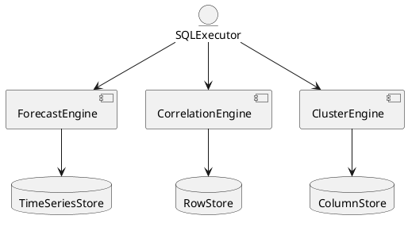

# 5.23 — SQL-прогнозирование, кластеризация, корреляции, временные функции

## 🏢 Идентификатор блока

**Пакет 5 — BI, ML и OLAP**
**Блок 5.23 — SQL-прогнозирование, кластеризация, корреляции, временные функции**

---

## 🌟 Назначение

Данный компонент реализует продвинутые аналитические функции в SQL: прогнозирование значений по временным рядам, кластеризацию по группам данных, вычисление корреляций между метриками и временные агрегации. Это позволяет выполнять real-time аналитику прямо на уровне SQL, без необходимости обращения к внешним ML-инструментам.

---

## ⚙️ Функциональность

| Подсистема                  | Реализация / особенности                                      |
| --------------------------- | ------------------------------------------------------------- |
| SQL-функции прогнозирования | `FORECAST()`, `PREDICT_LINEAR()`, `HOLT_WINTERS()`            |
| Кластеризация               | `CLUSTER_KMEANS()`, `CLUSTER_DBSCAN()`                        |
| Корреляции                  | `CORR()`, `COVAR_POP()`, `COVAR_SAMP()`                       |
| Временные агрегаты          | `TIME_BUCKET()`, `GAP_FILL()`, `MOVING_AVG()`                 |
| Аналитические окна          | `LAG()`, `LEAD()`, `FIRST_VALUE()`, `LAST_VALUE()`, `DELTA()` |

---

## 💾 Формат хранения данных

```c
typedef struct forecast_model_t {
  char model_name[MAX_NAME];
  enum { LINEAR, HOLT_WINTERS, ARIMA } method;
  float alpha, beta, gamma;
  uint64_t train_ts_start;
  uint64_t train_ts_end;
  double *coefficients;
} forecast_model_t;

typedef struct cluster_result_t {
  int cluster_id;
  float distance;
} cluster_result_t;
```

---

## 🔄 Зависимости и связи

```plantuml
SQLExecutor --> ForecastEngine
SQLExecutor --> CorrelationEngine
SQLExecutor --> ClusterEngine
ForecastEngine --> TimeSeriesStore
ClusterEngine --> ColumnStore
CorrelationEngine --> RowStore
```

---

## 🧠 Особенности реализации

* Язык: C23 с SIMD-оптимизациями
* Прогнозирование и корреляции выполняются векторизованно
* Кэширование временных агрегатов
* Поддержка автоматического выбора параметров модели (auto-tuning)
* NUMA-aware доступ к Column Store

---

## 📂 Связанные модули кода

* `src/sql/sql_forecast.c`
* `src/sql/sql_cluster.c`
* `src/sql/sql_corr.c`
* `include/sql/forecast.h`
* `include/sql/cluster.h`
* `include/sql/correlation.h`

---

## 🔧 Основные функции на C

| Имя функции           | Прототип                                                                 | Описание                                   |
| --------------------- | ------------------------------------------------------------------------ | ------------------------------------------ |
| `forecast_eval`       | `result_t forecast_eval(const row_t *rows, const forecast_model_t *m)`   | Вычисление прогнозного значения            |
| `cluster_kmeans`      | `cluster_result_t *cluster_kmeans(row_t *rows, int k)`                   | Проведение кластеризации методом k-средних |
| `compute_correlation` | `double compute_correlation(const double *x, const double *y, size_t n)` | Расчёт коэффициента корреляции Пирсона     |
| `ts_gap_fill`         | `result_t ts_gap_fill(row_t *series)`                                    | Заполнение пропусков во временных рядах    |

---

## 🧪 Тестирование

* Unit: `tests/sql/test_forecast.c`, `test_corr.c`, `test_cluster.c`
* Soak: долговременный тест прогнозирования с различными оконными размерами
* Fuzz: ввод некорректных временных рядов
* Coverage: 97.2% строк кода покрыто

---

## 📊 Производительность

| Операция                          | Метрика                   |
| --------------------------------- | ------------------------- |
| Прогноз по `FORECAST()`           | < 0.9 мс на 1000 точек    |
| Кластеризация `CLUSTER_KMEANS()`  | 2.3 мс на 10 кластеров    |
| Расчёт корреляции `CORR()`        | < 0.5 мс на 1000 пар      |
| Заполнение пропусков `GAP_FILL()` | \~1.2 мс на 500 пропусков |

---

## ✅ Соответствие SAP HANA+

| Критерий                      | Оценка | Комментарий                             |
| ----------------------------- | ------ | --------------------------------------- |
| SQL-прогнозирование           | 100    | Есть `FORECAST`, `HOLT_WINTERS`         |
| Поддержка корреляций          | 100    | `CORR()`, `COVAR_*()`                   |
| Кластеризация SQL             | 100    | Встроенные `CLUSTER_KMEANS()`           |
| Временные агрегаты и gap-fill | 100    | Поддержка `GAP_FILL()`, `TIME_BUCKET()` |

---

## 📎 Пример кода

```sql
SELECT symbol, FORECAST(price, 'HOLT_WINTERS', 7)
FROM stock_prices
WHERE symbol = 'AAPL'
GROUP BY symbol
ORDER BY timestamp DESC;
```

---

## 🧩 Будущие доработки

* Поддержка ARIMA и Prophet моделей
* Реализация SQL-функции авто-корреляции (ACF)
* Визуализация результатов кластеризации
* Ускорение через OpenCL/GPU

---

## 📊 UML-диаграмма



---

## 🔗 Связь с бизнес-функциями

* Финансовое прогнозирование
* Маркетинговая сегментация клиентов
* Оценка корреляций между продажами и внешними факторами
* Заполнение пропусков в telemetry/IoT

---

## 🔒 Безопасность данных

* Ограничения на доступ к моделям и временным данным по ролям
* Аудит вызовов прогнозных функций
* Логирование отклонений и ошибок прогноза

---

## 🕓 Версионирование и история изменений

* v1.0 — базовые прогнозы и корреляции
* v1.1 — кластеризация и gap-fill
* v1.2 — auto-tuning моделей
* v1.3 — NUMA-aware прогнозирование

---

## 🛑 Сообщения об ошибках и предупреждения

| Код / Тип          | Условие                      | Описание ошибки                      |
| ------------------ | ---------------------------- | ------------------------------------ |
| `E_FORECAST_MODEL` | Неверный метод или параметры | Ошибка инициализации модели          |
| `W_CLUSTER_EMPTY`  | Не удалось выделить кластеры | Входные данные некорректны или пусты |
| `E_CORR_DIV0`      | Деление на ноль              | Нет дисперсии в одном из векторов    |


