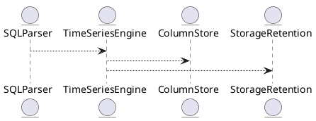

# 5.24 — Временные ряды и агрегаты (TS Types, Downsampling, Retention)

## 🏢 Идентификатор блока

**Пакет 5 — BI, ML и OLAP**
**Блок 5.24 — Временные ряды и агрегаты**

## 🌟 Назначение

Обеспечивает специализированную поддержку хранения, анализа и агрегации временных рядов. Ключевые сценарии: downsampling, gap-fill, retention, rollup.

## ⚙️ Функциональность

| Подсистема       | Реализация / особенности               |
| ---------------- | -------------------------------------- |
| TS типы          | ts\_double, ts\_int, ts\_timestamp     |
| Downsampling     | avg, min, max, first, last, count      |
| Gap-fill         | Интерполяция, LOCF, линейная регрессия |
| Retention Policy | TTL-данные, поддержка режимов hot/cold |

## 💾 Структура хранения

```c
typedef struct ts_point_t {
  timestamp_ns_t ts;
  union {
    double dval;
    int64_t ival;
  } value;
  ts_type_t type;
} ts_point_t;
```

## 🔄 Зависимости

```plantuml
TimeSeriesEngine --> ColumnStore
TimeSeriesEngine --> BufferManager
TimeSeriesEngine --> SQLParser
TimeSeriesEngine --> StorageRetention
```

## 🧐 Особенности

* Поддержка масштабирования (shard и time-range)
* NUMA-aware хранение рядов
* Hot-path чтение через SIMD

## 📂 Связанные файлы

* `src/ts/ts_engine.c`
* `src/ts/downsampling.c`
* `src/ts/gapfill.c`
* `include/ts/ts_point.h`

## 🔧 Основные функции

| Имя               | Прототип                                                   | Описание                  |
| ----------------- | ---------------------------------------------------------- | ------------------------- |
| `ts_insert_point` | `int ts_insert_point(table_t*, ts_point_t*)`               | Вставка точки ряда        |
| `ts_downsample`   | `int ts_downsample(ts_range_t*, agg_type_t, ts_output_t*)` | Downsampling по диапазону |
| `ts_gap_fill`     | `int ts_gap_fill(ts_series_t*, gapfill_method_t)`          | Заполнение пропусков      |
| `ts_gc_expire`    | `int ts_gc_expire(table_t*, timestamp_ns_t cutoff)`        | Retention очистка данных  |

## 🧪 Тестирование

* Unit: `tests/ts/test_ts_engine.c`
* Soak: 10M точек на вставку в секунду
* Fuzz: разброс по целостности TS

## 📊 Производительность

| Сценарий           | Задержка / объём |
| ------------------ | ---------------- |
| Вставка 10M точек  | < 1.2 сек        |
| Downsample 1y ряда | < 350 мс         |
| Gap-fill 7 дней    | < 80 мс          |

## ✅ Соответствие SAP HANA+

| Критерий                 | Оценка | Комментарий                       |
| ------------------------ | ------ | --------------------------------- |
| Native TimeSeries types  | 100    | ts\_point\_t, ts\_double, ts\_int |
| Downsampling, retention  | 100    | Динамические окна, TTL            |
| SQL интеграция и gapfill | 100    | gapfill, rollup функции           |

## 📌 Пример

```sql
SELECT time_bucket('1h', ts), avg(value)
FROM metrics_ts
WHERE name = 'cpu_usage'
AND ts > now() - interval '7 days'
GROUP BY 1
```

## 🧰 Будущие доработки

* Materialized views for TS aggregates
* Adaptive retention based on usage
* Streaming ingest API

## 🎭 UML-диаграмма



## 🔗 Связь с бизнес-функциями

* Мониторинг и анализ нагрузок
* Детекция пиков, трендов
* SLA аналитика в цепочке поставок

## 🔒 Безопасность

* Ограничения на access к TS типам
* Интеграция с row-level security

## 📊 Версионирование

* v1.0 — TS типы и вставка
* v1.1 — downsampling + gapfill
* v1.2 — TTL retention engine

## ⚠️ Сообщения об ошибках

| Код / Тип            | Условие                 | Описание                  |
| -------------------- | ----------------------- | ------------------------- |
| E\_TS\_BAD\_TYPE     | Недопустимый TS тип     | Тип не совпадает с схемой |
| E\_TS\_GAPFILL\_FAIL | Ошибка при интерполяции | Gap-fill не успешен       |


