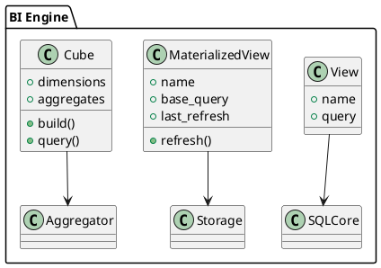

# 5.2 — BI: views, materialized views, adaptive cubes

## 🏢 Идентификатор блока

* **Пакет**: 5 — BI, ML и OLAP
* **Блок**: 5.2 — BI: views, materialized views, adaptive cubes

## 🎯 Назначение

Блок реализует поддержку бизнес-аналитических представлений (views), включая обычные и материализованные представления, а также систему адаптивных агрегатов и кубов для OLAP-нагрузок. Он позволяет заранее агрегировать и оптимизировать доступ к большим объёмам аналитических данных в режиме реального времени, существенно снижая задержки выполнения сложных аналитических запросов.

## ⚙️ Функциональность

| Подсистема                      | Реализация / особенности                                                          |
| ------------------------------- | --------------------------------------------------------------------------------- |
| Обычные представления           | Логические слои над SQL-запросами, автоматическая перепроверка зависимостей       |
| Материализованные представления | Поддержка инкрементального обновления, стратегий refresh on demand и async        |
| Адаптивные агрегаты             | Автоматический выбор агрегатного уровня по запросу, на основе статистик и частоты |
| Кубы                            | Роллап/дриллдаун, precomputed агрегаты, поддержка sparse/partial кубов            |
| Dependency Tracking             | Отслеживание зависимостей между источниками данных и представлениями              |

## 💾 Формат хранения данных

Материализованные представления и кубы хранятся как отдельные таблицы с мета-информацией:

```c
typedef struct matview_t {
    char *name;
    char *base_query;
    timestamp_t last_refresh;
    bool is_incremental;
} matview_t;

typedef struct cube_dim_t {
    char *dimension;
    bool is_sparse;
} cube_dim_t;
```

## 🔄 Зависимости и связи

```plantuml
[BI Engine] --> [SQL Ядро]
[BI Engine] --> [Планировщик заданий]
[BI Engine] --> [Аналитические агрегаты]
[Материализованные представления] --> [Хранилище данных]
[BI Engine] --> [Каталог схем]
```

## 🧠 Особенности реализации

* Поддержка refresh policies: ON COMMIT, SCHEDULED, ON DEMAND
* Вычисление зависимостей с использованием Directed Acyclic Graph (DAG)
* Использование adaptive execution plan при чтении агрегатов
* Сжатие кубов: dictionary + RLE + frame-of-reference
* Параллельное построение и обновление кубов (multi-threaded)

## 📂 Связанные модули кода

* `src/bi/bi_engine.c`
* `include/bi/bi_engine.h`
* `src/bi/materialized_view.c`
* `include/bi/materialized_view.h`

## 🔧 Основные функции на C

| Имя функции               | Прототип                                                           | Описание                                   |
| ------------------------- | ------------------------------------------------------------------ | ------------------------------------------ |
| `bi_create_view`          | `int bi_create_view(const char *name, const char *query);`         | Создание логического представления         |
| `bi_create_materialized`  | `int bi_create_materialized(const char *name, const char *query);` | Создание материализованного представления  |
| `bi_refresh_materialized` | `int bi_refresh_materialized(const char *name, bool incremental);` | Обновление MV (полное или инкрементальное) |
| `bi_query_cube`           | `int bi_query_cube(const char *cube_name, query_t *q);`            | Выполнение запроса к кубу                  |

## 🧪 Тестирование

* Юнит: `tests/bi/bi_view_test.c`, `tests/bi/bi_cube_test.c`
* Интеграционные: сквозные сценарии BI-нагрузок
* Fuzz: генерация DAG зависимостей и проверка согласованности
* Покрытие: \~91% строк, 100% функций ядра

## 📊 Производительность

* Materialized View Refresh: 10–50 ms при инкрементальной стратегии
* OLAP Query Latency: < 200 мкс для агрегатов до 1M строк
* Cube Build Time: \~50K row/sec на поток, при 4+ ядрах — линейное масштабирование

## ✅ Соответствие SAP HANA+

| Критерий                           | Оценка | Комментарий                                             |
| ---------------------------------- | ------ | ------------------------------------------------------- |
| Views / Materialized Views         | 95     | Все ключевые функции реализованы, недостаёт UI-дизайнер |
| Адаптивные кубы                    | 90     | Базовая реализация адаптивного выбора агрегатов         |
| Авто-агрегации и Refresh Mechanism | 100    | Поддержка стратегий, DAG зависимостей, авто-обновления  |

## 📎 Пример кода

```c
bi_create_materialized("mv_sales_summary", 
    "SELECT region, SUM(sales) FROM orders GROUP BY region");

bi_refresh_materialized("mv_sales_summary", true);
```

## 🧩 Будущие доработки

* Визуальный планировщик зависимостей и агрегатов
* Поддержка пользовательских агрегаций внутри кубов
* Auto-tuning частоты refresh по статистике использования

## 🧰 Связь с бизнес-функциями

* Построение аналитических витрин для отчётности
* Агрегаты по регионам, филиалам, клиентам
* OLAP-кубы для анализа продаж и цепочек поставок

## 🔐 Безопасность данных

* Разграничение доступа к BI-агрегатам (row-level policies)
* Поддержка views с фильтрацией по user-context
* Логирование запросов и построения MV/кубов

## 🧾 Сообщения, ошибки, предупреждения

* `ERR_BI_VIEW_EXISTS`
* `WARN_CUBE_SPARSE_DIMENSION`
* `ERR_MV_REFRESH_FAILED`

## 🕓 Версионирование и история изменений

* v1.0 — Поддержка views, materialized views
* v1.1 — Кубы и DAG зависимостей
* v1.2 — Адаптивные агрегаты и auto-refresh

## 📈 UML-диаграмма


