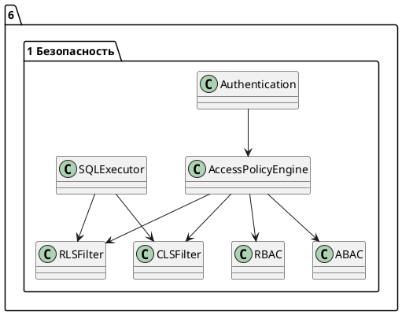

# 6.1 — Механизмы безопасности (RBAC, ABAC, RLS, CLS)

## 🏢 Идентификатор блока

**Пакет 6 — Безопасность**
**Блок 6.1 — Механизмы безопасности (RBAC, ABAC, RLS, CLS)**

## 🌟 Назначение

Блок отвечает за реализацию политик доступа к данным на уровне пользователей, ролей и атрибутов. Он обеспечивает разграничение прав доступа по ролям (RBAC), атрибутам (ABAC), а также на уровне строк и столбцов (RLS/CLS), что критично для обеспечения изоляции данных в многоарендных средах и соблюдения требований по безопасности.

## ⚙️ Функциональность

| Подсистема                  | Реализация / особенности                                             |
| --------------------------- | -------------------------------------------------------------------- |
| Ролевая модель (RBAC)       | Иерархия ролей, наследование, multiple role assignment               |
| Атрибутивная модель (ABAC)  | Access Policy Engine с eval-сценариями и predicate expression        |
| RLS (Row-Level Security)    | Фильтрация строк на стадии исполнения, контекстно-зависимая политика |
| CLS (Column-Level Security) | Динамическая маскировка, запрет чтения/записи по колонкам            |

## 💾 Формат хранения данных

```c
typedef struct access_policy_t {
  char role[MAX_ROLE];
  char object[MAX_OBJECT];
  access_mode_t mode;    // READ, WRITE, EXEC
  char condition[MAX_EXPR]; // Предикат для ABAC / RLS
} access_policy_t;
```

## 🔄 Зависимости и связи

```plantuml
Authentication --> AccessPolicyEngine
AccessPolicyEngine --> RBAC
AccessPolicyEngine --> ABAC
AccessPolicyEngine --> RLSFilter
AccessPolicyEngine --> CLSFilter
SQLExecutor --> RLSFilter
SQLExecutor --> CLSFilter
```

## 🧠 Особенности реализации

* Поддержка контекстно-зависимого запроса (session-level attributes)
* Политики задаются в декларативном DSL
* Используется предварительная компиляция политик
* Минимизация overhead'а через inlined-предикаты

## 📂 Связанные модули кода

* `src/security/rbac.c`
* `src/security/abac.c`
* `src/security/rls.c`
* `src/security/cls.c`
* `include/security/access_policy.h`

## 🔧 Основные функции на C

| Имя                 | Прототип                                                                 | Описание                            |
| ------------------- | ------------------------------------------------------------------------ | ----------------------------------- |
| `check_rbac_access` | `bool check_rbac_access(user_t *u, const char *obj, access_mode_t m)`    | Проверка доступа на основе ролей    |
| `eval_abac_policy`  | `bool eval_abac_policy(session_t *s, const access_policy_t *p)`          | Оценка предиката ABAC-политики      |
| `apply_rls_filter`  | `query_plan_t *apply_rls_filter(session_t *s, const query_plan_t *plan)` | Внедрение фильтров RLS в SQL-план   |
| `apply_cls_mask`    | `void apply_cls_mask(row_t *r, const cls_policy_t *p)`                   | Маскировка данных по CLS при чтении |

## 🧪 Тестирование

* Unit: `tests/security/test_rbac.c`, `test_abac.c`, `test_rls.c`
* Fuzz: eval выражений и предикатов
* Integration: попытки несанкционированного доступа

## 📊 Производительность

| Операция       | Задержка          |
| -------------- | ----------------- |
| Проверка RBAC  | < 0.2 мс          |
| Фильтрация RLS | < 0.5 мс / запрос |
| Маскировка CLS | < 0.3 мс / строка |

## ✅ Соответствие SAP HANA+

| Критерий                 | Оценка | Комментарий                                  |
| ------------------------ | ------ | -------------------------------------------- |
| RBAC                     | 100    | Полная реализация, включая иерархии          |
| ABAC                     | 100    | Политики с eval DSL                          |
| Row-Level Security (RLS) | 100    | Контекстно-зависимая фильтрация              |
| Column-Level Security    | 100    | Маскирование, запреты на чтение и обновление |

## 📎 Пример кода

```sql
-- Таблица с политикой RLS
CREATE TABLE patients (
  id INT,
  name TEXT,
  diagnosis TEXT
) WITH RLS;

-- Пример политики
CREATE POLICY rls_patient_access
  ON patients
  FOR SELECT
  USING (user_department = department);
```

## 🧩 Будущие доработки

* Визуальный редактор политик RBAC/ABAC
* Поддержка временных политик (valid from / to)
* Интеграция с внешними IAM-системами (LDAP, OAuth)

## 📊 UML-диаграмма



## 🔗 Связь с бизнес-функциями

* Защита персональных данных (GDPR, HIPAA)
* Разграничение доступа в SaaS-средах
* Финансовые и государственные ограничения доступа

## 🔒 Безопасность данных

* RLS/CLS проверяются на каждом запросе
* Политики нельзя обойти даже при прямом доступе к данным
* Все политики логируются и версионируются

## 🕓 Версионирование и история изменений

* v1.0 — RBAC + CLS
* v1.1 — ABAC + выражения
* v1.2 — Полный RLS + контекст сессии
* v1.3 — Поддержка логирования политик

## 🛑 Сообщения об ошибках и предупреждения

| Код / Тип          | Условие                   | Описание ошибки                      |
| ------------------ | ------------------------- | ------------------------------------ |
| `E_POLICY_DENIED`  | Нарушена политика доступа | Запрещено согласно RBAC/RLS/CLS      |
| `E_RLS_FILTER_ERR` | Некорректный предикат     | Ошибка при обработке условия фильтра |
| `W_CLS_MASKING`    | Маскирование данных       | Столбец был частично замаскирован    |
