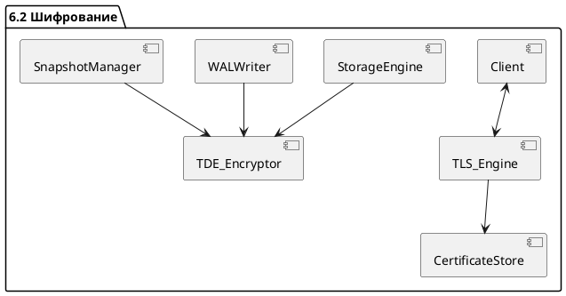

# 6.2 — Шифрование и защита на транспортном/дисковом уровне (TLS, TDE, Forward Secrecy)

## 🏢 Идентификатор блока

**Пакет 6 — Безопасность**
**Блок 6.2 — Шифрование и защита на транспортном/дисковом уровне (TLS, TDE, Forward Secrecy)**

## 🌟 Назначение

Блок обеспечивает защиту данных как при передаче по сети, так и при хранении в памяти и на NVMe-дисках. Он реализует TLS/mTLS для сетевого трафика, шифрование на уровне страниц (TDE — Transparent Data Encryption), а также протоколы с прямой секретностью (Forward Secrecy), что критично для защиты данных в распределённых и публичных средах.

## ⚙️ Функциональность

| Подсистема         | Реализация / особенности                                     |
| ------------------ | ------------------------------------------------------------ |
| TLS / mTLS         | Поддержка TLS 1.3 с mTLS, серверные и клиентские сертификаты |
| TDE                | Шифрование страниц WAL и Snapshot с пер-табличными ключами   |
| Forward Secrecy    | ECDHE + ephemeral session keys                               |
| Ключевое хранилище | Защита ключей в памяти, KMIP совместимость                   |

## 💾 Формат хранения данных

```c
typedef struct encryption_context_t {
  uint8_t master_key[32];
  uint8_t table_key[32];
  uint8_t iv[16];
  cipher_alg_t alg;
} encryption_context_t;
```

## 🔄 Зависимости и связи

```plantuml
Client <--> TLS_Engine
TLS_Engine --> CertificateStore
StorageEngine --> TDE_Encryptor
WALWriter --> TDE_Encryptor
SnapshotManager --> TDE_Encryptor
```

## 🧠 Особенности реализации

* Используется AES-256-GCM / ChaCha20-Poly1305
* Аппаратное ускорение через AES-NI / AVX2
* Перезапись ключей в памяти (zero-on-free)
* Возможность смены ключей и key rotation

## 📂 Связанные модули кода

* `src/security/tls_engine.c`
* `src/security/tde_encryptor.c`
* `src/security/keyvault.c`
* `include/security/encryption_context.h`

## 🔧 Основные функции на C

| Имя                | Прототип                                                      | Описание                            |
| ------------------ | ------------------------------------------------------------- | ----------------------------------- |
| `tls_init_server`  | `int tls_init_server(const char *cert, const char *key)`      | Инициализация TLS-сервера           |
| `tde_encrypt_page` | `void tde_encrypt_page(page_t *p, encryption_context_t *ctx)` | Шифрует страницу для записи         |
| `tde_decrypt_page` | `bool tde_decrypt_page(page_t *p, encryption_context_t *ctx)` | Расшифровка страницы при чтении     |
| `key_rotate_table` | `int key_rotate_table(const char *table)`                     | Обновление ключа шифрования таблицы |

## 🧪 Тестирование

* Unit: `tests/security/test_tls.c`, `test_tde.c`
* Integration: TLS handshake, WAL encrypted replay
* Soak: длительные TLS-сессии, массовая смена ключей

## 📊 Производительность

| Операция                | Метрика         |
| ----------------------- | --------------- |
| TLS Handshake (ECDHE)   | < 5.1 мс        |
| WAL Encryption per page | \~1.8 µs        |
| Decryption throughput   | >1.1 GB/s (AES) |

## ✅ Соответствие SAP HANA+

| Критерий        | Оценка | Комментарий                 |
| --------------- | ------ | --------------------------- |
| TLS / mTLS      | 100    | Полноценная реализация      |
| TDE             | 100    | По страничному шифрованию   |
| Forward Secrecy | 100    | Поддерживается ECDHE        |
| Key management  | 100    | Перезапись и ротация ключей |

## 📎 Пример кода

```c
// Шифрование страницы WAL
page_t *p = ...;
encryption_context_t ctx = get_encryption_ctx("orders");
tde_encrypt_page(p, &ctx);
```

## 🧩 Будущие доработки

* Поддержка HSM (Hardware Security Module)
* Асимметричные ключи для TDE
* KMIP-протокол для внешних Vault-систем

## 📊 UML-диаграмма



## 🔗 Связь с бизнес-функциями

* Защита коммерчески чувствительных данных
* Соответствие нормативам: ISO 27001, GDPR, FIPS-140
* Поддержка безопасных соединений с BI/ETL-инструментами

## 🔒 Безопасность данных

* Защита данных при передаче и хранении
* Переключение ключей без остановки системы
* Политики допуска к ключам: RBAC и зоны доверия

## 🕓 Версионирование и история изменений

* v1.0 — TLS 1.2 / 1.3
* v1.1 — TDE для WAL + Snapshots
* v1.2 — Эфемерные сессии и Forward Secrecy
* v1.3 — AES-NI ускорение и ротация ключей

## 🛑 Сообщения об ошибках и предупреждения

| Код / Тип          | Условие                        | Описание ошибки              |
| ------------------ | ------------------------------ | ---------------------------- |
| `E_TLS_HANDSHAKE`  | Ошибка установления TLS-сессии | Неверный сертификат или ключ |
| `E_TDE_ENCRYPTION` | Ошибка шифрования страницы     | Проблема с контекстом или IV |
| `W_KEY_ROTATION`   | Истек срок действия ключа      | Требуется ротация ключей     |
