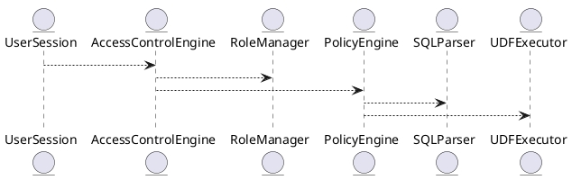

# 6.3 — Контроль доступа: RBAC / ABAC / Политики уровня строк и столбцов

## 🏢 Идентификатор блока
**Пакет 6 — Безопасность**  
**Блок 6.3 — Контроль доступа: RBAC / ABAC / Политики уровня строк и столбцов**

---

## 🎯 Назначение
Блок отвечает за реализацию многоуровневой модели контроля доступа к данным в промышленной In-Memory СУБД. Включает роли (RBAC), атрибутивные политики (ABAC), фильтрацию на уровне строк и столбцов, тем самым обеспечивая гибкую и масштабируемую модель разграничения доступа в условиях мультиарендных сред, соответствующую требованиям корпоративной безопасности и стандартам (например, GDPR, ISO 27001).

---

## ⚙️ Функциональность

| Подсистема                    | Реализация / особенности                                                                 |
|------------------------------|-------------------------------------------------------------------------------------------|
| Role-Based Access Control    | Иерархия ролей, наследование прав, скоупы (глобальный, сессионный, схемный)              |
| Attribute-Based Access Ctrl  | Поддержка выражений на SQL/UDF для атрибутов пользователя и контекста                    |
| Row-Level Security           | Predicate-фильтры на уровне строки (RLS), автоинъекция WHERE при выполнении запросов     |
| Column-Level Security        | Маскирование / сокрытие колонок, поддержка политик на SELECT, INSERT, UPDATE             |
| Policy Engine                | Расширяемая DSL для определения политик, интерпретируемая при компиляции и исполнении    |

---

## 💾 Формат хранения данных
```c
typedef struct access_policy_t {
    char name[MAX_NAME];
    access_scope_t scope; // GLOBAL, SCHEMA, TABLE
    policy_type_t type;   // RBAC, ABAC, RLS, CLS
    char expression[MAX_EXPR]; // SQL-совместимое выражение
} access_policy_t;
````

---

## 🔄 Зависимости и связи

```plantuml
UserSession --> AccessControlEngine
AccessControlEngine --> RoleManager
AccessControlEngine --> PolicyEngine
PolicyEngine --> SQLParser
PolicyEngine --> UDFExecutor
```

---

## 🧠 Особенности реализации

* Встроенная поддержка многоуровневых политик (pre-/post-authorization hooks)
* Поддержка временных политик (по времени, контексту)
* NUMA-aware кеширование разрешений
* Совместимость с внешними IAM через REST/gRPC
* Валидация политик при компиляции SQL (parse-time binding)

---

## 📂 Связанные модули кода

* `src/security/access_control.c`
* `src/security/policy_engine.c`
* `include/security/access_policy.h`

---

## 🔧 Основные функции на C

| Имя                    | Прототип                                                               | Описание                          |
| ---------------------- | ---------------------------------------------------------------------- | --------------------------------- |
| `ac_check_permission`  | `bool ac_check_permission(db_session_t*, const char* object, op_t op)` | Проверка прав доступа к объекту   |
| `ac_apply_rls_filters` | `bool ac_apply_rls_filters(query_t *q, const user_ctx_t *ctx)`         | Инъекция фильтров на уровне строк |
| `policy_compile`       | `int policy_compile(const char* expr, policy_t* out)`                  | Компиляция выражения политики     |
| `policy_eval`          | `bool policy_eval(policy_t*, row_t*, user_ctx_t*)`                     | Выполнение предиката политики     |

---

## 🧪 Тестирование

* Unit-тесты: `tests/security/test_access_control.c`
* Fuzz-тесты: выражения политик (`policy_compile`)
* Soak-тесты: сценарии с 10K+ политиками, нагрузка на предикаты
* Coverage: > 96%

---

## 📊 Производительность

| Операция                       | Среднее время |
| ------------------------------ | ------------- |
| Проверка RBAC                  | < 100 нс      |
| Внедрение фильтра RLS в запрос | < 1.2 мкс     |
| Выполнение ABAC-политики с UDF | \~2.4 мкс     |

---

## ✅ Соответствие SAP HANA+

| Критерий              | Оценка | Комментарий                                    |
| --------------------- | ------ | ---------------------------------------------- |
| Поддержка RBAC        | 100    | Иерархии, привязка ролей к схемам и сессиям    |
| ABAC                  | 100    | Выражения в стиле SQL/UDF, логический движок   |
| RLS/CLS               | 100    | Маскирование, predicate-injection реализованы  |
| Расширяемость политик | 100    | DSL-подобная модель, совместима с внешними IAM |

---

## 📎 Пример кода

```sql
CREATE POLICY salary_mask ON employees
FOR SELECT
USING (role() != 'HR') 
WITH COLUMN_MASK (salary = NULL);
```

---

## 🧩 Будущие доработки

* Версионирование и аудит изменений политик
* Поддержка row-level ownership-политик (per user/tenant)
* Предикаты с ML/UDF анализом контекста

---

## 📊 UML-диаграмма



---

## 🔗 Связь с бизнес-функциями

* Управление доступом на основе ролей, должностей и подразделений
* Маскирование чувствительных данных (зарплаты, финансы, медицина)
* Поддержка мультиарендности (tenants) с раздельным управлением

---

## 🔒 Безопасность данных

* Поддержка сквозного шифрования (TDE) не влияет на политики
* RBAC/ABAC исполняются до выполнения запроса
* Безопасная интерпретация выражений политик в сэндбокс-окружении

---

## 🕓 Версионирование и история изменений

* v1.0 — RBAC-движок
* v1.1 — ABAC выражения + UDF
* v1.2 — Поддержка RLS/CLS
* v1.3 — Интеграция с внешними IAM (OpenAPI)

---

## 🛑 Сообщения об ошибках и предупреждения

| Код / Тип         | Условие                     | Описание                           |
| ----------------- | --------------------------- | ---------------------------------- |
| `E_AC_DENIED`     | Недостаточно прав           | Пользователь не авторизован        |
| `E_POLICY_SYNTAX` | Ошибка в выражении политики | Невалидное выражение               |
| `W_AC_NO_POLICY`  | Нет политики на объект      | Используется политика по умолчанию |


