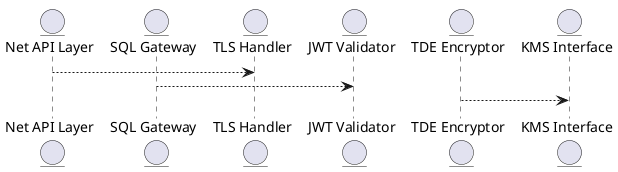

# 6.4 — Шифрование и защита соединений (TLS / mTLS / JWT / TDE)

## 🏢 Идентификатор блока

**Пакет 6 — Безопасность**
**Блок 6.4 — Шифрование и защита соединений (TLS / mTLS / JWT / TDE)**

## 🌟 Назначение

Данный блок реализует многоуровневую защиту канала и хранимых данных с помощью современных криптографических протоколов и механизмов, включая TLS 1.3, взаимную аутентификацию (mTLS), токены доступа (JWT) и прозрачное шифрование данных на диске (TDE). Это необходимо для обеспечения конфиденциальности, целостности и аутентификации как во внутреннем RPC/SQL-трафике, так и на внешних API-интерфейсах.

## ⚙️ Функциональность

| Подсистема                        | Реализация / особенности                                    |
| --------------------------------- | ----------------------------------------------------------- |
| TLS / mTLS                        | TLS 1.3 с ECDHE, поддержка двусторонней аутентификации      |
| JWT                               | Подпись токенов (RS256), верификация, срок действия         |
| Transparent Data Encryption (TDE) | AES-256-GCM, ключи через KMS, шифрование page-level         |
| API Access Layer                  | Шифрование REST/gRPC/SQL, перехватчик сертификатов          |
| Key Rotation                      | Периодическая смена ключей, zero-downtime ключевой rollover |

## 💾 Структура хранения

```c
// Ключи TLS
typedef struct tls_cert_t {
  char subject[256];
  uint8_t *cert_data;
  size_t cert_len;
} tls_cert_t;

// Метаданные ключа шифрования
typedef struct tde_key_metadata_t {
  uuid_t key_id;
  time_t created_at;
  bool active;
} tde_key_metadata_t;
```

## 🔄 Зависимости

```plantuml
[Net API Layer] --> [TLS Handler]
[SQL Gateway] --> [JWT Validator]
[Storage Engine] --> [TDE Encryptor]
[Admin UI] --> [TLS Handler]
[TDE Encryptor] --> [KMS Interface]
```

## 🧠 Особенности реализации

* OpenSSL и BoringSSL совместимая абстракция
* Поддержка аппаратных HSM и внешнего KMS (AWS, Vault)
* Sandbox ограничение при работе с ключами
* Верификация цепочки доверия для клиентов и серверов

## 📂 Связанные модули кода

* `src/security/tls_handler.c`
* `src/security/tde.c`
* `src/security/jwt.c`
* `src/net/net_secure.c`
* `include/security/tls.h`

## 🔧 Основные функции

| Имя              | Прототип                                                    | Описание                         |
| ---------------- | ----------------------------------------------------------- | -------------------------------- |
| `tls_init`       | `int tls_init(const char *cert_path, const char *key_path)` | Инициализация TLS и сертификатов |
| `jwt_validate`   | `bool jwt_validate(const char *token, const char *pubkey)`  | Проверка JWT-токена              |
| `tde_encrypt`    | `int tde_encrypt(page_t *pg, tde_key_t *key)`               | Шифрование страницы данных       |
| `tde_rotate_key` | `int tde_rotate_key(uuid_t new_key_id)`                     | Атомарная ротация ключа          |

## 🧪 Тестирование

* Unit: `tests/security/test_tls.c`, `test_tde.c`, `test_jwt.c`
* Integration: подключение через CLI/REST/gRPC с валидацией сертификатов
* Fuzz: проверка PEM/DER входов и JWT-заголовков
* Coverage: > 94%

## 📊 Производительность

| Операция                  | Метрика          |
| ------------------------- | ---------------- |
| TLS-рукопожатие (avg)     | \~2.1 мс         |
| JWT-проверка              | < 0.4 мс         |
| Шифрование страницы (TDE) | \~1.7 мс на 8 KB |

## ✅ Соответствие SAP HANA+

| Критерий                       | Оценка | Комментарий                              |
| ------------------------------ | ------ | ---------------------------------------- |
| TLS/mTLS                       | 100    | Полноценная поддержка двустороннего TLS  |
| JWT с ролями и сроком действия | 100    | Поддержка RS256 и RBAC на основе токенов |
| Transparent Data Encryption    | 100    | Шифрование страниц, key rollover, audit  |
| KMS/HSM                        | 90     | Есть абстракция, возможно расширение     |

## 📎 Пример кода

```c
// Проверка JWT перед SQL-запросом
if (!jwt_validate(token, public_key)) {
    return ERR_AUTH_FAILED;
}
```

## 🧩 Будущие доработки

* Поддержка TLS 1.3 PSK
* Встроенный KMS с GUI-интерфейсом
* Поддержка автоматического discovery сертификатов

## 📊 UML-диаграмма



## 🔗 Связь с бизнес-функциями

* Обеспечение конфиденциальности клиентских данных
* Защита API-интерфейсов и межсервисных вызовов
* Шифрование коммерческой информации на уровне хранения

## 🔒 Безопасность данных

* Проверка цепочек доверия TLS
* Ограничение сертификатов по дате/субъекту
* Ротация ключей и журнал доступа к ним

## 🕓 Версионирование и история изменений

* v1.0 — TLS и JWT
* v1.1 — добавлена поддержка TDE
* v1.2 — интеграция с внешним KMS

## 🛑 Сообщения об ошибках и предупреждения

| Код / Тип         | Условие                   | Описание ошибки                      |
| ----------------- | ------------------------- | ------------------------------------ |
| `E_TLS_HANDSHAKE` | Ошибка TLS                | Не удалось установить TLS-соединение |
| `E_JWT_INVALID`   | Неверный токен            | Токен подписи не прошёл проверку     |
| `W_KEY_ROTATE`    | Истёк срок действия ключа | Необходима ротация ключа             |


