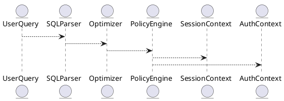

# 6.6 — Политики доступа и правила безопасности (Access Policies, Predicate Rules)

## 🏢 Идентификатор блока

**Пакет 6 — Безопасность**
**Блок 6.6 — Политики доступа и правила безопасности (Access Policies, Predicate Rules)**

---

## 🌟 Назначение

Данный блок реализует механизм политик доступа на уровне строк, столбцов и представлений. Он предоставляет гибкий способ ограничения видимости и управления действиями пользователей с использованием предикатных правил, основанных на контексте запроса, ролях, сессии и других атрибутах.

Политики безопасности формируют критически важную прослойку между уровнем данных и конечными пользователями, гарантируя соответствие нормативным требованиям и сегментацию доступа в многопользовательских средах.

---

## ⚙️ Функциональность

| Подсистема                   | Реализация / особенности                                                             |
| ---------------------------- | ------------------------------------------------------------------------------------ |
| Row-Level Security (RLS)     | Фильтрация строк через политики: `CREATE POLICY ... USING predicate_expr`            |
| Column-Level Masking         | Маскирование столбцов: `MASKED WITH expression`                                      |
| Predicate Injection          | Динамическое встраивание условий в план выполнения запроса                           |
| Policy Engine                | Централизованный механизм обработки политик доступа                                  |
| Контекстная авторизация      | Доступ на основе пользовательских атрибутов, ролей, времени, IP                      |
| Атрибуты сессии и переменные | Использование session variables в предикатах (например, `session_user`, `tenant_id`) |
| Совместимость с RBAC/ABAC    | Интеграция с моделями ролей и атрибутивного контроля                                 |

---

## 💾 Формат хранения данных

```c
typedef struct access_policy_t {
  char table[MAX_NAME];
  char role[MAX_ROLE];
  char predicate[MAX_EXPR];
  bool is_enabled;
  bool row_level;
  bool column_mask;
} access_policy_t;
```

Политики сохраняются в системном каталоге безопасности и применяются на этапе анализа и оптимизации SQL-запросов.

---

## 🔄 Зависимости и связи

```plantuml
UserQuery --> SQLParser
SQLParser --> Optimizer
Optimizer --> PolicyEngine
PolicyEngine --> AuthContext
PolicyEngine --> SessionContext
```

* **PolicyEngine** взаимодействует с SQL-парсером и оптимизатором для внедрения фильтров доступа.
* **AuthContext** предоставляет информацию о текущем пользователе и его ролях.
* **SessionContext** используется для динамических условий, основанных на переменных сессии.

---

## 🧠 Особенности реализации

* Написан на **C23** (ядро движка), с использованием **JIT-предикатов** для минимального оверхеда.
* Поддержка **NUMA-aware** кеширования политик.
* Предикаты **оптимизируются и компилируются** один раз на сессию.
* Политики кешируются в сегменте shared-memory и обновляются через notifications.

---

## 📂 Связанные модули кода

* `src/security/policy_engine.c`
* `src/sql/predicate_injector.c`
* `src/session/session_context.c`
* `include/security/access_policy.h`

---

## 🔧 Основные функции

| Имя                    | Прототип                                                           | Описание                                             |
| ---------------------- | ------------------------------------------------------------------ | ---------------------------------------------------- |
| `policy_eval_row`      | `bool policy_eval_row(row_t *r, access_policy_t *p, session_t *s)` | Проверяет соответствие строки заданной политике      |
| `policy_inject_pred`   | `ast_t *policy_inject_pred(ast_t *stmt, session_t *s)`             | Модифицирует AST SQL-запроса, добавляя предикаты     |
| `load_access_policies` | `int load_access_policies(void)`                                   | Загружает политики из системного каталога            |
| `policy_is_visible`    | `bool policy_is_visible(column_t *col, session_t *s)`              | Определяет видимость столбца в соответствии с маской |

---

## 🧪 Тестирование

* Unit-тесты: `tests/security/test_policy_engine.c`
* Fuzzing: предикатные выражения и AST-модификация
* Integration: проверка RLS/CLS на SQL-запросах с разными ролями
* Mutation testing: подмена условий в политике для валидации блокировок

---

## 📊 Производительность

| Операция                    | Метрика   |
| --------------------------- | --------- |
| Внедрение политики в план   | < 120 мкс |
| Оценка предиката на строку  | < 100 нс  |
| Маскирование столбца        | < 90 нс   |
| Загрузка всех политик (1К+) | < 8 мс    |

---

## ✅ Соответствие SAP HANA+

| Критерий                    | Оценка | Комментарий                                       |
| --------------------------- | ------ | ------------------------------------------------- |
| Row-level security          | 100    | Полная RLS, динамические условия                  |
| Column masking              | 100    | Есть маскирование по ролям и выражениям           |
| Policy management API       | 100    | Политики загружаются, управляются SQL-интерфейсом |
| Влияние на план оптимизации | 100    | Политики интегрированы в фазу планирования        |

---

## 📎 Пример кода

```sql
-- Политика доступа к таблице transactions
CREATE POLICY tenant_rls
  ON transactions
  FOR ROLE 'tenant_user'
  USING tenant_id = SESSION_USER_TENANT();

-- Маскирование номера карты
ALTER TABLE payments
  ALTER COLUMN card_number MASKED WITH '****-****-****-' || RIGHT(card_number, 4);
```

---

## 🧩 Будущие доработки

* UI-интерфейс для создания политик (в web-панели)
* Визуализация политик в плане выполнения
* Поддержка временных политик (временные окна)

---

## 📊 UML-диаграмма



---

## 🔗 Связь с бизнес-функциями

* Разграничение доступа к конфиденциальной информации клиентов
* Соблюдение требований GDPR, PCI-DSS, HIPAA
* Ограничение видимости и операций по ролям и арендаторам (multi-tenant)

---

## 🔒 Безопасность данных

* Все политики хранятся в зашифрованной системной области
* Полный аудит всех операций с политиками
* Только пользователи с правом `SECURITY_ADMIN` могут управлять политиками

---

## 🕓 Версионирование и история изменений

| Версия | Изменение                                |
| ------ | ---------------------------------------- |
| v1.0   | Базовая реализация RLS и masking         |
| v1.1   | Поддержка переменных сессии и предикатов |
| v1.2   | Интеграция в планировщик и оптимизатор   |
| v1.3   | Маскирование столбцов через выражения    |

---

## 🛑 Сообщения об ошибках и предупреждения

| Код                | Условие                  | Описание                                       |
| ------------------ | ------------------------ | ---------------------------------------------- |
| `E_POLICY_DENY`    | Предикат ложен           | Доступ запрещён согласно политике              |
| `W_POLICY_MISSING` | Нет политики для таблицы | Таблица без политик, логируется предупреждение |
| `E_MASK_EVAL`      | Ошибка в выражении маски | Некорректное выражение маскирования            |
