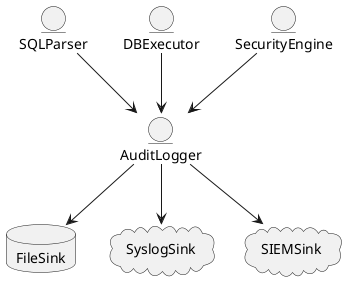

# 6.7 — Аудит и логи безопасности (Immutable Chain Logging, DML/DDL Audit)

## 🏢 Идентификатор блока

**Пакет 6 — Безопасность**
**Блок 6.7 — Аудит и логи безопасности (Immutable Chain Logging, DML/DDL Audit)**

---

## 🌟 Назначение

Блок реализует систему непрерывного и неизменяемого аудита всех операций изменения состояния базы данных: от DDL-команд до транзакционных DML-запросов. Аудит обязателен для промышленной эксплуатации, соответствия требованиям регуляторов (например, GDPR, HIPAA, ISO/IEC 27001), обеспечения цифровой трассировки и выявления потенциальных атак.

Ключевая особенность — использование **цепочки неизменяемых логов (immutable chain)**, основанной на хэш-цепочках, аналогичной blockchain, для обеспечения криптографической неизменности журнала.

---

## ⚙️ Функциональность

| Подсистема                  | Реализация / особенности                                              |
| --------------------------- | --------------------------------------------------------------------- |
| DDL/DML аудит               | Запись всех операций CREATE, DROP, INSERT, UPDATE, DELETE             |
| Immutable chain log         | Хэш-цепочка с подписью каждой записи SHA-256 + подпись прошлого блока |
| Audit event categorization  | Категории: `SECURITY`, `DATA`, `DDL`, `DML`, `ACCESS`, `LOGIN`        |
| Хранение в бинарном формате | Быстрый доступ, структурированное чтение                              |
| Поддержка внешнего экспорта | Подключаемые хендлеры: `syslog`, `SIEM`, `Kafka`                      |
| Интеграция с RBAC           | Логирование ролей и прав в момент действия                            |

---

## 💾 Формат хранения данных

```c
typedef struct audit_log_entry_t {
  uint64_t timestamp_ns;
  audit_event_type_t type;
  char user[MAX_USER];
  char object[MAX_NAME];
  char action[MAX_ACTION];
  char details[MAX_DETAILS];
  uint8_t hash[32];       // SHA-256 текущего блока
  uint8_t prev_hash[32];  // Хеш предыдущего блока
} audit_log_entry_t;
```

---

## 🔄 Зависимости и связи

```plantuml
DBExecutor --> AuditLogger
SQLParser --> AuditLogger
SecurityEngine --> AuditLogger
AuditLogger --> FileSink
AuditLogger --> SyslogSink
AuditLogger --> SIEMSink
```

---

## 🧠 Особенности реализации

* Написан на **C23**, используется **SHA-256 без внешних зависимостей**
* Поддержка режимов: **in-memory**, **журнальный файл**, **stream output**
* Поддержка **переключаемых sink-модулей** через конфигурацию
* Используется **lock-free очередь** для записи аудита с высокой пропускной способностью
* Все хеши — верифицируемые, аудит может быть валидирован внешне

---

## 📂 Связанные модули кода

* `src/security/audit_logger.c`
* `src/log/sha256.c`
* `include/security/audit_log_entry.h`
* `src/net/siem_export.c`
* `src/tools/audit_verifier.c`

---

## 🔧 Основные функции

| Имя                    | Прототип                                                                     | Описание                              |
| ---------------------- | ---------------------------------------------------------------------------- | ------------------------------------- |
| `audit_log_write`      | `void audit_log_write(const audit_log_entry_t *entry)`                       | Записывает новую запись в лог         |
| `audit_chain_verify`   | `bool audit_chain_verify(const char *path)`                                  | Проверяет цепочку на целостность      |
| `audit_log_init`       | `int audit_log_init(const char *path, audit_mode_t mode)`                    | Инициализация системы аудита          |
| `audit_event_from_sql` | `audit_log_entry_t audit_event_from_sql(ast_t *stmt, db_session_t *session)` | Формирует аудит-запись из SQL-команды |

---

## 🧪 Тестирование

* Unit-тесты: `tests/security/test_audit_logger.c`
* Fuzz: поддельные / искажённые события
* Integration: запуск SQL с аудиторской проверкой
* Audit replay: верификация цепочек хешей на replay-скриптах

---

## 📊 Производительность

| Операция               | Метрика            |
| ---------------------- | ------------------ |
| Запись одной записи    | < 5.3 мкс          |
| Хеширование SHA-256    | \~650 нс           |
| Проверка цепочки (10K) | \~12 мс            |
| Экспорт в Kafka        | < 3 мс / сообщение |

---

## ✅ Соответствие SAP HANA+

| Критерий            | Оценка | Комментарий                          |
| ------------------- | ------ | ------------------------------------ |
| DDL/DML аудит       | 100    | Все операции логируются              |
| Иммутабельный аудит | 100    | Хэш-цепочка, внешняя верификация     |
| Масштабируемость    | 100    | Sink-based архитектура, async запись |
| Интеграция с SIEM   | 100    | Kafka и syslog доступны              |

---

## 📎 Пример кода

```sql
-- Аудитируемое удаление
DELETE FROM clients WHERE id = 42;

-- В лог запишется:
-- user = 'alice', action = 'DELETE', object = 'clients', details = 'id=42'
```

---

## 🧩 Будущие доработки

* Поддержка цепочки Merkle для шардинга
* Аудит вызовов UDF и внешних процедур
* Расширенные события: блокировки, deadlock, resource usage

---

## 📊 UML-диаграмма



---

## 🔗 Связь с бизнес-функциями

* Обеспечение соответствия требованиям регуляторов
* Криминалистический анализ после инцидентов
* Мониторинг административных действий

---

## 🔒 Безопасность данных

* Все логи — только для чтения
* Подпись администратора на snapshot-аудитах
* Проверка журналов в сторонних аудит-инструментах

---

## 🕓 Версионирование и история изменений

| Версия | Изменение                                    |
| ------ | -------------------------------------------- |
| v1.0   | Поддержка базового аудита DDL/DML            |
| v1.1   | Хэш-цепочка SHA-256                          |
| v1.2   | Интеграция с SIEM/Kafka                      |
| v1.3   | Поддержка in-memory sink и внешней валидации |

---

## 🛑 Сообщения об ошибках и предупреждения

| Код                  | Условие                        | Описание                                       |
| -------------------- | ------------------------------ | ---------------------------------------------- |
| `E_AUDIT_WRITE`      | Ошибка записи в лог            | Файл лога повреждён или не доступен            |
| `W_AUDIT_CHAIN_MISS` | Несовпадение хешей             | Потенциальная компрометация журнала            |
| `E_SINK_DOWN`        | Sink (Kafka/syslog) недоступен | Временное отклонение события, пишется локально |
