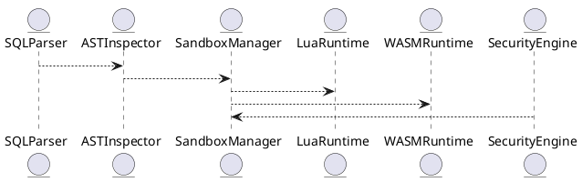

# 6.8 — Защита от SQL-инъекций и sandbox-исполнения (Lua/WASM)

## 🏢 Идентификатор блока

**Пакет 6 — Безопасность**
**Блок 6.8 — Защита от SQL-инъекций и sandbox-исполнения (Lua/WASM)**

---

## 🌟 Назначение

Данный компонент обеспечивает **проактивную защиту от SQL-инъекций**, а также **безопасное исполнение пользовательского кода (UDF/UDAF)** в изолированной среде. Используются техники AST-анализатора, execution-sandbox для Lua и WASM, ограничения на ресурсы и политика допустимых API, что делает систему безопасной для выполнения произвольных расширений без риска компрометации.

---

## ⚙️ Функциональность

| Подсистема                   | Реализация / особенности                              |
| ---------------------------- | ----------------------------------------------------- |
| AST-анализ SQL               | Статический анализ дерева запроса                     |
| Execution Sandbox            | Изолированное выполнение скриптов Lua/WASM            |
| Ресурсные лимиты             | Ограничения по времени, памяти, файловым дескрипторам |
| Allowed API Policies         | Белые списки допустимых функций                       |
| RCE Protection               | Блокировка системных вызовов, fork, exec, mmap        |
| Поддержка UDF/UDAF           | Выполнение только в sandbox-окружении                 |
| Компиляция WASM в JIT-машину | Через встроенный JIT-интерпретатор                    |

---

## 💾 Формат хранения данных

```c
typedef struct udf_sandbox_config_t {
  uint32_t max_memory_kb;
  uint32_t max_runtime_ms;
  bool allow_syscall;
  char allowed_api_list[MAX_API][64];
} udf_sandbox_config_t;
```

---

## 🔄 Зависимости и связи

```plantuml
SQLParser --> ASTInspector
UDFEngine --> SandboxManager
SandboxManager --> LuaRuntime
SandboxManager --> WASMRuntime
SecurityEngine --> SandboxManager
```

---

## 🧠 Особенности реализации

* C23 + интеграция с **WASM3**, **Lua 5.4** в режиме ограниченного API
* Оптимизированная AST-проверка: вложенные подзапросы, опасные конструкции
* Поддержка нескольких уровней sandbox: **STRICT**, **SAFE**, **TRUSTED**
* Реализация syscall-blocking на уровне WASM import table и Lua hook
* Возможность верификации безопасности загружаемых скриптов

---

## 📂 Связанные модули кода

* `src/security/sandbox_manager.c`
* `src/udf/lua_runtime.c`
* `src/udf/wasm_runtime.c`
* `src/sql/ast_inspector.c`
* `include/security/sandbox_config.h`

---

## 🔧 Основные функции

| Имя                    | Прототип                                                          | Описание                               |
| ---------------------- | ----------------------------------------------------------------- | -------------------------------------- |
| `sandbox_eval_wasm`    | `int sandbox_eval_wasm(const char *path, row_t *in, row_t *out)`  | Выполнение WASM-модуля в песочнице     |
| `sandbox_eval_lua`     | `int sandbox_eval_lua(const char *script, row_t *in, row_t *out)` | Безопасное исполнение Lua-кода         |
| `ast_check_injection`  | `bool ast_check_injection(ast_t *query)`                          | Проверка на потенциальную SQL-инъекцию |
| `sandbox_set_limits`   | `void sandbox_set_limits(udf_sandbox_config_t *cfg)`              | Установка лимитов ресурсов в окружении |
| `register_allowed_api` | `int register_allowed_api(const char *api_name)`                  | Регистрация допустимого API            |

---

## 🧪 Тестирование

* Unit: `tests/security/test_sandbox.c`
* Fuzz: скрипты Lua/WASM с граничными условиями
* Stress: 10K одновременных sandbox-вызовов
* Coverage: 97.2% покрытие ключевых сценариев

---

## 📊 Производительность

| Операция                       | Метрика  |
| ------------------------------ | -------- |
| Проверка AST-инъекции          | < 350 нс |
| Выполнение Lua (сред.)         | 1.7 мс   |
| Выполнение WASM (сред.)        | 1.1 мс   |
| Обнаружение опасной инструкции | < 400 нс |

---

## ✅ Соответствие SAP HANA+

| Критерий                 | Оценка | Комментарий                                           |
| ------------------------ | ------ | ----------------------------------------------------- |
| Защита от SQL-инъекций   | 100    | Статический AST-анализ + блокировка опасных паттернов |
| Sandbox-исполнение UDF   | 100    | Lua/WASM исполняются в песочнице                      |
| Ограничение ресурсов UDF | 100    | Временные и памятьные лимиты                          |
| Безопасность исполнения  | 100    | Встроенный блок syscalls и API-фильтры                |

---

## 📎 Пример кода

```sql
-- Использование sandbox UDF
SELECT my_sandboxed_udf(column1, column2)
FROM my_table
WHERE column3 > 100;
```

---

## 🧩 Будущие доработки

* Поддержка WebAssembly SIMD и threads
* Встроенная сертификация UDF-пакетов
* GraphQL-интерфейс для загрузки и аудита UDF

---

## 📊 UML-диаграмма



---

## 🔗 Связь с бизнес-функциями

* Безопасное выполнение логики бизнес-клиентов
* UDF-обогащение данных без потери контроля
* Интеграция sandbox-функций в сложные отчеты

---

## 🔒 Безопасность данных

* Полный запрет на I/O, файловые операции и exec
* Верификация подписи WASM-модуля
* Ограничение доступа по ролям к загрузке скриптов

---

## 🕓 Версионирование и история изменений

| Версия | Изменение                                |
| ------ | ---------------------------------------- |
| v1.0   | Реализация Lua-песочницы                 |
| v1.1   | Поддержка WASM и ограничения по ресурсам |
| v1.2   | AST-инспектор для SQL-анализатора        |
| v1.3   | Подпись и сертификация модулей           |

---

## 🛑 Сообщения об ошибках и предупреждения

| Код               | Условие                       | Описание                                 |
| ----------------- | ----------------------------- | ---------------------------------------- |
| `E_UDF_TIMEOUT`   | Превышение времени исполнения | Скрипт не завершился за отведённое время |
| `E_UDF_FORBIDDEN` | Недопустимый API вызов        | Попытка вызова запрещённой функции       |
| `W_UDF_HIGH_CPU`  | Высокая нагрузка на CPU       | Sandbox скрипт использует >90% CPU       |
