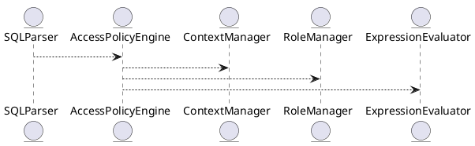

# 6.9 — Политики доступа и движок Access Policy Engine

## 🏢 Идентификатор блока

**Пакет 6 — Безопасность**
**Блок 6.9 — Политики доступа и движок Access Policy Engine**

---

## 🌟 Назначение

Access Policy Engine (APE) — это модуль контроля доступа на уровне строк, столбцов и условий запроса. Он обеспечивает декларативное и программное задание политик безопасности, автоматическое применение фильтрации в SQL-планах, а также централизованное управление ролями, атрибутами и пользовательскими контекстами (ABAC, RBAC).

---

## ⚙️ Функциональность

| Подсистема              | Реализация / особенности                            |
| ----------------------- | --------------------------------------------------- |
| Row-Level Security      | Фильтрация строк по user/role/attribute             |
| Column-Level Security   | Маскирование/скрытие столбцов                       |
| RBAC                    | Классическая ролевка, вложенные роли                |
| ABAC                    | Атрибутно-ориентированный контроль (user.attr == X) |
| Policy DSL              | Встроенный язык политик безопасности                |
| Enforcement Engine      | Инжекция политики в AST SQL                         |
| Context-aware execution | Привязка контекста (tenant\_id, region, clearance)  |

---

## 💾 Формат хранения данных

```c
typedef struct access_policy_t {
  char policy_id[64];
  policy_scope_t scope;      // ROW, COLUMN
  expr_ast_t *condition;     // AST выражение
  char target_table[64];
  char target_column[64];    // optional
  char role[64];             // optional
} access_policy_t;
```

---

## 🔄 Зависимости и связи

```plantuml
SQLParser --> AccessPolicyEngine
AccessPolicyEngine --> ContextManager
AccessPolicyEngine --> RoleManager
AccessPolicyEngine --> ExpressionEvaluator
```

---

## 🧠 Особенности реализации

* Использование compile-time и runtime enforcement
* Преобразование SQL AST с применением политик
* Поддержка tenant isolation, multi-tenant-режим
* Runtime context propagation (через db\_session\_t)
* Компиляция политик в BPF-подобные фильтры (в будущем)

---

## 📂 Связанные модули кода

* `src/security/access_policy_engine.c`
* `src/sql/sql_parser.c`
* `src/sql/policy_injector.c`
* `include/security/access_policy.h`

---

## 🔧 Основные функции

| Имя                     | Прототип                                                                | Описание                                     |
| ----------------------- | ----------------------------------------------------------------------- | -------------------------------------------- |
| `policy_eval_ast`       | `void policy_eval_ast(ast_t *tree, db_session_t *s)`                    | Инжекция политик в дерево SQL-запроса        |
| `policy_register`       | `int policy_register(access_policy_t *p)`                               | Регистрация новой политики доступа           |
| `policy_list_for_user`  | `list_t *policy_list_for_user(const char *user, const char *table)`     | Получение списка применимых политик          |
| `context_set_attribute` | `void context_set_attribute(db_session_t *s, const char *key, val_t v)` | Установка контекстных атрибутов пользователя |

---

## 🧪 Тестирование

* Unit: `tests/security/test_policy_engine.c`
* Soak: сценарии с 10k+ политиками на разные таблицы
* Fuzz: AST-модификация при разных SQL шаблонах
* Integration: RLS+ABAC на многотенантных данных

---

## 📊 Производительность

| Операция                     | Метрика       |
| ---------------------------- | ------------- |
| Инжекция политик в AST       | \~ 400–600 нс |
| Выборка RLS+ABAC             | < 1.5 мс      |
| Расширение контекста запроса | \~ 80–150 нс  |

---

## ✅ Соответствие SAP HANA+

| Критерий              | Оценка | Комментарий                               |
| --------------------- | ------ | ----------------------------------------- |
| Row-Level Security    | 100    | Полноценная фильтрация строк              |
| Column-Level Security | 100    | Маскирование, условная фильтрация         |
| ABAC-поддержка        | 100    | Поддерживаются произвольные user-атрибуты |
| DSL для политик       | 100    | Доступен декларативный синтаксис          |
| Runtime контексты     | 100    | Поддерживается настройка per-session      |

---

## 📎 Пример кода

```sql
-- Применение политики в SQL
SELECT * FROM accounts
WHERE region = CURRENT_USER_CONTEXT('region')
  AND role = 'auditor';
```

---

## 🧩 Будущие доработки

* JIT-компиляция политик в bytecode
* Консоль администратора политик (web)
* Расширение на CDC и внешние источники

---

## 📊 UML-диаграмма



---

## 🔗 Связь с бизнес-функциями

* Ограничение доступа к строкам/полям по отделам
* Защита персональных данных и коммерческой тайны
* Управление политиками для партнёров и мульти-аренды

---

## 🔒 Безопасность данных

* Аудит применения политик
* Обязательность политик для чувствительных таблиц
* Отказ от "оптимистического доступа" при отсутствии контекста

---

## 🕓 Версионирование и история изменений

| Версия | Изменение                              |
| ------ | -------------------------------------- |
| v1.0   | Поддержка RLS и RBAC                   |
| v1.1   | ABAC и выражения в политике            |
| v1.2   | Runtime контексты и session-переменные |
| v1.3   | DSL-синтаксис и компиляция политик     |

---

## 🛑 Сообщения об ошибках и предупреждения

| Код                 | Условие                         | Описание                                    |
| ------------------- | ------------------------------- | ------------------------------------------- |
| `E_POLICY_DENIED`   | Политика запретила запрос       | Пользователь не имеет доступа к данным      |
| `W_POLICY_FALLBACK` | Не найдены политики для таблицы | Запрос выполнен без фильтрации (логируется) |
