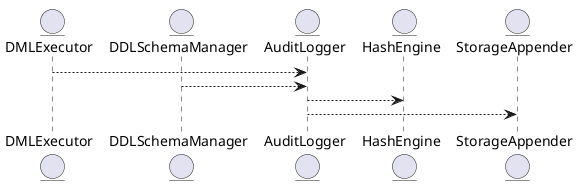

# 6.10 — Журналирование и аудит DML/DDL-операций (Immutable Chain Logging)

## 🏢 Идентификатор блока

**Пакет 6 — Безопасность**
**Блок 6.10 — Журналирование и аудит DML/DDL-операций (Immutable Chain Logging)**

---

## 🌟 Назначение

Данный блок обеспечивает полный аудит операций изменения данных (DML) и структуры БД (DDL) в неизменяемом формате. Журнал реализует цепочку записей с хеш-связями (Immutable Chain), позволяя гарантировать целостность, неизменность и доказуемость истории транзакций для целей соответствия (compliance), отладки и расследований.

---

## ⚙️ Функциональность

| Подсистема          | Реализация / особенности                                      |
| ------------------- | ------------------------------------------------------------- |
| Аудит DML           | Логирование INSERT/UPDATE/DELETE с деталями изменений         |
| Аудит DDL           | Логирование CREATE/ALTER/DROP/GRANT и прочих операций         |
| Immutable Chain     | Каждая запись включает хеш предыдущей (hash chaining)         |
| Подписи и хеши      | SHA-256 подписи событий, цифровая непротиворечивость          |
| Защита от изменений | Лог только для добавления (append-only), защита от перезаписи |

---

## 💾 Формат хранения данных

```c
typedef struct audit_log_entry_t {
  uint64_t entry_id;
  timestamp_t ts;
  char user[64];
  char operation[16]; // DML / DDL
  char object_name[64];
  char change_sql[512];
  uint8_t prev_hash[32];
  uint8_t curr_hash[32];
} audit_log_entry_t;
```

---

## 🔄 Зависимости и связи

```plantuml
DMLExecutor --> AuditLogger
DDLSchemaManager --> AuditLogger
AuditLogger --> HashEngine
AuditLogger --> StorageAppender
```

---

## 🧠 Особенности реализации

* Цепочка записей (hash chaining) с SHA-256
* Хеши записей зависят от всей истории — tamper-proof
* Потокобезопасное (thread-safe) добавление записей
* Иммутабельность достигается отсутствием функций update/delete

---

## 📂 Связанные модули кода

* `src/security/audit_logger.c`
* `src/sql/dml_executor.c`
* `src/sql/ddl_manager.c`
* `include/security/audit_log_entry.h`
* `src/crypto/sha256.c`

---

## 🔧 Основные функции

| Имя                      | Прототип                                                                 | Описание                                             |
| ------------------------ | ------------------------------------------------------------------------ | ---------------------------------------------------- |
| `audit_log_write`        | `int audit_log_write(db_session_t *s, const char *sql, const char *obj)` | Добавляет запись в аудит-журнал                      |
| `audit_log_init`         | `void audit_log_init(void)`                                              | Инициализация хеш-цепочки и загрузка последнего хеша |
| `audit_log_verify_chain` | `bool audit_log_verify_chain(void)`                                      | Проверка целостности цепочки по хешам                |

---

## 🧪 Тестирование

* Unit: `tests/security/test_audit_logger.c`
* Интеграция: все транзакции DML/DDL должны логироваться
* Fuzz: SQL входы на валидность и полноту логов
* Верификация: восстановление цепочки из журнала и проверка хешей

---

## 📊 Производительность

| Операция                | Метрика                |
| ----------------------- | ---------------------- |
| Вставка записи в журнал | \~1.5–2.0 мкс          |
| Хеширование записи      | \~320–420 нс           |
| Полная верификация      | < 45 мс / 100K записей |

---

## ✅ Соответствие SAP HANA+

| Критерий                             | Оценка | Комментарий                                   |
| ------------------------------------ | ------ | --------------------------------------------- |
| Аудит всех операций                  | 100    | DML и DDL полноцно логируются                 |
| Подписи и хеши                       | 100    | Реализовано на уровне SHA-256                 |
| Цепочка неизменных записей           | 100    | Поддерживается хеш-цепочка                    |
| Интеграция с остальной безопасностью | 100    | Поддержка RBAC/ABAC контекста при логировании |

---

## 📎 Пример кода

```c
audit_log_write(session, "INSERT INTO clients ...", "clients");
```

---

## 🧩 Будущие доработки

* Поддержка журналирования SELECT (optionally, для compliance)
* Экспорт логов в SIEM-системы
* Встраивание цифровых подписей

---

## 📊 UML-диаграмма



---

## 🔗 Связь с бизнес-функциями

* Обеспечение прозрачности изменений данных
* Доказуемость отсутствия подмены записей (non-repudiation)
* Соответствие требованиям PCI DSS, GDPR, ISO 27001

---

## 🔒 Безопасность данных

* Immutable chain — невозможность модификации
* Привязка к пользователю, роли и контексту
* Защита от несанкционированного удаления или замены журнала

---

## 🕓 Версионирование и история изменений

| Версия | Изменение                                    |
| ------ | -------------------------------------------- |
| v1.0   | Базовый аудит DML/DDL                        |
| v1.1   | Хеш-цепочка на SHA-256                       |
| v1.2   | Проверка целостности цепочки                 |
| v1.3   | Интеграция с механизмами доступа (RBAC/ABAC) |

---

## 🛑 Сообщения об ошибках и предупреждения

| Код             | Условие                      | Описание                               |
| --------------- | ---------------------------- | -------------------------------------- |
| `E_AUDIT_FAIL`  | Не удалось записать в журнал | Ошибка при добавлении записи           |
| `W_CHAIN_BREAK` | Нарушение цепочки хешей      | Возможна модификация или сбой хранения |
