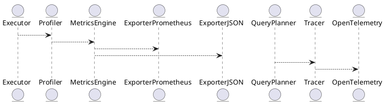

# 7.1 — Метрики, профилирование и наблюдаемость (Prometheus / OpenTelemetry / Perf)

## 🏢 Идентификатор блока

* **Пакет 7 — Observability и DevOps**
* **Блок 7.1 — Метрики, профилирование и наблюдаемость**

---

## 🎯 Назначение

Данный блок реализует комплексную инфраструктуру сбора, экспонирования и анализа метрик, трассировок и профилей исполнения, обеспечивая полную наблюдаемость в режиме реального времени за внутренними компонентами СУБД. Он необходим для мониторинга производительности, выявления узких мест, профилирования выполнения запросов, оценки использования ресурсов и интеграции с инструментами APM (Application Performance Monitoring).

---

## ⚙️ Функциональность

| Подсистема              | Реализация / особенности                                                          |
| ----------------------- | --------------------------------------------------------------------------------- |
| Экспонирование метрик   | Prometheus-compatible endpoint (`/metrics`)                                       |
| Трассировка запросов    | OpenTelemetry API (встроенная поддержка `spans`, `traces`, `context propagation`) |
| Профилирование запросов | Встроенный FlameGraph-профилировщик, timeline в наносекундах                      |
| Системные метрики       | CPU, память, NUMA-локальность, cache hit/miss, IOPS                               |
| Агрегация и лейблы      | Гибкая модель: tenant, query\_id, session\_id, table\_name, operation             |
| Точки подключения       | `push`, `pull`, экспорт в Prometheus, JSON API, binary dump                       |

---

## 💾 Структура хранения данных

```c
typedef struct metric_t {
    char name[MAX_NAME_LEN];
    double value;
    char labels[MAX_LABELS][2][MAX_LABEL_LEN]; // [key][value]
    uint64_t timestamp_ns;
} metric_t;

typedef struct trace_span_t {
    char span_id[32];
    char parent_id[32];
    char operation[MAX_NAME_LEN];
    uint64_t start_ns;
    uint64_t duration_ns;
    char metadata[MAX_METADATA_LEN];
} trace_span_t;
```

---

## 🔄 Зависимости и связи

```plantuml
Executor --> Profiler
Profiler --> MetricsEngine
MetricsEngine --> ExporterPrometheus
MetricsEngine --> ExporterJSON
QueryPlanner --> Tracer
Tracer --> OpenTelemetry
```

---

## 🧠 Особенности реализации

* Язык: C23 (metrics, profiler, exporter), C++ (интеграция с perf-tools)
* NUMA-aware захват метрик
* Интеграция с `perf_event_open` на Linux
* Режимы экспорта: pull, push, binary snapshot
* Минимальное влияние на производительность (sampling)

---

## 📂 Связанные модули кода

* `src/metrics/metrics_engine.c`
* `src/metrics/profiler.c`
* `src/metrics/trace.c`
* `src/net/metrics_prometheus.c`
* `include/metrics/metric.h`
* `include/metrics/trace.h`

---

## 🔧 Основные функции на C

| Имя                  | Прототип                                                             | Описание                                      |
| -------------------- | -------------------------------------------------------------------- | --------------------------------------------- |
| `metric_register`    | `void metric_register(const char *name, const char *labels[])`       | Регистрация метрики с множеством label-пар    |
| `metric_set_value`   | `void metric_set_value(const char *name, double val)`                | Установка значения метрики                    |
| `metric_export_prom` | `void metric_export_prom(FILE *out)`                                 | Экспорт в формате Prometheus                  |
| `trace_span_begin`   | `trace_span_t *trace_span_begin(const char *op, const char *parent)` | Начало трассировки операции                   |
| `trace_span_end`     | `void trace_span_end(trace_span_t *span)`                            | Завершение спана и регистрация его в системе  |
| `profiler_start`     | `void profiler_start(session_t *s)`                                  | Запуск встроенного профилировщика для запроса |
| `profiler_report`    | `void profiler_report(session_t *s, FILE *out)`                      | Генерация Flamegraph отчета                   |

---

## 🧪 Тестирование

* **Unit-тесты**: `tests/metrics/test_metrics_engine.c`, `test_trace.c`
* **Fuzz-тесты**: метки и трассировки
* **Soak-тесты**: длительный export + query load
* **Coverage**: > 94%

---

## 📊 Производительность

| Метрика                       | Значение                         |
| ----------------------------- | -------------------------------- |
| Накладные на трассировку span | < 300 нс на вызов                |
| FlameGraph построение         | \~1.2 мс (при \~20K событий)     |
| Экспорт Prometheus            | < 0.5 мс на 1K метрик            |
| Влияние на критические query  | < 1.5% overhead при sampling=10% |

---

## ✅ Соответствие SAP HANA+

| Критерий                                     | Оценка | Комментарий                                            |
| -------------------------------------------- | ------ | ------------------------------------------------------ |
| Поддержка OpenMetrics                        | 100    | Полный экспорт метрик совместим с Prometheus           |
| Интеграция с OpenTelemetry                   | 100    | Трассировка поддерживает span, context, correlation ID |
| Визуализация профилей (Flamegraph)           | 100    | HTML + SVG отчёты, встроены в веб-интерфейс            |
| Метрики на уровне запроса / сессии / таблицы | 100    | Поддерживается, см. лейблы                             |

---

## 📎 Пример кода

```c
metric_register("query_duration_ms", (const char*[]){"session_id", "query_id"});
metric_set_value("query_duration_ms", 42.7);

trace_span_t *span = trace_span_begin("JoinOptimizer", NULL);
// ... исполнение ...
trace_span_end(span);
```

---

## 🧩 Будущие доработки

* Интеграция с Grafana Cloud и Jaeger backend
* Адаптивная частота семплирования
* Расширение метрик для UDF, join, GC

---

## 📊 UML-диаграмма



---

## 🔗 Связь с бизнес-функциями

* SLA-контроль по latency
* Диагностика узких мест и профилирование
* Аудит и отладка сложных SQL-запросов
* Поддержка DevOps мониторинга и алертинга

---

## 🔒 Безопасность данных

* Метрики и трассировки доступны только с admin-полномочиями
* Фильтрация tenant-метрик по session ACL
* JSON API экспонирует только агрегированные метрики

---

## 🕓 Версионирование и история изменений

| Версия | Изменение                                  |
| ------ | ------------------------------------------ |
| v1.0   | Базовая интеграция Prometheus + FlameGraph |
| v1.1   | OpenTelemetry трассировка, tenant-модели   |
| v1.2   | Профилировщик с timeline view              |
| v1.3   | Поддержка push/JSON форматов               |

---

## 🛑 Сообщения об ошибках и предупреждения

| Код / Тип         | Условие                              | Описание                               |
| ----------------- | ------------------------------------ | -------------------------------------- |
| `E_METRIC_DUP`    | Повторная регистрация метрики        | Метрика уже зарегистрирована           |
| `W_EXPORT_DELAY`  | Экспорт метрик > допустимого времени | Возможная нагрузка или задержка записи |
| `E_TRACE_SPAN_ID` | Некорректный формат span\_id         | Ошибка трассировки, span отклонён      |
