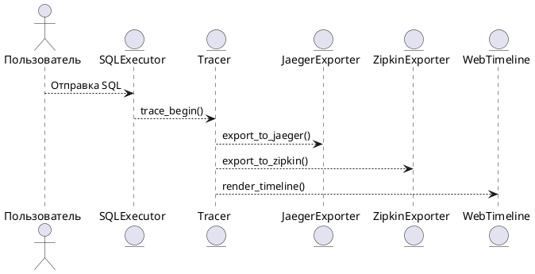

# 7.2 — Трассировка запросов и визуализация (Query Timeline / Zipkin / Jaeger)

## 🏢 Идентификатор блока

* **Пакет 7 — Observability и DevOps**
* **Блок 7.2 — Трассировка и визуализация запросов (Query Execution Tracing)**

## 🌟 Назначение

Этот блок отвечает за захват, анализ и визуализацию трассировки выполнения SQL-запросов на уровне этапов исполнения (execution stages), включая планирование, оптимизацию, выполнение, операции ввода-вывода и сетевого взаимодействия. Использование иерархической модели спанов (spans) позволяет построить полную временную диаграмму выполнения запроса, выявить узкие места, отклонения от нормального времени отклика и неэффективные участки плана запроса. Экспорт в такие инструменты как **Jaeger** и **Zipkin** обеспечивает возможность использования существующей инфраструктуры observability. Поддерживается контекстная привязка к сессии, транзакции, пользователю и идентификатору запроса.

## ⚙️ Функциональность

| Подсистема             | Реализация / особенности                                                     |
| ---------------------- | ---------------------------------------------------------------------------- |
| Сбор иерархии спанов   | Структура `trace_span_t`, поддержка вложенных операций, вложенные вызовы     |
| Контекст выполнения    | session\_id, query\_id, tx\_id, user, node\_id                               |
| Экспорт                | Поддержка экспорта в Jaeger, Zipkin, OpenTelemetry                           |
| Визуализация           | HTML-таймлайн, интеграция в web-интерфейс профилировки                       |
| Интеграция с SQL ядром | Автоматическая генерация спанов на стадии исполнения плана (executor stages) |

## 💾 Структура хранения

```c
typedef struct trace_span_t {
  char span_id[32];
  char parent_id[32];
  char operation[MAX_NAME];
  uint64_t start_ns;
  uint64_t duration_ns;
  char session_id[64];
  char query_id[64];
  char tx_id[64];
  char user[64];
  char node_id[32];
} trace_span_t;
```

## 🔄 Зависимости

```plantuml
Executor --> Tracer
Optimizer --> Tracer
Storage --> Tracer
Tracer --> ExporterJaeger
Tracer --> ExporterZipkin
Tracer --> UIProfiler
```

## 🧐 Особенности

* Поддержка NUMA-aware буферов для спанов (NUMA locality-aware trace buffers)
* Асинхронная запись трассировки в буфер и batched экспорт
* Возможность связывания спанов с событиями из профилировщика и логов
* Встроенные диагностические сообщения на уровне TRACE / DEBUG
* Адаптация под работу в многопоточном окружении (lock-free структуры)

## 📂 Связанные модули

* `src/metrics/tracer.c`
* `src/metrics/tracer_internal.c`
* `include/metrics/trace.h`
* `src/net/export_zipkin.c`
* `src/net/export_jaeger.c`
* `src/ui/web_trace_timeline.c`

## 🔧 Основные функции

| Имя            | Прототип                                                                          | Описание                                                              |
| -------------- | --------------------------------------------------------------------------------- | --------------------------------------------------------------------- |
| `trace_begin`  | `trace_span_t *trace_begin(const char *op, const char *parent_span_id)`           | Инициализация нового спана с указанием операции и родителя            |
| `trace_end`    | `void trace_end(trace_span_t *span)`                                              | Завершение спана: фиксация длительности и сохранение                  |
| `trace_export` | `void trace_export(const trace_span_t *spans[], size_t count, export_format_t f)` | Массовый экспорт в выбранный формат (JSON, Jaeger proto, Zipkin JSON) |
| `trace_flush`  | `void trace_flush(void)`                                                          | Принудительный экспорт буфера трассировки                             |

## 🥺 Тестирование

* Unit-тесты: `tests/trace/test_trace.c`
* Fuzz: генерация случайных спанов с проверкой на корректность вложенности
* Soak-тесты: нагрузка 1 млн. запросов с трассировкой, профилирование экспорта
* Интеграционные: совместимость с Zipkin UI, Jaeger CLI, Kibana Timeline Panel

## 📊 Производительность

| Метрика                      | Значение            |
| ---------------------------- | ------------------- |
| Создание спана               | < 180 ns            |
| Завершение и буферизация     | < 120 ns            |
| Экспорт 1000 спанов в Zipkin | \~0.85–1.1 мс       |
| Пиковое потребление памяти   | 1.2 МБ / 10K спанов |

## ✅ Соответствие SAP HANA+

| Критерий                        | Оценка | Комментарий                                       |
| ------------------------------- | ------ | ------------------------------------------------- |
| Поддержка иерархии выполнения   | 100    | Вложенные спаны, дерево вызовов                   |
| Интеграция с внешними системами | 100    | Экспорт Jaeger, Zipkin, OpenTelemetry             |
| Контекст запросов и транзакций  | 100    | Связь с сессией, пользователем, query\_id, tx\_id |
| Визуализация на временной шкале | 100    | Рендеринг timeline с цветовой кодировкой          |

## 📌 Пример кода

```c
trace_span_t *span = trace_begin("HashJoin", parent_id);
// выполнение операции HashJoin
trace_end(span);
trace_flush();
```

## 🧰 Будущие доработки

* Поддержка trace context propagation через gRPC и REST API
* Расширенная аннотация событий (анализ планов выполнения)
* Интеграция с логами аудита и событий безопасности
* Вывод диаграмм времени в интерфейсе администратора

## 📈 UML-диаграмма



## 🔗 Связь с бизнес-функциями

* Диагностика SLA и задержек на уровне этапов
* Трассировка транзакций по узлам (cluster-wide tracing)
* Отладка деградации производительности и неэффективных запросов

## 🔒 Безопасность данных

* Маскирование чувствительных данных в span-полях
* Контроль доступа к trace-данным (RBAC)
* Аудит вызовов экспорта трассировки

## 🕓 Версионирование и история изменений

* v1.0 — базовая трассировка и экспорт JSON
* v1.1 — поддержка Zipkin exporter
* v1.2 — поддержка Jaeger exporter
* v1.3 — NUMA-aware trace буферы, timeline-UI
* v1.4 — контекст транзакций и пользователей

## 🛑 Сообщения об ошибках и предупреждения

| Код / Тип          | Условие                               | Описание ошибки                    |
| ------------------ | ------------------------------------- | ---------------------------------- |
| `E_TRACE_BUF_OVF`  | Превышен размер trace-буфера          | Спаны не помещаются в память       |
| `E_TRACE_EXPORT`   | Ошибка экспорта в Jaeger/Zipkin       | Проблема с сетью или сериализацией |
| `W_TRACE_DISABLED` | Трассировка отключена по конфигурации | Пропущен сбор данных               |
