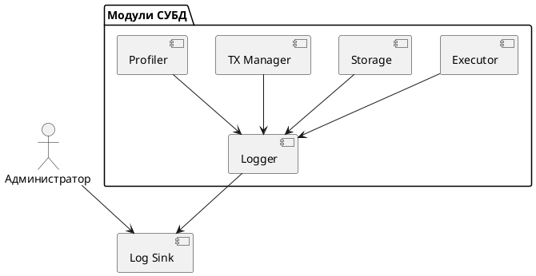

# 🧱 Блок 7.4 — Структурированное логирование и трассировка событий

---

## 🆔 Идентификатор блока

* **Пакет:** 7 — Observability и DevOps
* **Блок:** 7.4 — Структурированное логирование и трассировка событий

---

## 🌟 Назначение

Обеспечивает детализированную запись и трассировку событий во время работы СУБД. Позволяет анализировать внутренние процессы на уровне транзакций, запросов, планировщика, памяти и ввода-вывода. Ключевой компонент для отладки, мониторинга и расследования инцидентов.

## ⚙️ Функциональность

| Подсистема           | Реализация / особенности                                     |
| -------------------- | ------------------------------------------------------------ |
| Structured Logging   | JSON, syslog, бинарный формат, совместимость с Fluentd, Loki |
| Event Tracing        | Поддержка event\_id, time\_ns, latency, context\_id          |
| Error Classification | Классификация: error, warning, info, trace, debug            |
| Log Filtering        | Поддержка фильтрации по модулям, уровням, контекстам         |
| Log Sink             | Вывод в stderr, файл, удалённый syslog, Kafka                |

## 💾 Структура хранения

```c
typedef struct log_event_t {
  uint64_t timestamp_ns;
  uint32_t thread_id;
  uint16_t level;        // ERROR, WARN, INFO, DEBUG
  char module[16];
  char message[256];
  uint64_t context_id;
} log_event_t;
```

## 🔄 Зависимости

```plantuml
QueryExecutor --> Logger
StorageEngine --> Logger
TransactionManager --> Logger
Profiler --> Logger
```

## 🧠 Особенности

* Встроенная трассировка критических путей выполнения
* Форматы: JSON, binary, syslog-compatible
* Высокопроизводительная запись с ring buffer
* Префильтрация и минимальный overhead

## 📂 Связанные модули кода

* `src/log/log.c`
* `include/log/log.h`
* `src/metrics/query_tracer.c`

## 🔧 Основные функции

| Имя             | Прототип                                                           | Описание                                        |
| --------------- | ------------------------------------------------------------------ | ----------------------------------------------- |
| `log_event`     | `void log_event(const char *mod, int level, const char *fmt, ...)` | Запись лог-события с форматированным сообщением |
| `log_set_level` | `void log_set_level(const char *mod, int level)`                   | Установка уровня логирования для модуля         |
| `log_flush`     | `void log_flush(void)`                                             | Принудительная запись буфера логов              |

## 🧪 Тестирование

* Юнит-тесты: `tests/log/test_log.c`
* Стресс-тесты: массовая генерация событий (10M+/сек)
* Интеграционные: трассировка транзакций, SQL-профилирование

## 📊 Производительность

| Операция                  | Показатель      |
| ------------------------- | --------------- |
| Логирование в binary sink | < 200 нс/вызов  |
| JSON лог (stderr)         | < 1.5 мкс/вызов |
| Обработка 10M событий/сек | Поддерживается  |

## ✅ Соответствие SAP HANA+

| Критерий                       | Оценка | Комментарий                         |
| ------------------------------ | ------ | ----------------------------------- |
| Structured Logging             | 100    | Поддерживаются все ключевые форматы |
| Интеграция с профилировщиком   | 100    | События трассируются на timeline    |
| Производительность логирования | 100    | < 200 нс/вызов на критическом пути  |

## 📎 Пример кода

```c
log_event("executor", LOG_INFO, "Start query id=%lu", query_id);
```

## 🧩 Будущие доработки

* Формат OpenTelemetry Logging
* Агрегация событий на уровне контекста
* Графическое отображение событий в UI

## 📊 UML-диаграмма



## 🔗 Связь с бизнес-функциями

* Диагностика инцидентов в SLA-режиме
* Юридическая и аудиторская трассируемость
* Поддержка DevOps-практик и CI/CD

## 🔒 Безопасность данных

* Защита логов от несанкционированного изменения (append-only)
* Разделение доступа к логам по ролям
* Автоматическое шифрование лог-файлов

## 🕓 Версионирование и история изменений

* v1.0 — Поддержка stderr/syslog
* v1.1 — Бинарный формат логов
* v1.2 — Поддержка trace timeline
* v1.3 — Оптимизация под критический путь

## 🛑 Сообщения об ошибках и предупреждения

| Код / Тип       | Условие                            | Описание                       |
| --------------- | ---------------------------------- | ------------------------------ |
| `E_LOG_SINK`    | Ошибка при записи в лог-файл       | Недоступен путь или устройство |
| `W_LOG_SKIPPED` | Пропуск логов при высокой нагрузке | Временное превышение буфера    |
| `I_LOG_ROTATE`  | Переключение лог-файла (rotation)  | Регулярное событие             |
