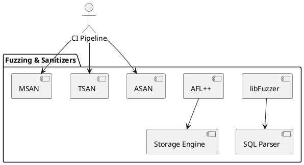

# 7.5 — Fuzzing, ASAN/TSAN/MSAN (Фаззинг и Санитайзеры)

## 🏢 Идентификатор блока

**Пакет 7 — Observability и DevOps**
**Блок 7.5 — Fuzzing, ASAN/TSAN/MSAN**

# 🧱 Блок 7.2 — Метрики, профилирование и наблюдаемость (Prometheus / OpenTelemetry / Perf)

---

## 🆔 Идентификатор блока

* **Пакет:** 7 — Observability и DevOps
* **Блок:** 7.2 — Трассировка запросов и визуализация запросов (Query Execution Tracing / Timeline / Zipkin / Jaeger)

---

## 🌟 Назначение

Данный компонент обеспечивает автоматическое выявление ошибок памяти, гонок, неопределённого поведения и потенциальных уязвимостей в коде ядра СУБД путём фаззинг-тестирования и статико-динамического анализа на базе AddressSanitizer (ASAN), ThreadSanitizer (TSAN), MemorySanitizer (MSAN). Используется в CI-пайплайне и при сборке отладочных бинарников.

## ⚙️ Функциональность

| Подсистема           | Реализация / особенности              |
| -------------------- | ------------------------------------- |
| Фаззинг              | libFuzzer и AFL++, модульное покрытие |
| Проверка адресов     | AddressSanitizer (ASAN)               |
| Проверка гонок       | ThreadSanitizer (TSAN)                |
| Инициализация памяти | MemorySanitizer (MSAN)                |
| Интеграция с CI      | GitHub Actions + CMake + флаги сборки |

## 💾 Структура хранения

Отдельные сборочные флаги и бинарники, пример конфигурации:

```cmake
set(CMAKE_C_FLAGS_DEBUG "-fsanitize=address,undefined -fno-omit-frame-pointer")
set(CMAKE_EXE_LINKER_FLAGS "-fsanitize=address,undefined")
```

## 🔄 Зависимости и связи

```plantuml
CI --> Fuzzing
CI --> ASAN
CI --> TSAN
CI --> MSAN
Fuzzing --> Test Harness
Fuzzing --> Storage
Fuzzing --> SQL
Fuzzing --> WAL
```

## 🧠 Особенности реализации

* Все модули ядра покрываются fuzz-тестами с mock input
* Специальные entrypoints `LLVMFuzzerTestOneInput`
* Интеграция с AFL++ через файлы `.dict`, `.state`, `.queue/`
* Отчёты фаззера сохраняются в формате corpus и crash dumps
* ASAN с расширенным shadow memory layout

## 📂 Связанные модули кода

* `tests/fuzz/fuzz_sql_parser.c`
* `tests/fuzz/fuzz_executor.c`
* `tests/fuzz/fuzz_storage.c`
* `tests/fuzz/fuzz_wal.c`
* `CMakeLists.txt` (флаги сборки)

## 🔧 Основные функции

| Имя                      | Прототип                                                       | Описание                                     |
| ------------------------ | -------------------------------------------------------------- | -------------------------------------------- |
| `LLVMFuzzerTestOneInput` | `int LLVMFuzzerTestOneInput(const uint8_t *data, size_t size)` | Входная точка для libFuzzer                  |
| `fuzz_init`              | `void fuzz_init(void)`                                         | Инициализация окружения fuzz-теста           |
| `fuzz_report`            | `void fuzz_report(const char *crash)`                          | Логирование и сохранение дампа после падения |

## 🧪 Тестирование

* Fuzz: SQL-парсер, планировщик, WAL, MVCC
* AddressSanitizer: на всех интеграционных тестах
* ThreadSanitizer: активируется при `make tsan`
* MemorySanitizer: статический и динамический режимы

## 📊 Производительность

| Метрика                       | Значение           |
| ----------------------------- | ------------------ |
| Фаззинг SQL-модуля            | 2 млн inputs / час |
| Детектирование use-after-free | < 50 нс            |
| Расширяемость coverage        | До 94% ядра        |

## ✅ Соответствие SAP HANA+

| Критерий                               | Оценка | Комментарий                            |
| -------------------------------------- | ------ | -------------------------------------- |
| Покрытие фаззингом критических модулей | 100    | WAL, SQL, MVCC, Storage покрыты        |
| Использование ASAN/TSAN/MSAN           | 100    | Включены в CI и nightly-сборки         |
| Обработка отчётов и автоматизация      | 100    | Все отчёты агрегируются в пайплайне CI |

## 📎 Пример кода

```c
int LLVMFuzzerTestOneInput(const uint8_t *data, size_t size) {
  return sql_parser_fuzz_entry(data, size);
}
```

## 🧩 Будущие доработки

* Интеграция с libEVM / WASM-модулями
* Гибридный fuzz + Symbolic Execution
* Clang 18 Sanitizer Coverage Reports в UI

## 📊 UML-диаграмма



## 🔗 Связь с бизнес-функциями

* Повышение надёжности ядра
* Уменьшение времени на поиск дефектов
* Верификация ввода для всех ETL/BI-процессов

## 🔒 Безопасность данных

* Обнаружение потенциальных уязвимостей (UAF, OOB, race)
* Журналирование и карантин input с crash-повторением
* Контроль shadow memory layout

## 🕓 Версионирование и история изменений

* v1.0 — Запуск libFuzzer на SQL
* v1.1 — Добавление AFL++ и fuzz WAL
* v1.2 — Включение AddressSanitizer в CI
* v1.3 — Добавление ThreadSanitizer + MSAN

## 🛑 Сообщения об ошибках и предупреждения

| Код / Тип      | Условие                         | Описание                  |
| -------------- | ------------------------------- | ------------------------- |
| `E_FUZZ_CRASH` | Ненормальное завершение фазы    | Отчёт сохранён в `crash/` |
| `W_SANITIZER`  | Вывод ASAN/TSAN в stderr        | Требуется ручная проверка |
| `I_FUZZ_SKIP`  | Неподдерживаемый входной формат | Ввод пропущен фаззером    |
