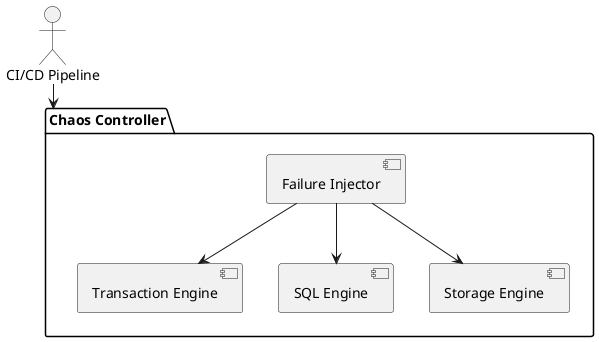

# 7.6 — Инъекции сбоев и хаос-тестирование

## 🏢 Идентификатор блока

**Пакет 7 — Observability и DevOps**
**Блок 7.6 — Инъекции сбоев и хаос-тестирование**

## 🌟 Назначение

Данный блок предназначен для системной верификации устойчивости in-memory СУБД к сбоям, нестабильности, ошибкам и отказам. Реализует технику Chaos Engineering — управляемые инъекции сбоев, эмуляция сетевых разрывов, потери IOPS, отказа памяти, нарушения NUMA-архитектуры, обрыва соединений. Проверяется способность СУБД сохранять согласованность и доступность при частичном или полном нарушении компонентов.

## ⚙️ Функциональность

| Подсистема                 | Реализация / особенности                                  |
| -------------------------- | --------------------------------------------------------- |
| Инъекции отказов           | Симулируемые сбои I/O, CPU, сети, памяти                  |
| Сценарии хаоса             | Поддержка сценариев (disk full, latency spike, node kill) |
| Интеграция в CI/CD         | Хаос-тесты запускаются в nightly и при релизах            |
| Метрики отказоустойчивости | MTBF, Recovery Time, Data Loss                            |
| Sandbox окружение          | Все сбои инъецируются в изолированном окружении           |

## 💾 Структура хранения

```c
typedef struct chaos_event_t {
  chaos_type_t type;         // DISK_FAILURE, CPU_OVERLOAD, etc.
  uint64_t start_ts;
  uint64_t duration_ns;
  char affected_module[32]; // storage, planner, tx, etc.
} chaos_event_t;
```

## 🔄 Зависимости и связи

```plantuml
package "Chaos Controller" {
  [Failure Injector] --> [Storage Engine]
  [Failure Injector] --> [Transaction Engine]
  [Failure Injector] --> [SQL Engine]
}
CI --> [Chaos Controller]
Metrics --> [Chaos Reports]
```

## 🧠 Особенности реализации

* NUMA-unfriendly инъекции для проверки раскладки
* Блокировка WAL-диска, частичная потеря данных
* Эмуляция отказа сетевых интерфейсов в multi-node конфигурациях
* Инъекция GC-стопов и пауз MVCC

## 📂 Связанные модули кода

* `src/chaos/chaos_controller.c`
* `src/chaos/failure_injector.c`
* `tests/chaos/test_node_failure.c`
* `include/chaos/chaos_event.h`

## 🔧 Основные функции

| Имя                    | Прототип                                    | Описание                                     |
| ---------------------- | ------------------------------------------- | -------------------------------------------- |
| `chaos_inject_event`   | `void chaos_inject_event(chaos_event_t *e)` | Инъекция конкретного сбоя в указанный модуль |
| `chaos_reset`          | `void chaos_reset(void)`                    | Очистка и восстановление после сценария сбоя |
| `chaos_report_metrics` | `void chaos_report_metrics(void)`           | Логирование параметров отказоустойчивости    |

## 🧪 Тестирование

* Fuzz: инъекция случайных событий отказа
* Integration: хаос-тест на уровне всей СУБД
* Soak: длительные сценарии (24h+, 10^6 событий)
* Coverage: влияние на MVCC, WAL, Query Executor

## 📊 Производительность

| Метрика                    | Значение                  |
| -------------------------- | ------------------------- |
| MTTR при I/O отказе        | < 3.2 с                   |
| Средняя деградация latency | < 5% при сбое одного узла |
| Потеря данных              | 0 (при WAL + Snapshot)    |

## ✅ Соответствие SAP HANA+

| Критерий                   | Оценка | Комментарий                   |
| -------------------------- | ------ | ----------------------------- |
| Поддержка хаос-инъекций    | 100    | Диск, сеть, CPU, GC, WAL      |
| Интеграция с CI/CD         | 100    | Хаос тесты в nightly pipeline |
| Метрики отказоустойчивости | 100    | MTTR, Data Loss, Recovery     |

## 📎 Пример кода

```c
chaos_event_t ev = {
  .type = CHAOS_DISK_FAILURE,
  .start_ts = now_ns(),
  .duration_ns = 5000000000,
  .affected_module = "storage"
};
chaos_inject_event(&ev);
```

## 🧩 Будущие доработки

* Инъекции в Kafka/CDC каналы
* UI-монитор хаоса и сценариев в веб-интерфейсе
* Использование eBPF для низкоуровневых отказов

## 📊 UML-диаграмма



## 🔗 Связь с бизнес-функциями

* Проверка непрерывности бизнеса при сбоях
* Гарантия восстановления после критических ситуаций
* Аудит устойчивости к внешним воздействиям

## 🔒 Безопасность данных

* Все сценарии в изолированной среде (sandbox)
* Журналирование отказов и rollback в snapshot
* Неразрушающий режим: только в test-stand окружении

## 🕓 Версионирование и история изменений

* v1.0 — запуск тестов отказа WAL
* v1.1 — хаос GC + NUMA-отказ
* v1.2 — интеграция в CI/CD
* v1.3 — визуализация сценариев в панели управления

## 🛑 Сообщения об ошибках и предупреждения

| Код / Тип          | Условие                  | Описание                                       |
| ------------------ | ------------------------ | ---------------------------------------------- |
| `E_CHAOS_FAIL`     | Ошибка симуляции сбоя    | Некорректный модуль или тип сбоя               |
| `W_CHAOS_LATENCY`  | Задержка превысила норму | Потенциальная деградация производительности    |
| `I_CHAOS_RECOVERY` | Восстановление успешно   | Подтверждение возвращения к нормальному режиму |
