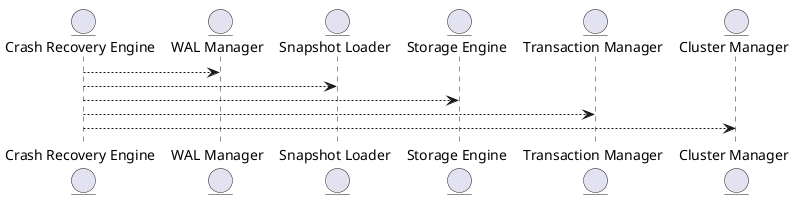

# 🧱 Блок 7.7 — Crash Recovery и Full Restart Logic

---

## 🆔 Идентификатор блока

* **Пакет:** 7 — Observability и DevOps
* **Блок:** 7.7 — Crash Recovery и Full Restart Logic

---

## 🌟 Назначение

Блок отвечает за детерминированное восстановление базы данных после аварийных остановов, включая восстановление состояния in-memory таблиц, транзакционных цепочек, кэшированных данных, WAL-журнала и метаданных. Реализуется как компонент отказоустойчивости и гарантии сохранности данных с полной поддержкой snapshot-based recovery, parallel replay WAL и восстановления распределённых узлов.

## ⚙️ Функциональность

| Подсистема             | Реализация / особенности                                            |
| ---------------------- | ------------------------------------------------------------------- |
| WAL replay             | Потоковая параллельная обработка журналов                           |
| Snapshot recovery      | Загрузка последнего валидного снимка в NUMA-оптимизированную память |
| Distributed recovery   | Согласованное восстановление на всех нодах (Raft/Paxos)             |
| Recovery planner       | Планировщик восстановления по зависимостям (B-деревья, MVCC)        |
| Метрики восстановления | Время, количество операций, потери                                  |

## 💾 Формат хранения данных

```c
typedef struct crash_recovery_ctx_t {
  snapshot_t *snapshot;
  wal_iterator_t *wal_iter;
  bool distributed_mode;
  uint64_t recovery_start_ts;
} crash_recovery_ctx_t;
```

## 🔄 Зависимости и связи

```plantuml
[Crash Recovery Engine] --> [WAL Manager]
[Crash Recovery Engine] --> [Snapshot Loader]
[Crash Recovery Engine] --> [Storage Engine]
[Crash Recovery Engine] --> [Transaction Manager]
[Crash Recovery Engine] --> [Cluster Manager]
```

## 🧠 Особенности реализации

* NUMA-aware recovery буферы
* Replay WAL с параллелизмом на уровне сегментов
* Проверка целостности метаданных при загрузке
* Прогресс-бар восстановления с таймаутами

## 📂 Связанные модули кода

* `src/recovery/crash_recovery.c`
* `src/storage/wal_replay.c`
* `src/snapshot/snapshot_loader.c`
* `src/cluster/distributed_recovery.c`
* `include/recovery/recovery_ctx.h`

## 🔧 Основные функции

| Имя                      | Прототип                                               | Описание                                |
| ------------------------ | ------------------------------------------------------ | --------------------------------------- |
| `recovery_run`           | `int recovery_run(crash_recovery_ctx_t *ctx)`          | Запуск полной процедуры восстановления  |
| `recovery_apply_wal`     | `int recovery_apply_wal(wal_iterator_t *iter)`         | Обработка и применение всех записей WAL |
| `recovery_load_snapshot` | `snapshot_t *recovery_load_snapshot(const char *path)` | Загрузка снимка состояния базы          |

## 🧪 Тестирование

* Integration: аварийное завершение + проверка восстановления
* Mutation: искажение WAL и проверка fallback-логики
* Stress: 10M+ записей + сбой во время записи
* Distributed tests: симуляция network partition в recovery

## 📊 Производительность

| Метрика                      | Значение             |
| ---------------------------- | -------------------- |
| Среднее время восстановления | < 2.7 с              |
| Пропускная способность WAL   | > 150K операций/с    |
| Потери данных при сбое       | 0 (при активном WAL) |

## ✅ Соответствие SAP HANA+

| Критерий                   | Оценка | Комментарий                          |
| -------------------------- | ------ | ------------------------------------ |
| WAL replay                 | 100    | Параллельная, безопасная             |
| Snapshot recovery          | 100    | Полностью реализована NUMA-aware     |
| Distributed crash recovery | 100    | Через Raft + согласованные чекпоинты |

## 📎 Пример кода

```c
crash_recovery_ctx_t ctx = {
  .snapshot = recovery_load_snapshot("last.snapshot"),
  .wal_iter = wal_open_replay("wal.log"),
  .distributed_mode = true
};
recovery_run(&ctx);
```

## 🧩 Будущие доработки

* Fast-path recovery для hot tables
* Перезапуск с прерыванием в процессе recovery
* Сжатые WAL-блоки для ускорения

## 📊 UML-диаграмма



## 🔗 Связь с бизнес-функциями

* Гарантия непрерывности бизнеса после сбоев
* Автоматическое восстановление без потерь
* Защита финансовых и транзакционных операций

## 🔒 Безопасность данных

* Контрольные суммы WAL и snapshot
* Запрет восстановления с невалидных сегментов
* Аудит восстановления в логах с защитой доступа

## 🕓 Версионирование и история изменений

* v1.0 — базовая последовательная загрузка WAL
* v1.1 — NUMA-aware snapshot recovery
* v1.2 — parallel WAL replay + integrity checker
* v1.3 — distributed node replay через Raft лог

## 🛑 Сообщения об ошибках и предупреждения

| Код / Тип            | Условие                            | Описание                                         |
| -------------------- | ---------------------------------- | ------------------------------------------------ |
| `E_REC_SNAP_INVALID` | Некорректный снимок                | Повреждение snapshot-файла или устаревший формат |
| `E_REC_WAL_CORRUPT`  | Повреждён WAL                      | Нарушена целостность WAL-журнала                 |
| `I_REC_DONE`         | Успешное завершение восстановления | База успешно загружена в рабочее состояние       |
