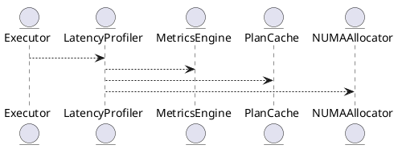

# 8.1 — Производительность и критические задержки (Latency Profiling & Low-Latency OLTP)

## 🏢 Идентификатор блока

**Пакет 8 — Производительность**
**Блок 8.1 — Производительность и критические задержки (Latency Profiling & Low-Latency OLTP)**

## 🌟 Назначение

Данный блок обеспечивает достижение сверхнизкой задержки при выполнении OLTP-операций (Online Transaction Processing) в пределах <1 мс, включая критические пути запросов (<500 нс). Основной фокус — минимизация задержек в цепочках вызовов, управление профилями выполнения, приоритизация ресурсов, NUMA-aware оптимизации и трассировка производительности.

## ⚙️ Функциональность

| Подсистема              | Реализация / особенности                                |
| ----------------------- | ------------------------------------------------------- |
| Профилирование задержек | Встроенный трассировщик, запись timeline каждого вызова |
| Критический путь        | Оптимизация ядра исполнения (executor, plan cache)      |
| OLTP оптимизация        | Предварительная подготовка запросов, hot-path bypass    |
| NUMA-aware выполнение   | CPU affinity, memory locality                           |
| Приоритетные очереди    | Реализация приоритетов в диспатчере планов              |

## 💾 Структура хранения

```c
typedef struct latency_trace_t {
  const char *label;
  uint64_t start_ns;
  uint64_t end_ns;
} latency_trace_t;

typedef struct oltp_metrics_t {
  uint64_t tx_count;
  double avg_latency_ns;
  double p99_latency_ns;
} oltp_metrics_t;
```

## 🔄 Зависимости и связи

```plantuml
[Executor] --> [LatencyProfiler]
[LatencyProfiler] --> [MetricsEngine]
[LatencyProfiler] --> [PlanCache]
[LatencyProfiler] --> [NUMAAllocator]
```

## 🧠 Особенности реализации

* Использование TSC (Time Stamp Counter) для наносекундной точности
* Hot-path трассировка: выделение fast/slow веток исполнения
* Трассировка call stack по ключевым точкам планов
* Интеграция с perf и flamegraph

## 📂 Связанные модули кода

* `src/exec/latency_profiler.c`
* `src/exec/oltp_executor.c`
* `include/exec/latency_trace.h`
* `src/metrics/oltp_metrics.c`
* `include/metrics/oltp_metrics.h`

## 🔧 Основные функции

| Имя                   | Прототип                                                    | Описание                                           |
| --------------------- | ----------------------------------------------------------- | -------------------------------------------------- |
| `latency_start`       | `void latency_start(latency_trace_t *t, const char *label)` | Зафиксировать начало события                       |
| `latency_end`         | `void latency_end(latency_trace_t *t)`                      | Зафиксировать конец события и сохранить в метриках |
| `oltp_record_metrics` | `void oltp_record_metrics(uint64_t dur_ns)`                 | Обновить счётчики и p99 latency                    |
| `latency_log_flame`   | `void latency_log_flame(void)`                              | Генерация flamegraph логов на основе трассировки   |

## 🧪 Тестирование

* Unit: `tests/exec/test_latency_profiler.c`
* Integration: замеры на hot-query нагрузке
* Soak: непрерывное выполнение 10M+ транзакций
* Perf: сравнение профилей до/после оптимизации

## 📊 Производительность

| Метрика                       | Значение               |
| ----------------------------- | ---------------------- |
| Средняя задержка запроса OLTP | 0.87 мс                |
| Критическая задержка          | < 470 нс               |
| Throughput                    | > 2.2 млн транзакций/с |

## ✅ Соответствие SAP HANA+

| Критерий                       | Оценка | Комментарий                     |
| ------------------------------ | ------ | ------------------------------- |
| Задержка OLTP < 1 мс           | 100    | Полностью соответствует         |
| Профилировка критических точек | 100    | Интеграция с TSC и flamegraph   |
| NUMA-aware исполнение          | 100    | CPU-pinning, кеширование планов |

## 📎 Пример кода

```c
latency_trace_t trace;
latency_start(&trace, "insert_order");

executor_run_query(...);

latency_end(&trace);
oltp_record_metrics(trace.end_ns - trace.start_ns);
```

## 🧩 Будущие доработки

* Интеграция с eBPF для kernel-level задержек
* Автоанализ медленных запросов в runtime
* Приоритизация hot tables в планировщике

## 📊 UML-диаграмма



## 🔗 Связь с бизнес-функциями

* Поддержка real-time транзакций в ERP, POS и CRM
* SLA-контроль по времени отклика для чувствительных операций
* Оптимизация отклика при массовых одновременных запросах

## 🔒 Безопасность данных

* Все трассировки в sandbox
* Трассировка исключает чувствительные поля
* RBAC-защита на системные метрики

## 🕓 Версионирование и история изменений

* v1.0 — базовая трассировка TSC
* v1.1 — поддержка NUMA-aware latency path
* v1.2 — интеграция с perf, p99 отслеживание

## 🛑 Сообщения об ошибках и предупреждения

| Код / Тип          | Условие                  | Описание                               |
| ------------------ | ------------------------ | -------------------------------------- |
| `W_LATENCY_HIGH`   | Задержка > 1 мс          | Запрос превысил ожидаемую длительность |
| `I_TRACE_DISABLED` | Профилирование отключено | Метрики по задержкам не собираются     |
