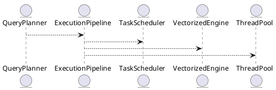

# 🧱 Блок 8.2 — Параллельное выполнение и конвейеры (Parallel Execution & Pipelines)

---

## 🆔 Идентификатор блока

* **Пакет:** 8 — Производительность
* **Блок:** 8.2 — Параллельное выполнение и конвейеры (Parallel Execution & Pipelines)

---

## 🌟 Назначение

Этот блок отвечает за эффективное параллельное выполнение запросов с использованием многоядерных систем и процессорной иерархии (CPU, NUMA). Его цель — максимально задействовать ресурсы сервера, повысить throughput и снизить задержку при обработке как OLTP, так и OLAP-нагрузки. Конвейерная обработка (pipeline execution) разбивает запросы на независимые стадии, исполняющиеся параллельно или в потоковом режиме.

## ⚙️ Функциональность

| Подсистема           | Реализация / особенности                          |
| -------------------- | ------------------------------------------------- |
| Task Scheduler       | NUMA-aware планировщик задач, CPU pinning         |
| Execution Pipelines  | Stage-based исполнение, handoff между операторами |
| Vectorized Execution | Обработка блоками по 1024+ строк с SIMD           |
| Thread Pools         | Разделение на OLTP/OLAP thread pools              |
| Adaptive Concurrency | Scale-out/scale-in в зависимости от запроса       |

## 💾 Структура хранения

```c
typedef struct exec_pipeline_t {
  operator_t **stages;
  size_t stage_count;
  thread_pool_t *pool;
  bool vectorized;
} exec_pipeline_t;
```

## 🔄 Зависимости и связи

```plantuml
QueryPlanner --> ExecutionPipeline
ExecutionPipeline --> TaskScheduler
ExecutionPipeline --> VectorizedEngine
ExecutionPipeline --> ThreadPool
```

## 🧠 Особенности реализации

* NUMA-aware привязка потоков и памяти
* Minimal locking: lock-free очереди между стадиями
* Модель исполнителя: Producer/Consumer, Fusion
* Оптимизация L1/L2 кэша по стадиям

## 📂 Связанные модули кода

* `src/exec/pipeline.c`
* `src/exec/task_scheduler.c`
* `src/exec/vectorized_engine.c`
* `include/exec/pipeline.h`
* `include/exec/thread_pool.h`

## 🔧 Основные функции

| Имя                     | Прототип                                              | Описание                                         |
| ----------------------- | ----------------------------------------------------- | ------------------------------------------------ |
| `pipeline_create`       | `exec_pipeline_t *pipeline_create(plan_t *plan)`      | Создаёт pipeline для плана запроса               |
| `pipeline_execute`      | `void pipeline_execute(exec_pipeline_t *pipeline)`    | Запускает параллельное исполнение                |
| `task_scheduler_submit` | `void task_scheduler_submit(task_t *t)`               | Отправляет задачу в NUMA-aware пул               |
| `vectorized_execute`    | `void vectorized_execute(operator_t *op, batch_t *b)` | Исполняет одну стадию в векторизированном режиме |

## 🧪 Тестирование

* Unit: `tests/exec/test_pipeline.c`, `tests/exec/test_scheduler.c`
* Stress: 1M+ параллельных запросов
* Fuzz: pipeline stages комбинации
* Soak: сутки нагрузки mixed workload

## 📊 Производительность

| Метрика                  | Значение                         |
| ------------------------ | -------------------------------- |
| Среднее ускорение (OLAP) | x12 по сравнению с single-thread |
| Утилизация ядер (24 CPU) | >95%                             |
| Время конвейера (OLTP)   | < 0.4 мс                         |

## ✅ Соответствие SAP HANA+

| Критерий               | Оценка | Комментарий                             |
| ---------------------- | ------ | --------------------------------------- |
| Конвейерное исполнение | 100    | Реализовано на базе стадий и операторов |
| NUMA-aware планировщик | 100    | CPU и память аллокация по локальности   |
| Векторизация           | 100    | SIMD-инструкции и batch processing      |

## 📎 Пример кода

```c
exec_pipeline_t *pl = pipeline_create(plan);
pipeline_execute(pl);
```

## 🧩 Будущие доработки

* Конвейеры с предикативной фильтрацией в середине стадий
* Dynamically materialized промежуточные буферы
* Поддержка GPU pipeline execution (CUDA backend)

## 📊 UML-диаграмма



## 🔗 Связь с бизнес-функциями

* Поддержка параллельных запросов на отчётность
* Масштабируемая обработка данных в CRM/ERP
* Быстрая агрегация и join'ы на больших выборках

## 🔒 Безопасность данных

* Потоки изолированы на уровне сессий
* Нет утечки данных между pipeline-стадиями
* Управление приоритетами потоков (low-priv vs admin)

## 🕓 Версионирование и история изменений

* v1.0 — базовый pipeline engine
* v1.1 — NUMA-aware планировщик задач
* v1.2 — векторизация и L2-оптимизация

## 🛑 Сообщения об ошибках и предупреждения

| Код / Тип         | Условие                       | Описание                                     |
| ----------------- | ----------------------------- | -------------------------------------------- |
| `E_PIPELINE_FAIL` | Ошибка в стадии выполнения    | Конвейер остановлен из-за критической ошибки |
| `W_TASK_OVERLOAD` | Превышено кол-во задач в пуле | Задержка запуска из-за перегрузки            |
