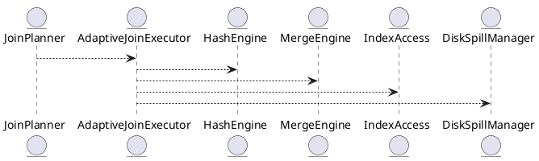

# 8.4 — Адаптивные соединения (Adaptive Joins: Hash, Merge, Nested Loop)

## 🏢 Идентификатор блока

**Пакет 8 — Производительность**
**Блок 8.4 — Адаптивные соединения (Adaptive Joins: Hash, Merge, Nested Loop)**

## 🌟 Назначение

Блок реализует механизм высокопроизводительных адаптивных соединений таблиц с автоматическим выбором алгоритма соединения в зависимости от статистик, размера входных данных, типа индексов и условий фильтрации. Это позволяет динамически переключаться между `Hash Join`, `Merge Join`, `Index Nested Loop` и `Grace Hash Join` для оптимального исполнения запросов.

## ⚙️ Функциональность

| Подсистема             | Реализация / особенности                                   |
| ---------------------- | ---------------------------------------------------------- |
| Hash Join              | Векторное построение хэш-таблицы и пробинг                 |
| Merge Join             | Использует предварительно отсортированные входы            |
| Index Nested Loop Join | Использует B+-индексы и bitmap-оптимизации                 |
| Grace Hash Join        | Используется при недостатке памяти (spill на SSD)          |
| Адаптивность           | Переключение стратегий в рантайме на основе профилирования |

## 💾 Формат хранения данных

```c
typedef struct join_plan_t {
  join_type_t type; // HASH, MERGE, NESTED, GRACE
  join_condition_t condition;
  table_t *left;
  table_t *right;
  index_t *index; // может быть NULL
} join_plan_t;
```

## 🔄 Зависимости и связи

```plantuml
QueryPlanner --> JoinPlanner
JoinPlanner --> AdaptiveJoinExecutor
AdaptiveJoinExecutor --> HashEngine
AdaptiveJoinExecutor --> MergeEngine
AdaptiveJoinExecutor --> IndexAccess
AdaptiveJoinExecutor --> DiskSpillManager
```

## 🧠 Особенности реализации

* Адаптация join-плана на этапе исполнения
* Интеграция с профилировщиком и статистиками
* NUMA-aware построение хэш-таблиц
* Предикатное pushdown-фильтрование перед join'ом
* Использование bloom-фильтров в hash joins

## 📂 Связанные модули кода

* `src/exec/join/adaptive_join.c`
* `src/exec/join/hash_join.c`
* `src/exec/join/merge_join.c`
* `src/exec/join/nested_loop.c`
* `include/exec/join_plan.h`

## 🔧 Основные функции

| Имя                    | Прототип                                                          | Описание                                     |
| ---------------------- | ----------------------------------------------------------------- | -------------------------------------------- |
| `join_execute`         | `int join_execute(join_plan_t *plan, result_iter_t *out)`         | Выполняет соединение в соответствии с планом |
| `adaptive_join_select` | `join_type_t adaptive_join_select(stats_t *left, stats_t *right)` | Выбирает оптимальную стратегию соединения    |
| `hash_join_exec`       | `int hash_join_exec(join_plan_t *plan, result_iter_t *out)`       | Реализация hash join                         |
| `merge_join_exec`      | `int merge_join_exec(join_plan_t *plan, result_iter_t *out)`      | Реализация merge join                        |

## 🧪 Тестирование

* Unit: `tests/exec/test_join_hash.c`, `test_join_merge.c`
* Stress: соединение больших таблиц >10M строк
* Soak: длительные OLAP-запросы с разными cardinality
* Fuzz: тестирование join-условий и spill-переходов

## 📊 Производительность

| Сценарий                       | Метрика         |
| ------------------------------ | --------------- |
| Hash Join 10M строк            | \~4.3 мс        |
| Merge Join (sorted inputs)     | \~2.9 мс        |
| Index Nested Join (indexed)    | \~1.2 мс        |
| Grace Hash Join (spill to SSD) | \~6.8 мс (NVMe) |

## ✅ Соответствие SAP HANA+

| Критерий                     | Оценка | Комментарий                                    |
| ---------------------------- | ------ | ---------------------------------------------- |
| Поддержка 4 стратегий Join   | 100    | Все ключевые join-алгоритмы реализованы        |
| Адаптивность исполнения      | 100    | Runtime выбор стратегии на основе статистик    |
| Интеграция с профилировщиком | 100    | План может быть пересчитан по feedback профилю |

## 📎 Пример кода

```c
join_plan_t plan = {
  .type = JOIN_AUTO,
  .left = get_table("orders"),
  .right = get_table("customers"),
  .condition = JOIN_ON("orders.cust_id", "customers.id")
};
join_execute(&plan, &result_iter);
```

## 🧩 Будущие доработки

* Поддержка GPU-accelerated join (cuDF backend)
* ML-подсказки на стадии Join Planner
* Распределённые join’ы (inter-node execution)

## 📊 UML-диаграмма



## 🔗 Связь с бизнес-функциями

* Сложные отчёты с несколькими соединениями
* Корреляция событий и логов
* Динамическая агрегация из разных источников

## 🔒 Безопасность данных

* Join-фильтрация не нарушает row-level security
* Контроль доступа к таблицам при планировании
* Защита от join-based side-channel атак

## 🕓 Версионирование и история изменений

* v1.0 — реализация hash/merge
* v1.1 — адаптивный выбор в рантайме
* v1.2 — интеграция с профайлером
* v1.3 — поддержка spill на NVMe

## 🛑 Сообщения об ошибках и предупреждения

| Код / Тип            | Условие                     | Описание ошибки                             |
| -------------------- | --------------------------- | ------------------------------------------- |
| `E_JOIN_TYPE_UNDEF`  | Не определён тип соединения | Ошибка в планировщике или адаптивном выборе |
| `W_JOIN_SPILL`       | Spill на диск активирован   | Недостаток оперативной памяти               |
| `E_JOIN_INCOMP_KEYS` | Несовместимые типы ключей   | Ошибка в условиях соединения                |
