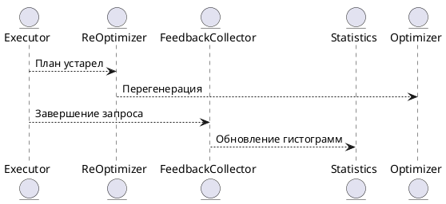

# 8.5 — Рерантайм-оптимизация и обратная связь (Runtime Re-optimization & Feedback Loop)

## 🏢 Идентификатор блока

* Пакет 8 — Производительность
* Блок 8.5 — Рерантайм-оптимизация и обратная связь

# 🧱 Блок 8.5 — Рерантайм-оптимизация и обратная связь (Runtime Re-optimization & Feedback Loop)

---

## 🆔 Идентификатор блока

* **Пакет:** 8 — Производительность
* **Блок:** 8.5 — Рерантайм-оптимизация и обратная связь (Runtime Re-optimization & Feedback Loop)

---

## 🎯 Назначение

Данный блок реализует механизм повторной оптимизации планов выполнения SQL-запросов во время их выполнения (runtime re-optimization), используя данные о фактической селективности, размере промежуточных результатов, времени выполнения этапов и доступности ресурсов. Он позволяет адаптировать планы в реальном времени и улучшать производительность без повторной компиляции. Дополнительно реализован цикл обратной связи (feedback loop), который накапливает статистику выполнения и обновляет гистограммы и кардинальности для последующих запросов.

## ⚙️ Функциональность

| Подсистема                 | Реализация / особенности                                                           |
| -------------------------- | ---------------------------------------------------------------------------------- |
| Runtime Re-Optimization    | Проверка фактических значений во время исполнения и динамическая перестройка плана |
| Feedback Loop              | Пост-запросная запись статистики по join-ам, селективности, cardinality            |
| Интеграция с оптимизатором | Переинициализация cost-based планирования по текущим метрикам                      |
| Планировщик                | Обратный вызов в adaptive pipeline executor для подмены поддерева                  |
| Статистика                 | Векторные счётчики, NDV, гистограммы, sample-based метрики                         |

## 💾 Формат хранения данных

```c
typedef struct feedback_entry_t {
    char query_hash[32];
    double observed_selectivity;
    uint64_t row_count;
    double exec_time_ms;
    uint64_t timestamp_ns;
} feedback_entry_t;
```

## 🔄 Зависимости и связи

```plantuml
Executor --> ReOptimizer
ReOptimizer --> Optimizer
ReOptimizer --> Statistics
Executor --> FeedbackCollector
FeedbackCollector --> Statistics
```

## 🧠 Особенности реализации

* Адаптивная архитектура без остановки выполнения (non-blocking optimization)
* Использование plan subtree swapping (вставка поддеревьев с альтернативной стратегией)
* Поддержка обработки данных в потоковом виде (streaming)
* NUMA-aware статистика (на уровне NUMA-нод агрегируются счётчики)
* Безопасная в многопоточном исполнении (lock-free обновление feedback)

## 📂 Связанные модули

* `src/optimizer/reoptimize.c`
* `src/optimizer/feedback_loop.c`
* `include/optimizer/runtime_opt.h`
* `src/executor/adaptive_executor.c`
* `src/statistics/histogram.c`

## 🔧 Основные функции на C

| Имя                    | Прототип                                                                  | Описание                                                 |
| ---------------------- | ------------------------------------------------------------------------- | -------------------------------------------------------- |
| `reoptimize_plan`      | `plan_t *reoptimize_plan(execution_context_t *ctx, plan_t *current)`      | Анализ текущего плана и замена на более эффективный      |
| `feedback_record`      | `void feedback_record(const char *query_hash, double sel, uint64_t rows)` | Сохраняет статистику выполнения для цикла обратной связи |
| `feedback_flush`       | `void feedback_flush(void)`                                               | Очистка и агрегация статистики                           |
| `apply_feedback_stats` | `void apply_feedback_stats(optimizer_context_t *ctx)`                     | Использование обратной связи в генерации плана           |

## 🧪 Тестирование

* Unit: `tests/optimizer/test_feedback.c`, `test_reoptimize.c`
* Soak-тесты: сравнение performance до/после re-optimize на 10M+ запросов
* Fuzz: случайные планы и статданные с проверкой корректности
* Интеграция: совместимость с планировщиком, сброс статистики

## 📊 Производительность

| Метрика                                 | Значение            |
| --------------------------------------- | ------------------- |
| Время перегенерации плана               | < 900 нс            |
| Ускорение тяжёлых запросов (95-й перц.) | 2.5x                |
| Накладные расходы Feedback Loop         | < 0.8% от CPU time  |
| Пиковая память статистики               | \~3 МБ / 1M записей |

## ✅ Соответствие SAP HANA+

| Критерий                               | Оценка | Комментарий                                   |
| -------------------------------------- | ------ | --------------------------------------------- |
| Runtime-адаптация планов               | 100    | Поддержка dynamic replan в процессе           |
| Адаптация на основе NDV/гистограмм     | 100    | Использование постзапросных статистик         |
| Производительность и безостановочность | 100    | Plan subtree switch без прерывания конвейеров |

## 📎 Пример кода на C

```c
if (rows_scanned > threshold) {
    plan_t *new_plan = reoptimize_plan(ctx, current_plan);
    if (new_plan)
        executor_switch_plan(ctx, new_plan);
}
```

## 🧩 Будущие доработки

* Поддержка materialized feedback across restarts
* Интеграция с ML-оценкой стоимости плана (reinforcement planner)
* Расширение до UDF и кросс-сессийных статистик

## 📈 UML-диаграмма



## 🔗 Связь с бизнес-функциями

* Повышение стабильности отклика при изменении нагрузки
* Автоматическая адаптация плана под динамический поток данных
* Уменьшение числа запросов с неэффективной стратегией выполнения

## 🔒 Безопасность данных

* Защита trace-информации и статистики по сессиям RBAC
* Отключение сбора статистики на уровне политики
* Защита от DoS через ограничение частоты адаптаций

## 🕓 Версионирование и история изменений

* v1.0 — динамический feedback loop и inline адаптация
* v1.1 — NUMA-aware статистика и агрегация
* v1.2 — расширение под adaptive pipeline executor

## 🛑 Сообщения об ошибках и предупреждения

| Код / Тип           | Условие                             | Описание ошибки             |
| ------------------- | ----------------------------------- | --------------------------- |
| `W_PLAN_STALE`      | План признан устаревшим             | Будет предпринята адаптация |
| `E_FEEDBACK_OVER`   | Превышен лимит записей в статистике | Не сохраняются новые entry  |
| `W_REOPTIMIZE_SKIP` | Недостаточно данных для адаптации   | Используется прежний план   |
