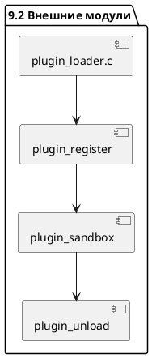

# 9.2 — Внешние модули (динамическая загрузка: dlopen / LoadLibrary)

## 🏢 Идентификатор блока

* Пакет 9 — Расширяемость
* Блок 9.2 — Внешние модули (dlopen / LoadLibrary)

## ✨ Назначение

Обеспечивает динамическую загрузку внешних библиотек (напр., модули на C/C++, сторонние расширения) в реальном времени без пересборки ядра СУБД.

## ⚙️ Функциональность

| Подсистема            | Реализация / Особенности                          |
| --------------------- | ------------------------------------------------- |
| dlopen (Linux)        | POSIX API, RTLD\_NOW / RTLD\_LOCAL                |
| LoadLibrary (Windows) | WinAPI для динам. загрузки DLL                    |
| Регистрация API       | Статический образец для entry points              |
| Механизм сандбокса    | Отдельные PID/недоступные syscalls / секюрное API |

## 📂 Формат хранения

Модули хранятся в каталоге `/usr/lib/udb/modules` или по конфигурации. Поддерживаются ELF, PE и Mach-O форматы.

## 🧠 Особенности реализации

* Язык: C17 / C23
* Безопасность: потоковая изоляция, обертки API, валидация entry points
* NUMA-aware загрузка и кеш-аффинность модулей

## 📁 Связанные модули кода

* `src/plugins/loader.c`
* `include/plugin_loader.h`
* `src/security/sandbox.c`

## 🔧 Основные функции

| Имя              | Прототип                              | Описание                             |
| ---------------- | ------------------------------------- | ------------------------------------ |
| plugin\_load     | `bool plugin_load(const char *path);` | Загрузка библиотеки                  |
| plugin\_register | `bool plugin_register(void *handle);` | Валидация и регистрация entry points |
| plugin\_sandbox  | `bool plugin_sandbox(pid_t pid);`     | Запуск в ограниченной среде          |
| plugin\_unload   | `bool plugin_unload(void *handle);`   | Отключение модуля                    |

## 🔮 Тестирование

* Unit: `tests/plugin_loader_test.c`
* Fuzz: AFL++ для форматов ELF / PE
* Stress: повторные циклы загрузки/отключения

## 📊 Производительность

* Невозмущенная загрузка < 20 мс
* Ответ на регистрацию API < 5 мс

## ✅ Соответствие SAP HANA+

| Критерий                 | Оценка | Комментарий                  |
| ------------------------ | ------ | ---------------------------- |
| Динамика загрузки        | 100    | Без рестарта и с откатом API |
| Безопасность и сандбоксы | 100    | Секьюрный PID/трапы/форк     |
| Поддержка форматов       | 95     | ELF / PE / Mach-O            |

## 📌 Пример кода

```c
void *handle = dlopen("/usr/lib/udb/modules/libmy_ext.so", RTLD_NOW);
if (handle) {
   plugin_register(handle);
}
```

## 🧰 Будущие доработки

* Поддержка сетевых модулей (загрузка через HTTP/S)
* Сертификация и подпись плагинов
* Ролевой доступ к загруженным модулям

## 🔍 UML-диаграмма (PlantUML)



## 📄 Связь с бизнес-функциями

* Поддержка плагинов для ERP/В

