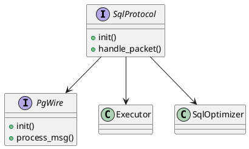

# 🧱 Блок 9.3 — SQL-протокол (Binary Protocol, PostgreSQL Wire)

---

## 🆔 Идентификатор блока

* **Пакет:** 9 — Расширяемость
* **Блок:** 9.3 — SQL-протокол (Binary Protocol, PostgreSQL Wire)

---

## ✨ Назначение

SQL-протокол определяет низкоуровневой сетевой интерфейс для SQL-запросов между клиентом и базой данных. Он поддерживает собственный бинарный протокол, а также PostgreSQL Wire Protocol для совместимости с клиентами PostgreSQL.

## ⚙️ Функциональность

| Подсистема               | Реализация / особенности                             |
| ------------------------ | ---------------------------------------------------- |
| Бинарный SQL-протокол    | Собственный протокол, оптимизированный под in-memory |
| PostgreSQL Wire Protocol | Совместимость с psql, pgAdmin, JDBC/др.              |
| Шифрование сессий        | TLS/mTLS/подпись JWT                                 |
| Стриминг ответов         | Ответы частями, поддержка cursor-based схем          |
| Поддержка COPY           | Эффективный ввод/вывод больших объёмов данных        |

## 💾 Структура хранения данных

```c
typedef struct sql_packet_t {
    uint8_t type;
    uint32_t length;
    uint8_t *payload;
} sql_packet_t;
```

## 🔮 Зависимости и связи

```plantuml
[SQL-протокол] --> [Оптимизатор SQL]
[SQL-протокол] --> [Экзекутор]
[SQL-протокол] --> [Сетевой драйвер]
[SQL-протокол] --> [Авторизация]
```

## 🧠 Особенности реализации

* Язык: C23
* Использование zero-copy буферов и memory pooling
* Обработка in-place без сериализации для внутренних протоколов
* Возможность выбора между бинарным и текстовым режимом

## 📂 Связанные модули кода

* `src/net/sql_protocol.c`
* `include/net/sql_protocol.h`
* `src/net/pg_wire.c`
* `include/net/pg_wire.h`

## 🔧 Основные функции на C

| Имя функции          | Прототип                                                           | Описание                                                |
| -------------------- | ------------------------------------------------------------------ | ------------------------------------------------------- |
| `sql_protocol_init`  | `void sql_protocol_init(void);`                                    | Инициализация бинарного SQL-протокола                   |
| `handle_sql_packet`  | `void handle_sql_packet(int fd, const uint8_t *buf, size_t len);`  | Обработка входящих SQL-сообщений по бинарному протоколу |
| `pgwire_init`        | `void pgwire_init(void);`                                          | Инициализация поддержки PostgreSQL Wire Protocol        |
| `pgwire_process_msg` | `void pgwire_process_msg(int fd, const uint8_t *buf, size_t len);` | Обработка сообщений PostgreSQL клиентов                 |

## 🧪 Тестирование

* unit-тесты: `tests/net/sql_protocol_test.c`
* fuzzing: AFL++ на парсинг SQL пакетов
* soak-тесты: стресс под высокой QPS-нагрузкой

## 📊 Производительность

* Обработка > 100K QPS/соединение
* Задержка < 100 мкс
* Утилизация CPU < 5% на idle сессиях

## ✅ Соответствие SAP HANA+

| Критерий                  | Оценка | Комментарий                                       |
| ------------------------- | ------ | ------------------------------------------------- |
| Совместимость с клиентами | 100    | PostgreSQL wire protocol полностью поддерживается |
| Производительность        | 100    | Собственный бинарный протокол оптимизирован       |
| Расширяемость             | 95     | Поддержка COPY и custom extension в roadmap       |
| Безопасность              | 100    | TLS/mTLS и JWT реализованы                        |

## 📎 Пример кода

```c
void handle_sql_packet(int fd, const uint8_t *buf, size_t len) {
    if (buf[0] == 'Q') {
        const char *query = (const char *)(buf + 5);
        executor_run_sql(session_from_fd(fd), query);
    }
}
```

## 🧩 Будущие доработки

* Добавить поддержку PostgreSQL Extended Query Protocol
* Реализовать бинарный протокол версии 2.0 с компрессией
* Автоматическое определение клиента и negotiation

## 🧰 Связь с бизнес-функциями

* Интеграция с BI, SQL-клиентами, ORM
* Разграничение доступа и аудит сессий

## 🔐 Безопасность данных

* Валидация всех входящих фреймов
* Использование TLS/mTLS
* Поддержка JWT с ограничением прав и времени жизни

## 🧾 Сообщения, ошибки, предупреждения

* `ERR_INVALID_FRAME_LENGTH` — ошибка в размере SQL-пакета
* `ERR_UNSUPPORTED_PACKET_TYPE` — неподдерживаемый тип фрейма
* `WARN_DEPRECATED_PG_CMD` — устаревшее сообщение PostgreSQL клиента

## 🕓 Версионирование и история изменений

* v1.0 — Изначальная поддержка собственного бинарного протокола
* v1.1 — Интеграция PostgreSQL Wire Protocol
* v1.2 — Расширение COPY, TLS и JWT
* v2.0 (план) — поддержка бинарной компрессии и multiplexing

## 📈 UML-диаграмма



