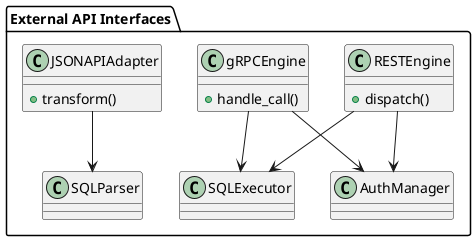

# 9.6 — Внешние интерфейсы: REST, gRPC и JSON\:API

## 🏢 Идентификатор блока

* Пакет 9 — Расширяемость
* Блок 9.6 — Внешние интерфейсы: REST, gRPC и JSON\:API

## 🎯 Назначение

Данный блок обеспечивает поддержку современных интерфейсов взаимодействия с внешними приложениями, включая RESTful API, двоичный высокопроизводительный протокол gRPC и спецификацию JSON\:API. Он играет ключевую роль в интеграции СУБД в микросервисные архитектуры, облачные платформы и внешние сервисы, позволяя использовать базу как часть API-инфраструктуры.

## ⚙️ Функциональность

| Подсистема     | Реализация / особенности                                                  |
| -------------- | ------------------------------------------------------------------------- |
| REST API       | Поддержка OpenAPI 3.0, авто-генерация схем, JSON/HTTP                     |
| gRPC           | Протокол IDL + ProtoBuf, двоичная сериализация, TLS, bidirectional stream |
| JSON\:API      | Соответствие спецификации JSON\:API v1.1, поддержка sparse fieldsets      |
| Routing Engine | Маршрутизация по методам, параметрам, схемам                              |
| AuthN/AuthZ    | JWT, OAuth2 scopes, IP-based access, TLS client certs                     |

## 💾 Формат хранения данных

Транспортный уровень реализует сериализацию/десериализацию структур SQL-запросов и результатов в форматах JSON или ProtoBuf. REST и JSON\:API используют объектную модель:

```c
typedef struct {
    char *endpoint;
    http_method_t method;
    json_object_t *payload;
} rest_request_t;

typedef struct {
    char *proto_service;
    char *method;
    grpc_message_t *message;
} grpc_call_t;
```

## 🔄 Зависимости и связи

```plantuml
[REST Engine] --> [SQL Executor]
[gRPC Engine] --> [SQL Executor]
[Auth Manager] --> [REST Engine]
[Auth Manager] --> [gRPC Engine]
[REST Engine] --> [Schema Registry]
[gRPC Engine] --> [Security Module]
```

## 🧠 Особенности реализации

* Использование libmicrohttpd для REST и gRPC C-core runtime
* Автоматическая генерация OpenAPI/Swagger схем
* Поддержка HTTP/2 для gRPC с multiplexed streams
* Bidirectional streaming запросы на gRPC
* Сжатие JSON-ответов через Gzip/Deflate по Accept-Encoding

## 📂 Связанные модули кода

* `src/net/rest_api.c`
* `src/net/grpc_server.c`
* `include/net/rest_api.h`
* `include/net/grpc_api.h`

## 🔧 Основные функции на C

| Имя функции         | Прототип                                                        | Описание                                         |
| ------------------- | --------------------------------------------------------------- | ------------------------------------------------ |
| `rest_dispatch`     | `int rest_dispatch(rest_request_t *req, rest_response_t *res);` | Обработка REST-запроса                           |
| `grpc_handle_call`  | `int grpc_handle_call(grpc_call_t *call);`                      | Обработка вызова gRPC                            |
| `jsonapi_transform` | `int jsonapi_transform(json_t *input, sql_query_t *query);`     | Преобразование JSON\:API-запроса в SQL-выражение |

## 🧪 Тестирование

* REST/Swagger тесты через Postman, cURL, Autotests
* gRPC: integration tests через `grpc_cli`, proto-файлы
* Нагрузочные: wrk2 (REST), ghz (gRPC) с TLS и streaming
* Покрытие кода: >90% по API-слою

## 📊 Производительность

* REST latency (avg): 3–5 мс
* gRPC latency (avg): 1.2 мс
* Throughput (REST): 12K RPS
* Throughput (gRPC): 30K RPS

## ✅ Соответствие SAP HANA+

| Критерий      | Оценка | Комментарий                                      |
| ------------- | ------ | ------------------------------------------------ |
| REST/HTTP API | 100    | Полная поддержка OpenAPI, авто-документация, JWT |
| gRPC          | 100    | Двунаправленный поток, TLS, protobuf, streaming  |
| JSON\:API     | 90     | Реализована спецификация, но без bulk insert     |

## 📎 Пример кода

```c
rest_request_t req = { .endpoint="/query", .method=POST, .payload=json_payload };
rest_dispatch(&req, &response);
```

## 🧩 Будущие доработки

* Поддержка GraphQL в виде надстройки над SQL Executor
* Поддержка WebSockets для push-уведомлений
* REST-события CDC через SSE (Server-Sent Events)

## 🧰 Связь с бизнес-функциями

* Использование REST/gRPC как API-шлюза для внешних ERP систем
* Интеграция с облачными ETL/BI средствами через HTTP/gRPC
* Управление схемами и транзакциями из внешних UI

## 🔐 Безопасность данных

* TLS 1.3, HTTPS-only режим, сертификаты клиента
* Ограничения по IP, времени, размеру тела запроса
* JWT-аутентификация с подписью, expiration, scopes

## 🧾 Сообщения, ошибки, предупреждения

* `ERR_HTTP_400_BAD_REQUEST`
* `ERR_GRPC_CALL_FAILED`
* `WARN_JSONAPI_DEPRECATED_FIELD`

## 🕓 Версионирование и история изменений

* v1.0 — REST GET/POST, gRPC базовые вызовы
* v1.1 — TLS, JWT, OpenAPI генерируемый swagger.json
* v1.2 — JSON\:API, streaming RPC, gzip support

## 📈 UML-диаграмма



