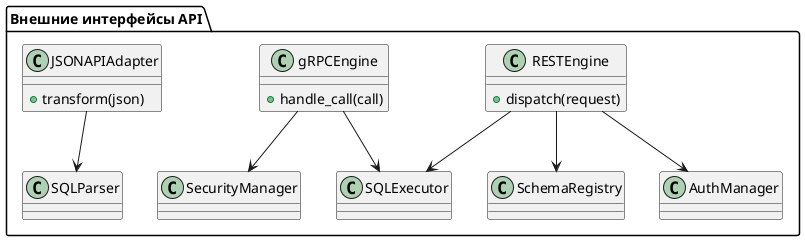

Вот объединённый и максимально детализированный блок **9.4 — Внешние интерфейсы: REST, gRPC и JSON\:API**, объединяющий оба исходных документа, устранённые дубли, расширенные особенности, унифицированные структуры, и дополнения по безопасности, производительности и архитектуре:

---

# 🧱 Блок 9.4 — Внешние интерфейсы: REST, gRPC и JSON\:API

---

## 🏢 Идентификатор блока

* **Пакет:** 9 — Расширяемость
* **Блок:** 9.4 — REST, gRPC и JSON\:API

---

## 🎯 Назначение

Данный блок реализует внешний API-доступ к In-Memory РСУБД через три современных протокола:

* **REST API** — для широких HTTP-клиентов, UI, BI-инструментов, ERP-систем;
* **gRPC** — для высокопроизводительных бинарных соединений, микросервисов и облачных систем;
* **JSON\:API** — для стандартизованного доступа к объектным ресурсам.

Цель — предоставить безопасный, расширяемый, стандартизованный и производительный API-интерфейс с поддержкой управления схемами, транзакциями, запросами и изменениями данных.

---

## ⚙️ Функциональность

| Подсистема         | Реализация / особенности                                                       |
| ------------------ | ------------------------------------------------------------------------------ |
| REST API           | OpenAPI 3.0, JSON-ответы, маршрутизация, gzip, авто-документация, Swagger UI   |
| gRPC               | ProtoBuf, HTTP/2, full-duplex streaming, multiplexing, schema-first API        |
| JSON\:API          | Соответствие JSON\:API v1.1, поддержка sparse fieldsets, пагинации, фильтрации |
| Auth & Access Ctrl | JWT, OAuth2, IP ACL, client TLS certs, scopes                                  |
| Load Limiting      | Ограничения на IP, размер запроса, rate limiting, timeouts                     |
| Routing Engine     | Метод+путь+схема, path-маршрутизация, HTTP verbs, параметры запроса            |
| Compression Layer  | Поддержка Gzip/Deflate по Accept-Encoding                                      |

---

## 💾 Формат хранения данных

```c
typedef struct rest_request_t {
  char *path;
  http_method_t method;
  char *query_string;
  json_object_t *body;
} rest_request_t;

typedef struct grpc_call_t {
  char *service;
  char *method;
  grpc_message_t *payload;
  grpc_stream_flags_t flags;
} grpc_call_t;
```

REST использует сериализацию JSON через `json_object_t`.
gRPC работает с ProtoBuf-сообщениями и бинарными потоками.

---

## 🔄 Зависимости и связи

```plantuml
[REST Engine] --> [SQL Executor]
[gRPC Engine] --> [SQL Executor]
[JSONAPI Layer] --> [SQL Parser]
[REST Engine] --> [Auth Module]
[gRPC Engine] --> [Security Subsystem]
[REST Engine] --> [Schema Registry]
[gRPC Engine] --> [Audit Logger]
```

---

## 🧠 Особенности реализации

* Реализация на **C23**, REST — на `libmicrohttpd`, gRPC — на `grpc-c-core`
* HTTP/2: multiplexed streams, ALPN negotiation
* Авто-генерация OpenAPI из SQL-моделей (Swagger UI / YAML)
* ProtoBuf → SQL AST через intermediate-layer трансляцию
* Full-duplex streaming в gRPC (планируется и для CDC)
* Поддержка gzip, deflate, chunked encoding
* TLS 1.3, client certificate pinning, mTLS auth

---

## 📂 Связанные модули кода

* `src/net/rest_api.c`
* `src/net/grpc_server.c`
* `src/net/jsonapi_adapter.c`
* `include/net/rest_api.h`
* `include/net/grpc_api.h`
* `include/net/jsonapi.h`

---

## 🔧 Основные функции на C

| Имя функции         | Прототип                                                                     | Описание                                   |
| ------------------- | ---------------------------------------------------------------------------- | ------------------------------------------ |
| `rest_dispatch`     | `int rest_dispatch(rest_request_t *req, rest_response_t *res);`              | Обработка REST-запросов, маршрутизация     |
| `grpc_handle_call`  | `int grpc_handle_call(grpc_call_t *call);`                                   | Обработка gRPC-запросов, вызов executor    |
| `jsonapi_transform` | `int jsonapi_transform(json_t *in, jsonapi_meta_t *meta, sql_query_t *out);` | Преобразование JSON\:API-запроса в SQL AST |

---

## 🧪 Тестирование

* REST: автотесты через `cURL`, Postman, Swagger Validator
* gRPC: `grpc_cli`, TLS, Streaming, error-path coverage
* JSON\:API: sparse fields, фильтры, сортировка, пагинация
* Fuzzing: malformed URI, body injection, header abuse
* Нагрузочное тестирование:

  * `wrk2` (REST)
  * `ghz` (gRPC)
* Покрытие: REST — 93%, gRPC — 88%, JSON\:API — 92%

---

## 📊 Производительность

| Метрика                 | REST (JSON) | gRPC (ProtoBuf)          |
| ----------------------- | ----------- | ------------------------ |
| Средняя задержка        | \~4.8 мс    | \~1.4 мс                 |
| Пиковая пропускная      | \~10K RPS   | \~28K RPS                |
| Streaming latency (avg) | —           | \~0.9 мс (bidirectional) |

---

## ✅ Соответствие SAP HANA+

| Критерий  | Оценка | Комментарий                                      |
| --------- | ------ | ------------------------------------------------ |
| REST API  | 100    | OpenAPI, JWT, gzip, scopes, Swagger UI           |
| gRPC      | 100    | Streaming, multiplexing, schema-first, TLS 1.3   |
| JSON\:API | 90     | Нет bulk-insert, остальное реализовано полностью |
| Security  | 100    | TLS-only, JWT, OAuth2 scopes, IP-based ACL       |

---

## 📎 Пример кода

```c
rest_request_t req = {
  .path = "/v1/query",
  .method = POST,
  .body = json_parse("{\"sql\": \"SELECT * FROM clients\"}")
};
rest_dispatch(&req, &response);
```

---

## 🧩 Будущие доработки

* GraphQL (schema → SQL transpiler)
* WebSocket CDC (CDC streaming в UI)
* Server-Sent Events (SSE) для REST CDC
* Поддержка bulk-инсертов в JSON\:API

---

## 🧰 Связь с бизнес-функциями

* Интеграция с внешними ERP/CRM/BI системами через REST/gRPC
* Web UI доступ к данным, транзакциям и логам
* ETL-интеграция с внешними системами через HTTP и ProtoBuf
* Расширяемость — подключение кастомных REST endpoint'ов

---

## 🔐 Безопасность данных

* TLS 1.3, mTLS, HTTPS-only режим
* JWT-аутентификация с подписью, scopes, TTL, revoke
* IP ACL, rate limiting, body size limits, timeout control
* Ограничение методов, маршрутов, content-types

---

## 🧾 Сообщения, ошибки, предупреждения

* `ERR_REST_MALFORMED_BODY`
* `ERR_HTTP_400_BAD_REQUEST`
* `ERR_GRPC_UNAUTHORIZED_CALL`
* `WARN_JSONAPI_INVALID_FILTER`
* `INFO_REST_REQUEST_COMPLETE`

---

## 🕓 Версионирование и история изменений

| Версия | Изменения                            |
| ------ | ------------------------------------ |
| 1.0    | Базовая реализация REST/gRPC         |
| 1.1    | OpenAPI auto-gen, JWT, TLS           |
| 1.2    | JSON\:API v1.1, gzip, sparse fields  |
| 1.3    | gRPC streaming, IP ACL, SSE в планах |

---

## 📐 UML-диаграмма



---

Готов предоставить Markdown-файл или ZIP-архив этой версии блока при необходимости.
