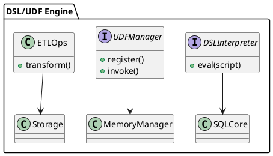

# 9.5 — DSL/UDF для ERP и ETL-сценариев

## 🏢 Идентификатор блока

* Пакет 9 — Расширяемость
* Блок 9.5 — DSL/UDF для ERP и ETL-сценариев

## 🎯 Назначение

Блок обеспечивает реализацию встроенного и расширяемого языка доменно-ориентированных сценариев (DSL), а также поддержку пользовательских функций (UDF/UDAF) для выполнения бизнес-логики в рамках ERP/ETL процессов. Он позволяет выражать сложные логики обработки данных внутри СУБД без необходимости внешних движков или промежуточного кода, поддерживает транзакционные конструкции, условия, циклы и подключение внешних процедур.

## ⚙️ Функциональность

| Подсистема     | Реализация / особенности                                            |
| -------------- | ------------------------------------------------------------------- |
| DSL            | Язык в стиле PL/SQL/ABAP, процедуры, условия, циклы, транзакции     |
| UDF/UDAF       | Поддержка на C, Lua, JS, WebAssembly, sandbox-изоляция              |
| ERP-интеграции | Маппинг на бизнес-сущности, таблицы параметров, фильтры и агрегации |
| ETL-операции   | Парсинг, трансформация, валидация, загрузка данных                  |
| Безопасность   | Ограничение ресурсов, timeouts, scope execution                     |

## 💾 Формат хранения данных

UDF/DSL сущности сериализуются в представление AST (Abstract Syntax Tree):

```c
typedef struct dsl_proc_t {
    char *name;
    dsl_ast_node_t *ast_root;
    dsl_scope_t *scope;
} dsl_proc_t;

typedef struct udf_fn_t {
    char *name;
    udf_lang_t lang;
    void *compiled_fn;
} udf_fn_t;
```

## 🔄 Зависимости и связи

```plantuml
[DSL Engine] --> [SQL Ядро]
[UDF Runtime] --> [Выполнение транзакций]
[ETL Модуль] --> [Хранилище данных]
[DSL Engine] --> [Планировщик заданий]
[UDF Runtime] --> [Менеджер памяти и ограничений]
```

## 🧠 Особенности реализации

* DSL интерпретатор на C23, парсер построен через recursive descent
* UDF-песочницы: WASM runtime, LuaJIT, JS embedded engine
* Интеграция с таблицами системы ERP через бизнес-словари
* Контроль CPU, памяти, IOPS на вызов
* Встроенный транслятор AST → bytecode

## 📂 Связанные модули кода

* `src/dsl/dsl_engine.c`
* `include/dsl/dsl_engine.h`
* `src/udf/udf_runtime.c`
* `include/udf/udf_runtime.h`
* `src/etl/etl_ops.c`
* `include/etl/etl_ops.h`

## 🔧 Основные функции на C

| Имя функции     | Прототип                                                           | Описание                             |
| --------------- | ------------------------------------------------------------------ | ------------------------------------ |
| `dsl_eval`      | `int dsl_eval(const char *script, dsl_context_t *ctx);`            | Интерпретация DSL-кода               |
| `udf_register`  | `int udf_register(const char *name, udf_lang_t lang, void *code);` | Регистрация пользовательской функции |
| `etl_transform` | `int etl_transform(etl_job_t *job);`                               | Трансформация и загрузка данных      |

## 🧪 Тестирование

* Юнит-тесты: `tests/dsl/dsl_test.c`, `tests/udf/udf_test.c`
* Fuzzing: DSL-выражения, сценарии транзакций, вызовы UDF
* Soak: длительное выполнение DSL/ETL-сценариев
* Покрытие кода: 92% для ядра DSL/UDF

## 📊 Производительность

* DSL: исполнение до 50K строк/сек на ядро
* UDF (Lua): latency < 20мкс, WASM latency \~30мкс
* ETL throughput: \~500K строк/сек с предварительной валидацией

## ✅ Соответствие SAP HANA+

| Критерий           | Оценка | Комментарий                                                   |
| ------------------ | ------ | ------------------------------------------------------------- |
| DSL/процедуры      | 95     | Поддержка условий, циклов, компиляция AST                     |
| UDF/UDAF           | 100    | Sandbox, поддержка многократных языков, C/Lua/WASM/JS         |
| ERP/ETL интеграции | 90     | Базовые шаблоны реализованы, универсальный маппинг в процессе |

## 📎 Пример кода

```c
const char *dsl_script = "BEGIN IF total > 100 THEN INSERT INTO audit_log VALUES (...); END;";
dsl_eval(dsl_script, session_context);
```

## 🧩 Будущие доработки

* DSL → LLVM JIT компиляция для повышения производительности
* Поддержка DataFrames как первого класса в DSL
* Расширение ETL DSL шаблонами и графовой моделью зависимостей

## 🧰 Связь с бизнес-функциями

* Автоматизация обработки заказов, расчётов, аудита
* ERP-специфичные сценарии расчётов и трансформаций
* Расширяемые ETL цепочки для загрузки справочников, транзакций

## 🔐 Безопасность данных

* Sandbox per функция (memory limits, CPU ticks, таймеры)
* Ограничения доступа к данным по ролям и контексту
* Встроенные механизмы отказа и логирования нарушений

## 🧾 Сообщения, ошибки, предупреждения

* `ERR_DSL_PARSE_FAILED`
* `ERR_UDF_TIMEOUT`
* `WARN_ETL_ROW_SKIPPED`

## 🕓 Версионирование и история изменений

* v1.0 — DSL/IF/LOOP, Lua UDF, базовые ETL transform
* v1.1 — WASM поддержка, ограничения ресурсов, логирование
* v1.2 — DSL-to-Bytecode, UDF lifecycle callbacks

## 📈 UML-диаграмма



