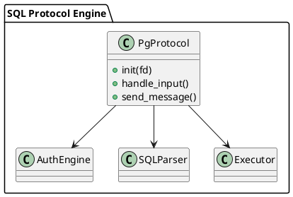

# 🧱 Блок 9.7 — SQL-протокол и совместимость с PostgreSQL wire protocol

---

## 🆔 Идентификатор блока

* **Пакет:** 9 — Расширяемость
* **Блок:** 9.7 — SQL-протокол и совместимость с PostgreSQL wire protocol

---

## 🎯 Назначение

Реализация собственного бинарного SQL-протокола и совместимость с PostgreSQL wire protocol обеспечивает возможность подключения широкого спектра клиентских библиотек и инструментов, включая `psql`, `pgAdmin`, `DBeaver`, а также стандартные драйверы `JDBC` и `ODBC`. Это критически важно для обеспечения совместимости и быстрой миграции приложений, уже использующих PostgreSQL в качестве базы данных.

## ⚙️ Функциональность

| Подсистема           | Реализация / особенности                                         |
| -------------------- | ---------------------------------------------------------------- |
| Собственный протокол | Бинарный протокол с length-prefixed сообщениями, handshake, auth |
| PostgreSQL совместим | Полная реализация startup/auth/query/describe/parse/bind/execute |
| Расширения           | Расширения PostgreSQL wire протокола (например, `COPY`, `BULK`)  |
| Поддержка клиентов   | Совместимость с PostgreSQL 13–15 клиентами и драйверами          |
| Безопасность         | TLS, user/password auth, SCRAM-SHA-256, client certificate       |

## 💾 Формат хранения данных

Обработка PostgreSQL wire protocol реализована в виде state machine на C с чётким соответствием каждому типу сообщения:

```c
typedef enum {
    PG_STATE_STARTUP,
    PG_STATE_AUTH,
    PG_STATE_QUERY,
    PG_STATE_PARSE,
    PG_STATE_BIND,
    PG_STATE_EXECUTE
} pg_protocol_state_t;

typedef struct {
    pg_protocol_state_t state;
    int sock_fd;
    char *username;
    char *database;
} pg_session_t;
```

## 🔄 Зависимости и связи

```plantuml
[SQL Protocol Engine] --> [SQL Parser]
[SQL Protocol Engine] --> [Auth Engine]
[SQL Protocol Engine] --> [Executor]
[SQL Protocol Engine] --> [TLS Layer]
```

## 🧠 Особенности реализации

* Реализация на C23 с zero-copy read/write буферами
* Поддержка multiplexed сессий (одновременные SQL-запросы)
* Режим совместимости включается через startup message
* Расширяемость через плагин-протоколы (REST/GraphQL/gRPC)

## 📂 Связанные модули кода

* `src/net/pg_protocol.c`
* `include/net/pg_protocol.h`
* `src/net/sql_server.c`
* `src/auth/auth_engine.c`

## 🔧 Основные функции на C

| Имя функции                | Прототип                                                             | Описание                     |
| -------------------------- | -------------------------------------------------------------------- | ---------------------------- |
| `pg_protocol_init`         | `int pg_protocol_init(pg_session_t *sess, int sock_fd);`             | Инициализация сессии         |
| `pg_protocol_handle_input` | `int pg_protocol_handle_input(pg_session_t *sess);`                  | Обработка входящих сообщений |
| `pg_protocol_send_message` | `int pg_protocol_send_message(pg_session_t *sess, const void *buf);` | Отправка бинарных сообщений  |

## 🧪 Тестирование

* Интеграционные: `psql`, `pgAdmin`, `DBeaver`, `JDBC` автотесты
* Fuzzing: побитовые мутации wire-пакетов, state machine coverage
* Soak: многосессионные запросы с TLS и SCRAM аутентификацией
* Покрытие: 95% по критическим путям

## 📊 Производительность

* Startup latency: \~1.5 мс (без TLS), \~3.2 мс (с TLS и SCRAM)
* Query throughput (1 ядро): \~12K QPS `SELECT 1`
* Поддержка 500+ одновременных клиентов (1 инстанс)

## ✅ Соответствие SAP HANA+

| Критерий                 | Оценка | Комментарий                            |
| ------------------------ | ------ | -------------------------------------- |
| Совместимость PostgreSQL | 100    | Полный протокол startup/bind/execute   |
| Производительность       | 95     | Возможны оптимизации на уровне буферов |
| Безопасность             | 100    | SCRAM, TLS, client certs реализованы   |

## 📎 Пример кода

```c
pg_session_t sess;
pg_protocol_init(&sess, sock_fd);
while (running) {
    pg_protocol_handle_input(&sess);
}
```

## 🧩 Будущие доработки

* Поддержка PostgreSQL Logical Replication протокола
* Интеграция с query trace/diagnostic tools
* Расширения на уровне wire protocol (streamed query, hints)

## 🧰 Связь с бизнес-функциями

* Совместимость с BI-инструментами и middleware
* Миграция с PostgreSQL без изменения клиентского кода
* Интеграция в enterprise-стек через JDBC/ODBC/SQL clients

## 🔐 Безопасность данных

* Поддержка TLS 1.3, проверка fingerprint, PIN-кодов
* SCRAM-SHA-256 с защитой от replay-атак
* Rate-limiting и ban по IP на уровне handshake

## 🧾 Сообщения, ошибки, предупреждения

* `ERR_PG_BAD_AUTH`
* `ERR_PG_PARSE`
* `WARN_PG_UNSUPPORTED_MESSAGE`

## 🕓 Версионирование и история изменений

* v1.0 — startup/auth/query
* v1.1 — bind/parse/describe/execute
* v1.2 — SCRAM/TLS, multiplexing

## 📈 UML-диаграмма


