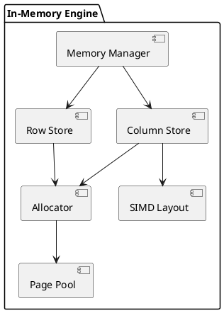

# 🧱 Блок 1.1 — In-Memory движок

---

## 🆔 Идентификатор блока

| Категория | Значение                    |
| --------- | --------------------------- |
| 📦 Пакет  | 1 — Архитектура и Хранилище |
| 🔢 Блок   | 1.1 — In-Memory движок      |

---

## 🎯 Назначение

Реализация основного in-memory движка хранения данных, обеспечивающего **нулевую задержку доступа к данным**, **высокую пропускную способность**, **поддержку MVCC**, и **работу без обращения к диску на критическом пути**.

В основе лежит разделение по физическому представлению данных (строковое и колонковое), быстрая аллокация, минимизация копирования и NUMA-оптимизация.

---

## ⚙️ Функциональность

| Подсистема         | Реализация / особенности                                   |
| ------------------ | ---------------------------------------------------------- |
| Аллокация памяти   | NUMA-aware, preallocated arenas, lock-free page management |
| Layout             | Поддержка row-store, column-store и hybrid layout          |
| Консистентность    | Copy-on-write + MVCC chain в in-memory                     |
| Поддержка типов    | Native: INT, FLOAT, STRING, TIMESTAMP, JSON                |
| Расширяемость      | Добавление новых типов через `type_desc_t`                 |
| Производительность | Cache alignment, prefetch, SIMD friendly layout            |

---

## 🔧 Основные функции на C

| Имя функции                 | Прототип                                                    | Назначение                           |
| --------------------------- | ----------------------------------------------------------- | ------------------------------------ |
| `memory_init()`             | `bool memory_init(memory_config_t *)`                       | Инициализация in-memory подсистемы   |
| `allocator_alloc()`         | `void *allocator_alloc(allocator_t *, size_t)`              | Выделение страницы/ячейки            |
| `row_store_insert()`        | `bool row_store_insert(row_store_t *, const row_t *)`       | Вставка строки в строковое хранилище |
| `column_store_insert()`     | `bool column_store_insert(column_store_t *, const row_t *)` | Вставка в колонковое хранилище       |
| `memory_get_available_mb()` | `uint64_t memory_get_available_mb()`                        | Получение объёма доступной памяти    |

---

## 📊 Метрики

| Метрика                      | Источник            | Цель                    |
| ---------------------------- | ------------------- | ----------------------- |
| `memory_used_mb`             | allocator / metrics | ≤ 90% от объема         |
| `alloc_latency_ns`           | alocator perf       | < 50 нс                 |
| `insert_throughput_rows_sec` | row/column insert   | > 1 млн строк/сек       |
| `cache_hit_ratio`            | page/row cache      | > 99%                   |
| `type_support_ratio`         | registry of types   | 100% (все базовые типы) |

---

## 📂 Связанные модули кода

```
src/memory.c
src/row_store.c
src/column_store.c
src/allocator.c
src/datatype.c
include/memory.h
include/allocator.h
include/datatype.h
```

---

## 🧠 Особенности реализации

* Поддержка прозрачного auto-eviction в NVMe-tier при нехватке памяти
* Copy-on-write для snapshot и read consistency
* Preallocated page pool с bitmap-based tracking
* Adaptive row size allocation по schema fingerprint
* Minimal false sharing через cache-line separation

---

## 🧪 Тестирование

| Вид теста  | Методика / покрытие                            | Где расположен             |
| ---------- | ---------------------------------------------- | -------------------------- |
| Unit       | malloc, insert, lookup                         | `tests/test_memory.c`      |
| Stress     | Постоянные insert/delete/alloc на 10 млн строк | `tests/stress/mem_alloc.c` |
| Fuzz       | Повреждённые данные, массивы                   | `fuzz/fuzz_allocator.c`    |
| Benchmarks | insert throughput, latency, memory reuse       | `bench/memory_bench.c`     |

---

## 📐 UML — Архитектура in-memory слоя



---

## ✅ Соответствие SAP HANA+

| Критерий                      | Оценка | Комментарий                            |
| ----------------------------- | ------ | -------------------------------------- |
| In-Memory only execution      | 100    | Данные не читаются с диска в OLTP-пути |
| Copy-on-write MVCC            | 95     | Цепочки в памяти без блокировок        |
| Поддержка row+column store    | 100    | Гибридные таблицы                      |
| NUMA и prefetch optimizations | 90     | На уровне аллокатора и планировщика    |

---

## 📎 Пример кода

```c
allocator_t *arena = allocator_create(ARENA_DEFAULT);
row_store_t *rs = row_store_create(schema, arena);
row_t row = row_init(schema);
row_set(&row, "id", 42);
row_store_insert(rs, &row);
```

---

## 📌 Связь с бизнес-функциями

* Позволяет хранить и обрабатывать миллиарды записей в оперативной памяти
* Ключ к достижению <1мс latency в OLTP и аналитике
* Основа гибридной OLTP/OLAP архитектуры (HTAP)
