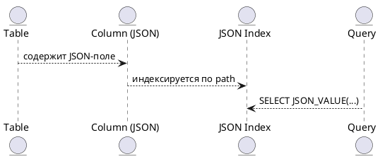

# 🧾 Блок 1.3 — JSON-хранилище

---

## 🆔 Идентификатор блока

| Категория | Значение                    |
| --------- | --------------------------- |
| 📦 Пакет  | 1 — Архитектура и Хранилище |
| 🔢 Блок   | 1.3 — JSON-хранилище        |

---

## 🎯 Назначение

Блок отвечает за хранение, индексирование и запрос данных в формате **JSON** внутри таблиц in-memory СУБД.
Обеспечивает:

* Встраиваемое **JSON-поле** внутри row/column таблиц,
* **Быстрый доступ к JSON path** с помощью структуры ValueIndex,
* **Индексация** по ключам, вложенным полям и массивам,
* Интеграцию с SQL (`JSON_VALUE`, `JSON_QUERY`, `->`, `#>`),
* Сжатие JSON-объектов для экономии памяти.

---

## ⚙️ Функциональность

| Подсистема     | Реализация / особенности                                               |
| -------------- | ---------------------------------------------------------------------- |
| Парсинг        | Zero-copy DOM-представление, адаптивная аллокация                      |
| Хранение       | Raw-бинарное и сжатое хранение, со встроенными offset-таблицами        |
| Индексация     | Вложенные ключи, path-based индекс (JSONPath trie)                     |
| SQL-интеграция | JSON\_VALUE, JSON\_EXISTS, JSON\_OBJECT, JSON\_ARRAY, JSON\_TABLE      |
| API            | Поддержка прямого доступа через `json_get(json_t *, const char *path)` |

---

## 🔧 Основные функции на C

| Имя функции           | Прототип                                                   | Назначение                   |
| --------------------- | ---------------------------------------------------------- | ---------------------------- |
| `json_parse()`        | `json_t *json_parse(const char *raw)`                      | Парсинг строки JSON          |
| `json_get()`          | `bool json_get(json_t *, const char *path, json_node_t *)` | Доступ к вложенному полю     |
| `json_index_add()`    | `void json_index_add(index_t *, json_t *)`                 | Добавление объекта в индекс  |
| `json_value_as_int()` | `int json_value_as_int(json_node_t *)`                     | Получение значения как числа |
| `json_compress()`     | `void *json_compress(json_t *)`                            | Сжатие JSON-объекта          |

---

## 📊 Метрики

| Метрика                  | Источник        | Цель                              |
| ------------------------ | --------------- | --------------------------------- |
| `json_lookup_latency_ns` | JSON\_GET       | < 1 мкс                           |
| `json_compression_ratio` | compressed size | > 2x                              |
| `json_index_build_time`  | on insert       | < 100 мкс                         |
| `json_path_hit_ratio`    | query planner   | > 90% при использовании индексов  |
| `json_query_exec_time`   | SQL → JSON      | < 10 мс на большие вложенные поля |

---

## 📂 Связанные модули кода

```
src/json.c
src/json_index.c
src/datatype.c
src/sql_expr_json.c
include/json.h
include/json_index.h
```

---

## 🧠 Особенности реализации

* Compact DOM-представление с memory arena
* Индексация по ключевым путям с помощью trie + hashmap
* Поддержка строгой схемы JSON-валидности (по опции)
* Использование RLE/dict compression на повторяющихся структурах
* Прямая интеграция в SQL через выражения и предикаты

---

## 🧪 Тестирование

| Вид теста | Методика / покрытие                     | Где расположен              |
| --------- | --------------------------------------- | --------------------------- |
| Unit      | Парсинг, доступ, сериализация           | `tests/test_json.c`         |
| Fuzz      | Повреждённые JSON-документы             | `fuzz/fuzz_json_parse.c`    |
| Stress    | 1 млн JSON объектов на вставку + индекс | `tests/stress/json_store.c` |
| SQL       | Запросы вида `SELECT JSON_VALUE(...)`   | `tests/sql/json_sql.c`      |

---

## 📐 JSON + SQL схема



---

## ✅ Соответствие SAP HANA+

| Критерий                        | Оценка | Комментарий                     |
| ------------------------------- | ------ | ------------------------------- |
| Хранение JSON в таблицах        | 100    | Встроенная поддержка            |
| JSON\_VALUE, JSON\_EXISTS в SQL | 100    | Полная реализация               |
| Индексация по JSON path         | 95     | Поддерживается trie-based index |
| Сжатие JSON                     | 90     | Используется при вставке        |

---

## 📎 Пример кода

```c
json_t *obj = json_parse("{\"a\": {\"b\": 42}}");
json_node_t node;
if (json_get(obj, "a.b", &node)) {
    int v = json_value_as_int(&node);
    printf("a.b = %d\n", v);
}
```

---

## 📌 Связь с бизнес-функциями

* Поддержка semi-структурированных данных (например, события, параметры устройств, webhooks)
* Упрощает миграцию с NoSQL решений (MongoDB, Firebase)
* Позволяет создавать адаптивные схемы в рамках одной таблицы
