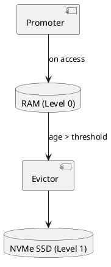

# 💾 Блок 1.4 — Tiered Storage (NVMe/SSD)

---

## 🆔 Идентификатор блока

| Категория | Значение                        |
| --------- | ------------------------------- |
| 📦 Пакет  | 1 — Архитектура и Хранилище     |
| 🔢 Блок   | 1.4 — Tiered Storage (NVMe/SSD) |

---

## 🎯 Назначение

Tiered Storage реализует многоуровневую архитектуру хранения, в которой **горячие данные** хранятся в **RAM (In-Memory)**, а **холодные** — в **NVMe/SSD**-дисках.
Обеспечивает:

* Автоматический перенос неактивных данных на SSD,
* Быстрый возврат данных в память при обращении (auto-promote),
* Поддержку TTL, LRU и приоритетов хранения,
* Асинхронный сброс данных на диск (flush/evict),
* Встроенную сериализацию и сжатие.

---

## ⚙️ Функциональность

| Подсистема        | Реализация / особенности                               |
| ----------------- | ------------------------------------------------------ |
| Иерархия хранения | Level-0 (RAM) → Level-1 (SSD, mmaped, compressed)      |
| Перенос данных    | Background thread с eviction policy                    |
| Доступ            | Transparent access (in-memory → SSD) через unified API |
| Стратегии         | FIFO, LRU, TTL-aware eviction, read-promote            |
| Формат            | Бинарный формат с compressible pages (gzip, delta)     |

---

## 🔧 Основные функции на C

| Имя функции           | Прототип                                        | Назначение                          |
| --------------------- | ----------------------------------------------- | ----------------------------------- |
| `tier_storage_init()` | `bool tier_storage_init(const char *path)`      | Инициализация NVMe-уровня           |
| `tier_flush_table()`  | `bool tier_flush_table(table_t *)`              | Сброс таблицы на SSD                |
| `tier_load_page()`    | `void *tier_load_page(tier_page_id_t)`          | Загрузка страницы в память          |
| `tier_promote()`      | `bool tier_promote(const char *table, rowid_t)` | Перемещение записи обратно в память |
| `tier_evict_idle()`   | `size_t tier_evict_idle(uint64_t max_age)`      | Выгрузка неактивных страниц         |

---

## 📊 Метрики

| Метрика                    | Источник          | Цель       |
| -------------------------- | ----------------- | ---------- |
| `hot_data_residency_ratio` | Memory/SSD баланс | > 95%      |
| `flush_latency_ms`         | Сброс данных      | < 20 мс    |
| `eviction_throughput_mb_s` | SSD-выгрузка      | > 300 МБ/с |
| `ssd_page_read_latency_us` | mmap/disk read    | < 150 мкс  |
| `tier_write_amplification` | WAL + flush       | < 1.2      |

---

## 📂 Связанные модули кода

```
src/tiered_storage.c
src/page_cache.c
src/evictor.c
src/ssd_serializer.c
include/tiered_storage.h
include/page_cache.h
```

---

## 🧠 Особенности реализации

* Выгрузка и загрузка реализованы как фоновый поток (`thrd_t`)
* Поддержка mmap-файлов с проверкой CRC32
* Unified API: чтение и запись работают одинаково для RAM и SSD
* Формат страниц: `{header, [compressed blocks], footer}`
* Встроенный eviction-лог и статистика по hot/cold-данным

---

## 🧪 Тестирование

| Вид теста | Методика / покрытие                      | Где расположен             |
| --------- | ---------------------------------------- | -------------------------- |
| Unit      | Сброс и восстановление таблицы           | `tests/test_tier.c`        |
| Soak      | Нагрузка 100 млн записей с авто-eviction | `tests/soak/tier_stress.c` |
| Crash     | Тест восстановления после сбоя           | `tests/crash/tier_crash.c` |
| Perf      | Eviction latency / flush throughput      | `bench/tier_flush_bench.c` |

---

## 📐 UML — Архитектура tiered storage



---

## ✅ Соответствие SAP HANA+

| Критерий                         | Оценка | Комментарий                   |
| -------------------------------- | ------ | ----------------------------- |
| Многоуровневая иерархия хранения | 100    | RAM + SSD + auto-eviction     |
| Автоматическая выгрузка          | 95     | TTL, LRU, flush-on-pressure   |
| Поддержка mmap и prefetch        | 90     | Есть, но можно улучшить с ZNS |
| Сжатие / сериализация страниц    | 90     | gzip + delta compression      |

---

## 📎 Пример кода

```c
tier_storage_init("/data/tier0");
table_t *t = table_create(schema, STORE_ROW);
for (int i = 0; i < 1000000; i++) {
    table_insert(t, generate_row(i));
}
tier_flush_table(t);
```

---

## 📌 Связь с бизнес-функциями

* Поддержка хранения исторических/неактивных данных без потери доступа
* Уменьшает RAM-потребление на 70–90% при длительной работе
* Позволяет обслуживать аналитические запросы на "холодных" данных без задержек

