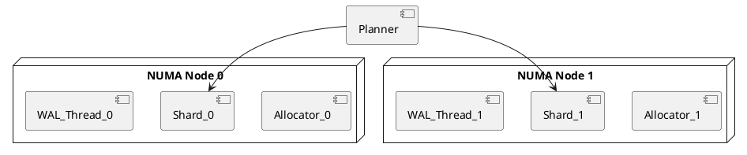

# 🧠 Блок 1.5 — NUMA-aware управление памятью

---

## 🆔 Идентификатор блока

| Категория | Значение                            |
| --------- | ----------------------------------- |
| 📦 Пакет  | 1 — Архитектура и Хранилище         |
| 🔢 Блок   | 1.5 — NUMA-aware управление памятью |

---

## 🎯 Назначение

NUMA-aware управление памятью позволяет:

* Повысить пропускную способность доступа к памяти,
* Минимизировать **remote memory latency**,
* Эффективно распределять ресурсы между shard-ами, потоками и сессиями.

Движок должен автоматически привязывать **память, потоки и шард** к локальному NUMA-узлу и поддерживать NUMA-statistics для анализа.

---

## ⚙️ Функциональность

| Подсистема       | Реализация / особенности                                                |
| ---------------- | ----------------------------------------------------------------------- |
| Аллокатор        | NUMA-aware allocator: выделение по узлу (local vs interleave vs remote) |
| Потоки           | CPU-pinning потоков фоновых задач, executor'ов, WAL writer'ов           |
| Размещение shard | Привязка shard к NUMA-узлу (affinity)                                   |
| Планировщик      | Учитывает affinity при выборе потоков и shard для задачи                |
| Статистика       | Поддержка `numa_stats`, `local_alloc_ratio`, `remote_miss_ratio`        |

---

## 🔧 Основные функции на C

| Имя функции               | Прототип                                         | Назначение                               |
| ------------------------- | ------------------------------------------------ | ---------------------------------------- |
| `numa_alloc_onnode()`     | `void *numa_alloc_onnode(size_t size, int node)` | Выделение памяти на конкретном NUMA-узле |
| `numa_node_of_ptr()`      | `int numa_node_of_ptr(void *ptr)`                | Получение NUMA-узла для указателя        |
| `numa_bind_thread()`      | `void numa_bind_thread(int cpu, int node)`       | Привязка потока к ядру и узлу            |
| `shard_set_numa_node()`   | `void shard_set_numa_node(shard_t *, int node)`  | Установка NUMA-affinity для shard'а      |
| `memory_get_node_usage()` | `numa_stats_t memory_get_node_usage(int node)`   | Получение статистики по узлу             |

---

## 📊 Метрики

| Метрика                     | Источник            | Цель               |
| --------------------------- | ------------------- | ------------------ |
| `local_alloc_ratio`         | Аллокатор           | > 95%              |
| `remote_page_miss_ratio`    | Hardware counter    | < 5%               |
| `thread_affinity_violation` | Scheduler           | = 0                |
| `numa_node_balance_index`   | Memory load monitor | между узлами ≤ 20% |
| `shard_cpu_numa_coherence`  | shard planner       | > 90%              |

---

## 📂 Связанные модули кода

```
src/memory.c
src/allocator_numa.c
src/shard.c
src/numa.c
src/planner.c
include/numa.h
include/allocator.h
```

---

## 🧠 Особенности реализации

* Выделение больших блоков (arena) на конкретных NUMA-узлах
* Потоки WAL, GC и ETL — строго привязаны к NUMA node
* Shard создаётся на NUMA-узле, на котором максимальный объём доступной памяти
* NUMA-statistics автоматически собираются и экспортируются в метрики

---

## 🧪 Тестирование

| Вид теста   | Методика / покрытие                    | Где расположен               |
| ----------- | -------------------------------------- | ---------------------------- |
| Integration | WAL+shard+GC с 4 NUMA-узлами           | `tests/numa/test_affinity.c` |
| Stress      | Потоковая нагрузка с pinning           | `tests/stress/numa_shard.c`  |
| Metrics     | Проверка `local_alloc_ratio`           | `bench/numa_stat_bench.c`    |
| Fault-inj   | Принудительное нарушение NUMA-affinity | `fuzz/fuzz_numa_rebind.c`    |

---

## 📐 UML — NUMA-aware размещение ресурсов



---

## ✅ Соответствие SAP HANA+

| Критерий                      | Оценка | Комментарий                     |
| ----------------------------- | ------ | ------------------------------- |
| NUMA-aware аллокация          | 100    | Выделение по узлам              |
| CPU/thread affinity           | 95     | Используются system calls       |
| Мониторинг NUMA балансировки  | 90     | Есть статистика по alloc и miss |
| NUMA-aware shard distribution | 90     | Учитывается при планировании    |

---

## 📎 Пример кода

```c
void *mem = numa_alloc_onnode(4096, 1); // Выделить 4КБ на NUMA-узле 1
numa_bind_thread(3, 1); // Закрепить текущий поток за CPU 3 и NUMA node 1
```

---

## 📌 Связь с бизнес-функциями

* Снижение latency при многопоточном доступе к shard'ам
* Повышение пропускной способности WAL и ingest
* Возможность более плотного размещения филиалов по NUMA-нагрузке
